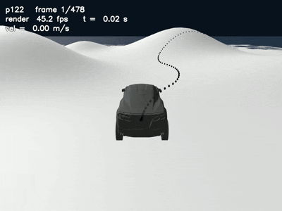

# Physics-Grounded Driving Policy via MPPI Label Mining

> **대규모 병렬 물리 시뮬레이션의 최적 제어를, 실시간 주행 정책으로 증류한다.**
> Genesis 물리 엔진 위에서 MPPI가 채굴한 골든 제어 라벨로 Path→(Steer, Throttle, Brake)
> Mapper를 학습하고, Real2Sim–Sim2Real 정책 전이로 확장하는 프로젝트.

**Abstract (EN).** We distill the optimal control of large-scale parallel physics
simulation into a real-time driving policy. On the Genesis physics engine, an MPPI
controller mines *golden* control labels by rolling out 2048 candidate futures per step
over ray-wheel vehicle dynamics; a lightweight trajectory-to-controls mapper is then
trained on these labels via behavior cloning and DAgger, replacing the 2048-env
optimizer with a single neural-network inference at deployment. Because the labels
carry physical response — slope climbing, load transfer, tire slip — rather than
idealized kinematics, the learned policy targets generalization on rough, off-nominal
terrain. The same Blender→Genesis sim2sim calibration (frame, timestep, terrain, and
vehicle-parameter alignment) is designed to serve directly as the methodology for a
future Real2Sim→Sim2Real transfer loop. On top of this supervised base, we plan a
reinforcement-learning stage: a residual RL head that compensates for covariate shift
and unmodeled dynamics, and extends the action space to explicit brake control for a
full (steer, throttle, brake) policy.

*매 스텝 2048개의 후보 미래를 병렬 물리로 시뮬레이션하고, 최적 궤적 하나를 선택해 지형을 주행하는 MPPI — 반투명 고스트는 컨트롤러가 "상상한" 미래들이다.*

---

## 무엇을 하는가

자율주행 경로 추종 제어기를 **물리적으로 실현 가능한(physically feasible) 데이터**로 학습한다.

1. **Reference 생성** — 한국 도로공사 표준 기반 지형 위에서 차량이 순수 물리 주행으로 만든
   궤적을 추출한다. 위치를 강제로 이식한 kinematic 궤적은 배제한다 — 지형 경사, 하중 이동,
   타이어 접지, 서스펜션 응답이 빠진 데이터로는 실물에서 일반화되지 않기 때문이다.
2. **골든 라벨 채굴 (sim2sim)** — Genesis의 ray-wheel 차량 물리 위에서 **MPPI**(Model
   Predictive Path Integral)가 reference 궤적을 재추종한다. 매 스텝 **2048개 병렬 환경**에서
   후보 제어 시퀀스를 실제 물리로 전개·평가해 최적 입력을 선택하고, 그 결과로
   *(주행 상태 → Throttle, Steer, Brake)* 전문가 라벨이 쌓인다.
3. **Path→(ST,B) Mapper 학습** — 채굴된 라벨을 지도학습(BC + DAgger)해, 경로와 현재 상태만
   보고 제어를 출력하는 경량 정책을 만든다. 학습 후에는 **2048-env 최적화 없이** 단일
   신경망 추론만으로 실시간 경로 추종이 가능하다.

## 왜 중요한가

- **최적 제어의 증류** — MPPI는 강력하지만 실시간 실차 제어에는 무겁다. 이를 오프라인
  라벨 생성기로만 사용하고 실시간 주행은 경량 mapper가 담당하는 구조는, 대규모 시뮬레이션
  최적화의 성능을 실차 수준의 연산 예산으로 가져오는 실용적 경로다.
- **Dynamic-first 데이터** — 학습 라벨이 이상적 궤적이 아니라 물리 응답(경사 등판, 미끄러짐,
  하중 이동)을 담고 있어, 험지·비정형 지형에서의 일반화를 겨냥한다.
- **전이 파이프라인의 리허설** — 현재의 Blender→Genesis sim2sim 정합(좌표계·시간 스텝·
  지형·차량 파라미터)은 그대로 real2sim 정합의 방법론이 된다.

## 로드맵

| 단계 | 상태 | 내용 | 문서 |
|---|---|---|---|
| Sim2Sim 정합 | 완료 | Blender 물리 주행 ↔ Genesis ray-wheel 물리 정합 | [Sim2Sim Calibration](car_test/docs/%5B26-03-15%5D_Sim2Sim_Calibration.md) · [Ray-wheel 충돌 모델](car_test/docs/%5B26-05-02%5D_ray_wheel.md) · [Pacejka 타이어 모델](car_test/docs/%5B26-05-07%5D_pacejka_model.md) · [정합 평가 지표](car_test/docs/tech/%5B26-04-29%5D_slope_kappa_rmse.md) |
| 골든 라벨 채굴 | 완료 | 34개 기동 시나리오 × 표준 지형, MPPI 마이닝 (최저 CTE 0.11 m) | [MPPI 개요](car_test/docs/%5B26-02-22%5D_MPPI.md) · [3D 지형 마이닝](car_test/docs/%5B26-06-01%5D_MPPI_onTerrain.md) · [데이터 스케일링](car_test/docs/%5B26-06-24%5D_data.md) · [MPPI 파라미터](car_test/docs/tech/%5B26-06-01%5D_MPPI_warmstart.md) |
| Path→(ST,B) Mapper | 진행 중 | BC 학습 + DAgger 폐루프 개선 | [BC Inverse Mapper](car_test/docs/%5B26-03-05%5D_BC_inverse_mappper.md) · [DAgger](car_test/docs/tech/%5B26-03-05%5D_DAgger.md) |
| Residual RL 정책 | 설계 완료 | BC 기반 정책 위 residual RL, brake 제어 추가, (S,T,B) 완전 정책 | [PPO Residual RL 설계](car_test/docs/%5B26-01-12%5D_ppo_residualRL.md) · [보상 함수](car_test/docs/tech/%5B26-01-15%5D_reward.md) |
| Real2Sim | 다음 단계 | 실측 궤적·지형의 시뮬 정합, 실환경 분포 라벨 재채굴 | — |
| Sim2Real | 최종 목표 | 학습 정책의 실차 전이 | — |

전체 연구 기록(50여 편)은 **[문서 인덱스](car_test/docs/README.md)** 에서 단계별로 볼 수 있다.

## 장기 비전 — Real2Sim ↔ Sim2Real 폐루프

이 프로젝트의 sim2sim 정합은 그 자체가 목적이 아니라, **실측–시뮬 폐루프의 리허설**이다.
현재 Blender를 "이상적 현실의 대리자(surrogate)"로 두고 Genesis가 그 주행을 물리적으로
재현하도록 정합하는데, 이 파이프라인이 성립하면 Blender 자리에 실제 현실을 그대로 치환할 수
있다. 지향하는 최종 구조는 두 방향이 맞물린 폐루프다.

- **Real2Sim** — 관측된 실차 롤아웃에서 inverse-dynamics mapper가 잠재 제어 궤적(ST, B)과
  Genesis–현실 간 보정 항을 복원한다. 정책 학습이 시작되기 *전에* 제어와 동역학을 명시적으로
  복원해 sim-to-real 간극을 먼저 좁힌다. 이 복원된 정합이 이후 모든 학습(residual RL, 다중
  에이전트, 험지 전이)이 올라서는 공통 기반이 된다.
- **Sim2Real** — 보정된 시뮬에서 학습한 정책이 정량적 강건성을 갖고 실차로 전이된다.
  BC 기반 정책 위에 covariate shift와 미모델링 동역학을 보상하는 residual RL 항을 얹는
  구조를 겨냥한다.

> Real2Sim / Sim2Real은 현재 진행 중인 sim2sim 정합 위에서 이어질 다음 단계이며, 위 서술은
> 그 설계 방향이다.

## 강화학습 단계

지도학습(BC + DAgger)으로 만든 mapper는 전문가 라벨을 재현하는 **기반 정책**이다. 그 위에
강화학습을 얹어 라벨만으로는 닿지 않는 부분을 채우는 것이 다음 단계다. 세 방향을 겨냥한다.

- **Residual RL** — BC 기반 정책의 출력에 강화학습 residual 항을 더해, 폐루프에서 누적되는
  covariate shift와 MPPI 라벨이 담지 못한 미모델링 동역학을 보상한다. 처음부터 정책을
  학습하는 대신 검증된 base 위의 보정만 학습하므로 표본 효율과 안정성이 높다.
- **Brake 제어 확장** — 현재 mapper 출력은 (Steer, Throttle) 2차원이고 brake는 물리 검증만
  된 상태다. 강화학습 단계에서 행동 공간에 brake를 추가해 **(Steer, Throttle, Brake) 완전
  정책**으로 확장한다. 급경사 하강·감속 구간처럼 throttle만으로 부족한 상황이 대상이다.
- **Policy 학습** — 정합된 시뮬 위에서 보상 기반으로 주행 정책을 직접 최적화하고, 이를
  Sim2Real 전이 대상 정책으로 삼는다.

> 설계 노트: [PPO Residual RL](car_test/docs/%5B26-01-12%5D_ppo_residualRL.md) ·
> [보상 함수 설계](car_test/docs/tech/%5B26-01-15%5D_reward.md)