# MLP Pipeline Changes: Optuna Mining, Sequence BC, dual_scene performance eval

---
## 1. 도로 규격 기반 S,T 주행 데이터 생성 (Claude MCP → Blender)

| 항목 | 값 |
|---|---|
| 시나리오 수 | 33개 |
| 경로 유형 | 직진/커브/시케인/헤어핀/8자/랜덤 등  |
| 규격 근거 | 최대경사 8% 이하 등 KEC 규정 참고  |

### Golden Data Mining

|  |  |  |  |
|---|---|---|---|
| **p120** [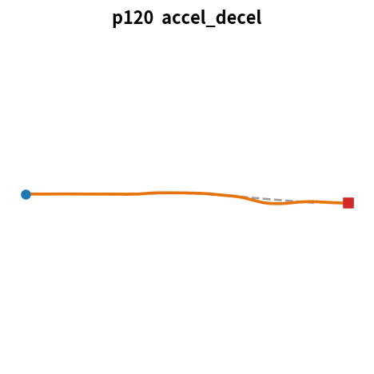](../res_wjdaksry/0701/replay_p120.mp4) <video src="../res_wjdaksry/0701/replay_p120.mp4" controls width="200"></video> | **p121** [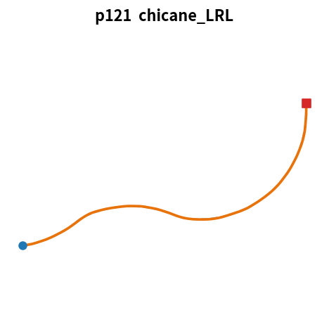](../res_wjdaksry/0701/replay_p121.mp4) <video src="../res_wjdaksry/0701/replay_p121.mp4" controls width="200"></video> | **p122** [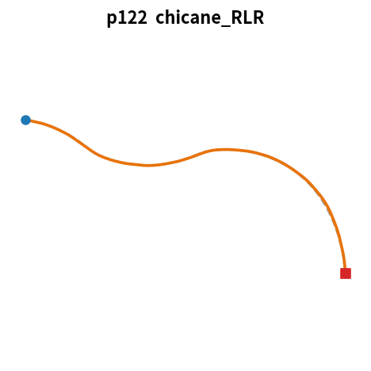](../res_wjdaksry/0701/replay_p122.mp4) <video src="../res_wjdaksry/0701/replay_p122.mp4" controls width="200"></video> | **p123** [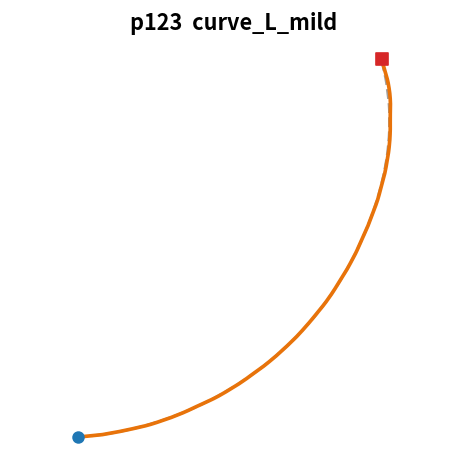](../res_wjdaksry/0701/replay_p123.mp4) <video src="../res_wjdaksry/0701/replay_p123.mp4" controls width="200"></video> |
| **p124** [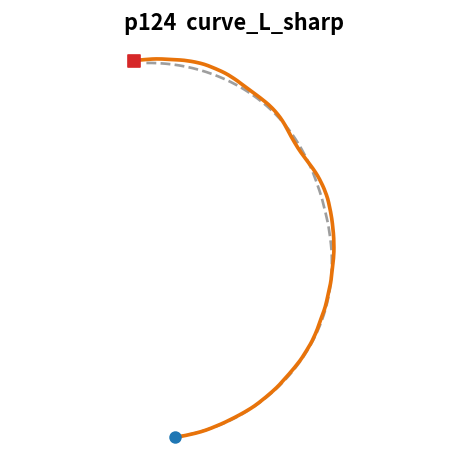](../res_wjdaksry/0701/replay_p124.mp4) <video src="../res_wjdaksry/0701/replay_p124.mp4" controls width="200"></video> | **p125** [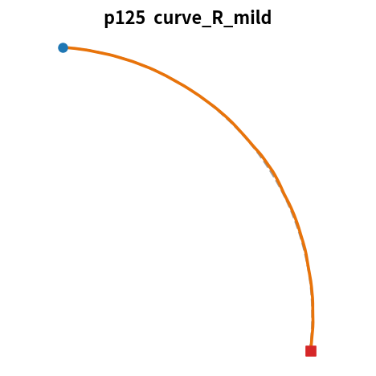](../res_wjdaksry/0701/replay_p125.mp4) <video src="../res_wjdaksry/0701/replay_p125.mp4" controls width="200"></video> | **p126** [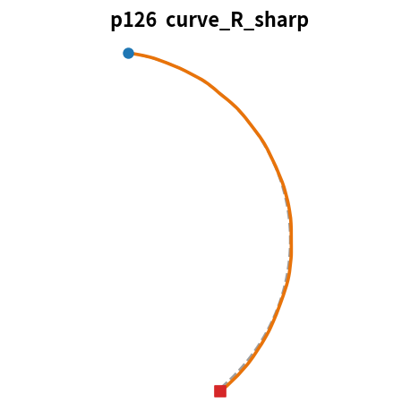](../res_wjdaksry/0701/replay_p126.mp4) <video src="../res_wjdaksry/0701/replay_p126.mp4" controls width="200"></video> | **p127** [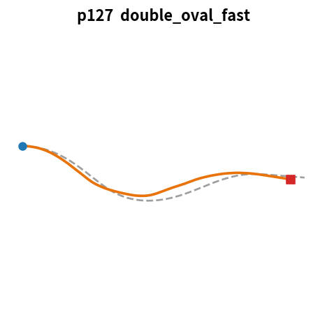](../res_wjdaksry/0701/replay_p127.mp4) <video src="../res_wjdaksry/0701/replay_p127.mp4" controls width="200"></video> |
| **p128** [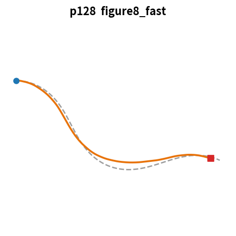](../res_wjdaksry/0701/replay_p128.mp4) <video src="../res_wjdaksry/0701/replay_p128.mp4" controls width="200"></video> | **p129** [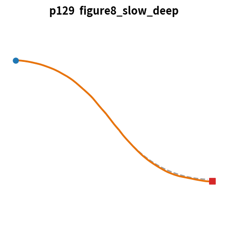](../res_wjdaksry/0701/replay_p129.mp4) <video src="../res_wjdaksry/0701/replay_p129.mp4" controls width="200"></video> | **p130** [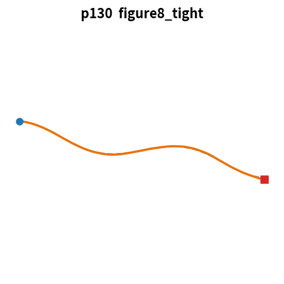](../res_wjdaksry/0701/replay_p130.mp4) <video src="../res_wjdaksry/0701/replay_p130.mp4" controls width="200"></video> | **p131** [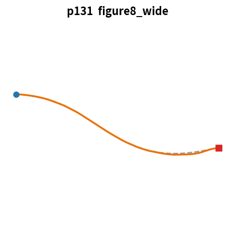](../res_wjdaksry/0701/replay_p131.mp4) <video src="../res_wjdaksry/0701/replay_p131.mp4" controls width="200"></video> |
| **p132** [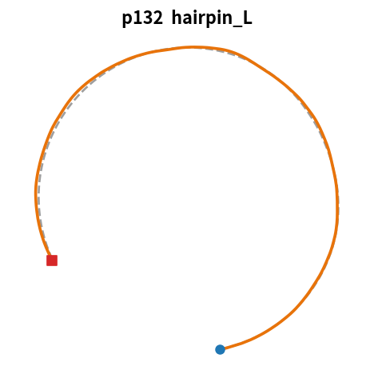](../res_wjdaksry/0701/replay_p132.mp4) <video src="../res_wjdaksry/0701/replay_p132.mp4" controls width="200"></video> | **p133** [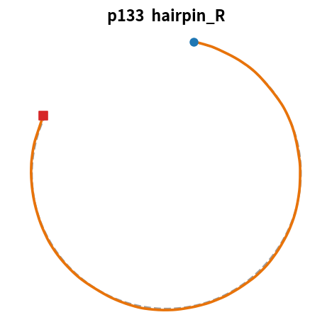](../res_wjdaksry/0701/replay_p133.mp4) <video src="../res_wjdaksry/0701/replay_p133.mp4" controls width="200"></video> | **p134** [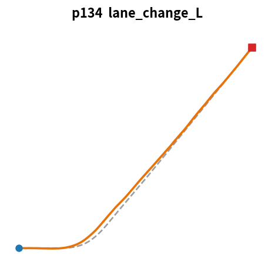](../res_wjdaksry/0701/replay_p134.mp4) <video src="../res_wjdaksry/0701/replay_p134.mp4" controls width="200"></video> | **p135** [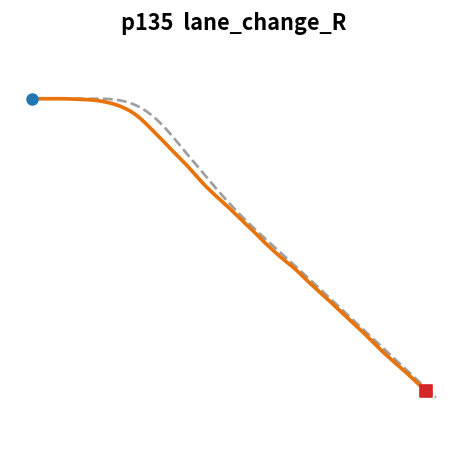](../res_wjdaksry/0701/replay_p135.mp4) <video src="../res_wjdaksry/0701/replay_p135.mp4" controls width="200"></video> |
| **p136** [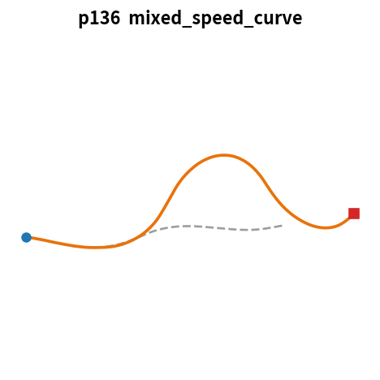](../res_wjdaksry/0701/replay_p136.mp4) <video src="../res_wjdaksry/0701/replay_p136.mp4" controls width="200"></video> | **p137** [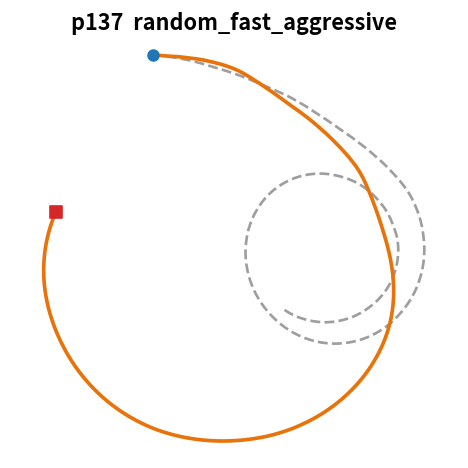](../res_wjdaksry/0701/replay_p137.mp4) <video src="../res_wjdaksry/0701/replay_p137.mp4" controls width="200"></video> | **p138** [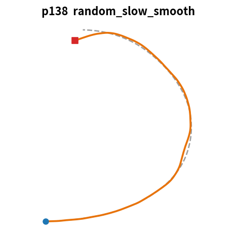](../res_wjdaksry/0701/replay_p138.mp4) <video src="../res_wjdaksry/0701/replay_p138.mp4" controls width="200"></video> | **p139** [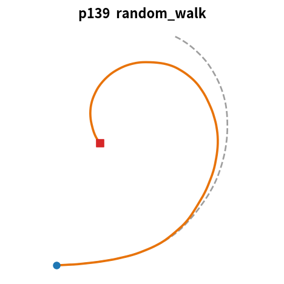](../res_wjdaksry/0701/replay_p139.mp4) <video src="../res_wjdaksry/0701/replay_p139.mp4" controls width="200"></video> |
| **p140** [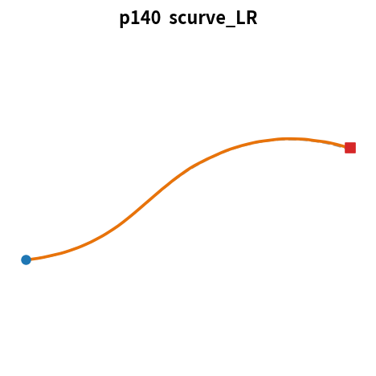](../res_wjdaksry/0701/replay_p140.mp4) <video src="../res_wjdaksry/0701/replay_p140.mp4" controls width="200"></video> | **p141** [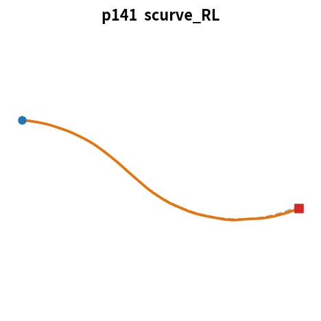](../res_wjdaksry/0701/replay_p141.mp4) <video src="../res_wjdaksry/0701/replay_p141.mp4" controls width="200"></video> | **p142** [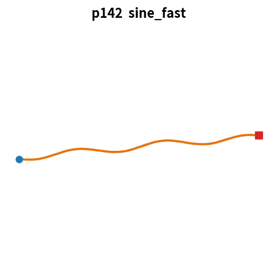](../res_wjdaksry/0701/replay_p142.mp4) <video src="../res_wjdaksry/0701/replay_p142.mp4" controls width="200"></video> | **p143** [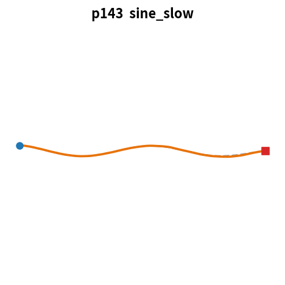](../res_wjdaksry/0701/replay_p143.mp4) <video src="../res_wjdaksry/0701/replay_p143.mp4" controls width="200"></video> |
| **p144** [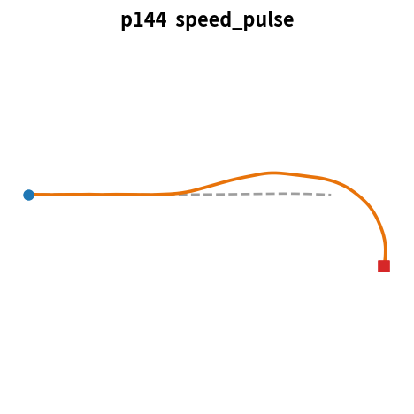](../res_wjdaksry/0701/replay_p144.mp4) <video src="../res_wjdaksry/0701/replay_p144.mp4" controls width="200"></video> | **p145** [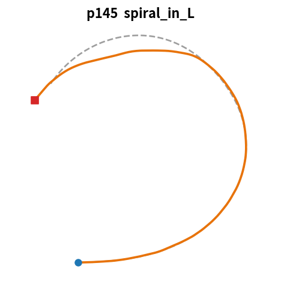](../res_wjdaksry/0701/replay_p145.mp4) <video src="../res_wjdaksry/0701/replay_p145.mp4" controls width="200"></video> | **p146** [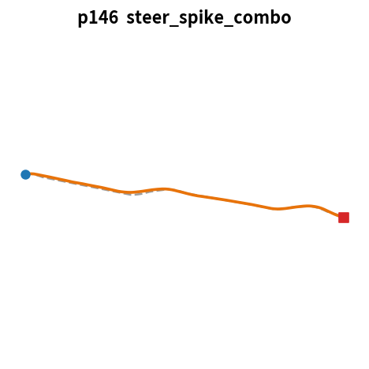](../res_wjdaksry/0701/replay_p146.mp4) <video src="../res_wjdaksry/0701/replay_p146.mp4" controls width="200"></video> | **p147** [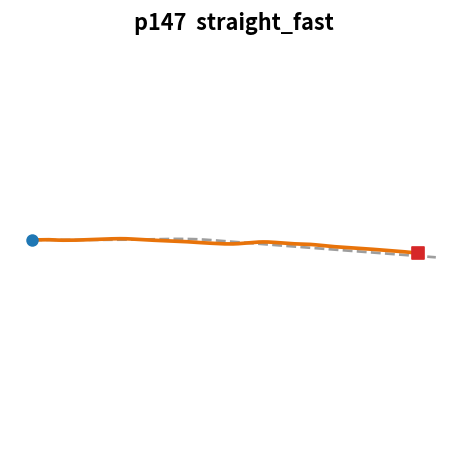](../res_wjdaksry/0701/replay_p147.mp4) <video src="../res_wjdaksry/0701/replay_p147.mp4" controls width="200"></video> |
| **p148** [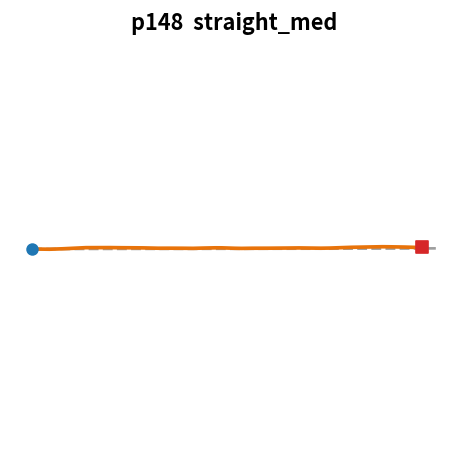](../res_wjdaksry/0701/replay_p148.mp4) <video src="../res_wjdaksry/0701/replay_p148.mp4" controls width="200"></video> | **p149** [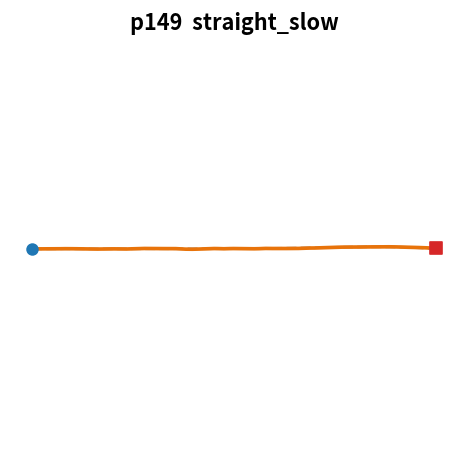](../res_wjdaksry/0701/replay_p149.mp4) <video src="../res_wjdaksry/0701/replay_p149.mp4" controls width="200"></video> | **p150** [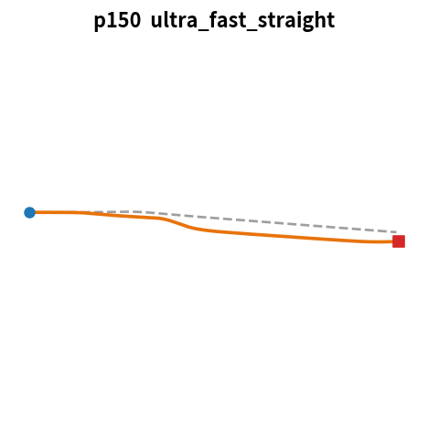](../res_wjdaksry/0701/replay_p150.mp4) <video src="../res_wjdaksry/0701/replay_p150.mp4" controls width="200"></video> | **p151** [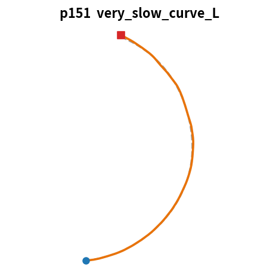](../res_wjdaksry/0701/replay_p151.mp4) <video src="../res_wjdaksry/0701/replay_p151.mp4" controls width="200"></video> |
| **p152** [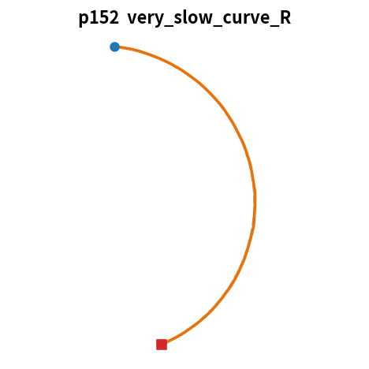](../res_wjdaksry/0701/replay_p152.mp4) <video src="../res_wjdaksry/0701/replay_p152.mp4" controls width="200"></video> |  |  |  |

## 2. Golden 마이닝 파라미터: Optuna (TPE: Bayesian Optimization)

> 데이터 수가 늘어남에 따라서 grid-search 보다 더 최적의 golden $T,S$ 마이닝 방법이 필요하다 느낌

1. 첫 10 trial(1 trial이 1개의 파라미터 조합)만 random sampling
2. 각 trial에 대한 cost를 계산하여 cost 순으로 정렬
3. 그 후, 상위 γ%를 기준으로 good(A), bad(B)를 나누어 각각의 파라미터 분포를 학습(해당 분포들은 trial 단위로 업데이트)
4. 다음 trial의 파라미터 조합은 good(A) / bad(B)를 기준으로 추출(즉, good 분포 방향으로 파라미터 조합이 추출되게)

* optuna 보다 현재까지는 grid search 의 성능이 더 좋아서 위 방법은 grid search parameter로 진행
* optuna가 더 좋은 결과를 낸다면 방법을 변경 할 것

## 3. 학습 구조: per-frame to 시퀀스(멀티프레임) 학습

> 피드백 요지 — 1:1 프레임 학습은 MPPI 라벨의 프레임별 노이즈를 그대로 흡수한다 

| | 1스텝 (2_train) | action 청크 (2.1_train) | 청크 + prev 제거 + 경향성 추가(2.2_train) |
|---|---|---|---|
| 폐루프 robust score | 1.458 (best ep10) | 0.667 (best ep240, −54%) | **0.627 (best ep70, −57%)** |
| holdout p112 CTE | 1.17 m | 0.64 m | **0.62 m** |
| 검증 26경로 평균 CTE | 1.17 m | 0.89 m (−24%) | **0.73 m (−38%)** |
| 학습 후반 안정성 | ep10 이후 폐루프 붕괴 (ep161+ 실격) | ep240 까지 건강 | 건강 |

### meeting feedback

#### MLP 구조 변경 

* 프레임간 오버랩된 제어값으로 gitter를 없앰 : 자체 스무딩 효과
1. 미래 10 frame의 경로 정보(v,k) 넣는 현재 구조는 문제 없음
2. current dynamic state (1 frame) 만으로는 부족하다

* 특히 고속에서는 관성, 하중이동, 서스펜션, 미끄러짐 등을 영향을 크게 받음
* 같은 dynamic state $(v,k)$ 여도, `slip`인지, `커브길`인지 모델은 모름
* 단일 프레임에 대한 $(S,T)$ action 출력 노이즈에 치명적

3. 그렇다면 과거 프레임의 `경향성`을 넣어줘야하는데, prev(S,T)를 넣는 순간 `copycat` / `data leakage` 가 될 수 있음

* 이전 n 프레임의 `미분값` / `변화량` 을 입력 state로 가져감.

* 과거 프레임을 통째로 넣지 않고, 미분 피쳐 3개로 압축하되, dt(1/48)가 매우 작기에 5프레임의 `평균 변화율`을 사용하여 노이즈 영향이 적은 `경향성`을 주입

#### 삭제된 prev states
> data leakage / copycat 문제가 발생 할 수 있어 이를 제거하고 경향성(미분값)으로 정보 제시
* prev_S : 이전 frame의 제어값 steer
* prev_T : 이전 frame의 제어값 throttle

#### 추가된 prev dynamic states
> 주행의 경향성을 나타내주는 k frame 이전의 데이터를 입력
* dv_rate : prev 5 frame의 v_long 흐름 - 차량의 속도 흐름
* pitch_rate : prev 5 frame의 chassis pitch rate - pose 변화율
* roll_rate :  prev 5 frame의 chassis roll rate - pose 변화율

### MLP State Sheet(31D) 

$$\mathbf{X} = [\underbrace{\Delta v,\ \Delta \psi,\ \text{CTE}}_{\text{오차 피드백 (3D)}},\ \underbrace{v_{\text{long}},\ \kappa,\ \text{pitch},\ \text{roll}}_{\text{현재 상태 (4D)}},\ \underbrace{\kappa_{\text{bl},t+1..t+10}}_{\text{미래 곡률 (10D)}},\ \underbrace{a_{\text{bl},t+1..t+10}}_{\text{미래 가속 (10D)}},\underbrace{a_{\text{target}}}_{\text{현재 FF (1D)}},\ \underbrace{\dot{v},\ \dot{\text{pitch}},\ \dot{\text{roll}}}_{\text{prev 5 프레임 경향성 미분 (3D)}}]$$

#### 그룹 별 설계 의도

| 그룹 | Dim | 피처 | 설계 의도 |
|---|---|---|---|
| **FeedBack** | 3 | `delta_v`, `delta_heading`, `cte` | 누적 오차 명시 → PID 의 오차 항을 신경망으로 |
| **Current Dynamic State** | 4 | `v_long`, `kappa`, `pitch`, `roll` | Genesis 차량의 현재 물리 상태 |
| **Current FF** | 1 | `a_target` | 현재 스텝 FF (직접 참조) |
| **FeedForward k** | 10 | `k_target[t+1..t+10]` | 10-step 미래 곡률 — 사전 조향 준비 |
| **FeedForward a** | 10 | `a_target[t+1..t+10]` | 10-step 미래 가속 — 사전 스로틀 준비 |
| **경향성 미분** | 3 | `dv_rate`, `pitch_rate`, `roll_rate` | ★ 2.2 — 상태 변화 방향 (관측 스파이크 흡수) |

<b>MLP Input State Sheet (31D 상세)</b> — 인덱스별 전체 명세 펼치기

| # | 그룹 | 피처명 | 출처 | 설명 |
|---|---|---|---|---|
| 0 | **오차 피드백** | `delta_v` | 계산값 | 속도 오차 ($v_{\text{target}} - v_{\text{long}}$) |
| 1 | | `delta_heading` | 계산값 | 헤딩 오차, $\text{wrap}_\pi(\psi_{\text{ref}} - \psi_{\text{sim}})$ |
| 2 | | `cte` | Golden CSV | 횡방향 위치 오차, 부호 포함 |
| 3 | **현재 상태** | `v_long` | Genesis CSV | 현재 종방향 속도 |
| 4 | | `kappa` | Genesis CSV | 현재 주행 곡률 |
| 5 | | `pitch` | Genesis CSV | 현재 차체 pitch |
| 6 | | `roll` | Genesis CSV | 현재 차체 roll |
| 7~16 | **미래 곡률** | `k_target[t+1..t+10]` | Blender CSV | 10-step 미래 곡률 target |
| 17~26 | **미래 가속** | `a_target[t+1..t+10]` | Blender CSV | 10-step 미래 종가속 target |
| 27 | **현재 FF** | `a_target` | Blender CSV | 현재 스텝 $a_{\text{target}}$ (직접 피드포워드) |
| 28 | **경향성 미분** | `dv_rate` | 계산값 | $\dot{v}_{\text{long}}$ — 백워드 K프레임 최소자승 기울기 |
| 29 | | `pitch_rate` | 계산값 | $\dot{\text{pitch}}$ — 동일 방식 |
| 30 | | `roll_rate` | 계산값 | $\dot{\text{roll}}$ — 동일 방식 |

### Output Action(미래 10프레임 제어값 overlap : 20D)

$$(T,S)_t \in [-1, 1]^{20}$$

- **청크 길이**: $H = 10$ 스텝 (약 0.21초 : 48Hz)

#### Overlaped Output의 설계의도

> - **MPPI 라벨 지터 완화**: 프레임 별 지터를 시퀀스 구조 안에서 평균화
> - **Copycat 억제**: `prev_T/S` 단순 복사 지름길 차단

### 결과 비교 

#### 기존 학습 모델(code 2_train.py)

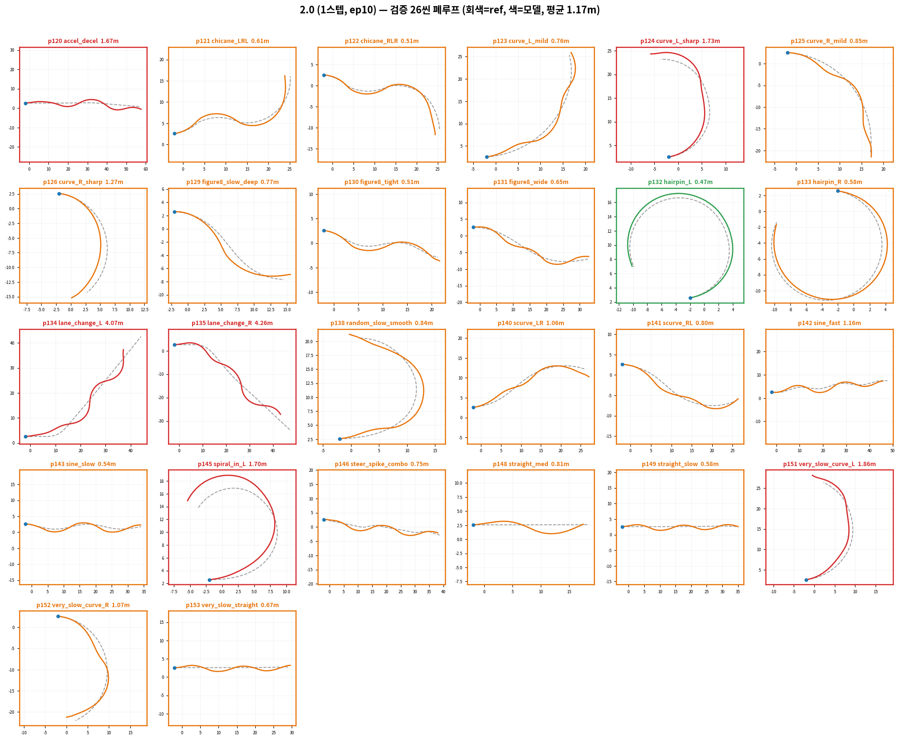 

* 30 , [3D: 2_train.py 설계](%5B26-06-01%5D_MPPI_onTerrain.md)

#### 출력값 미래 10프레임의 $(S,T)$ (2.1_train.py)

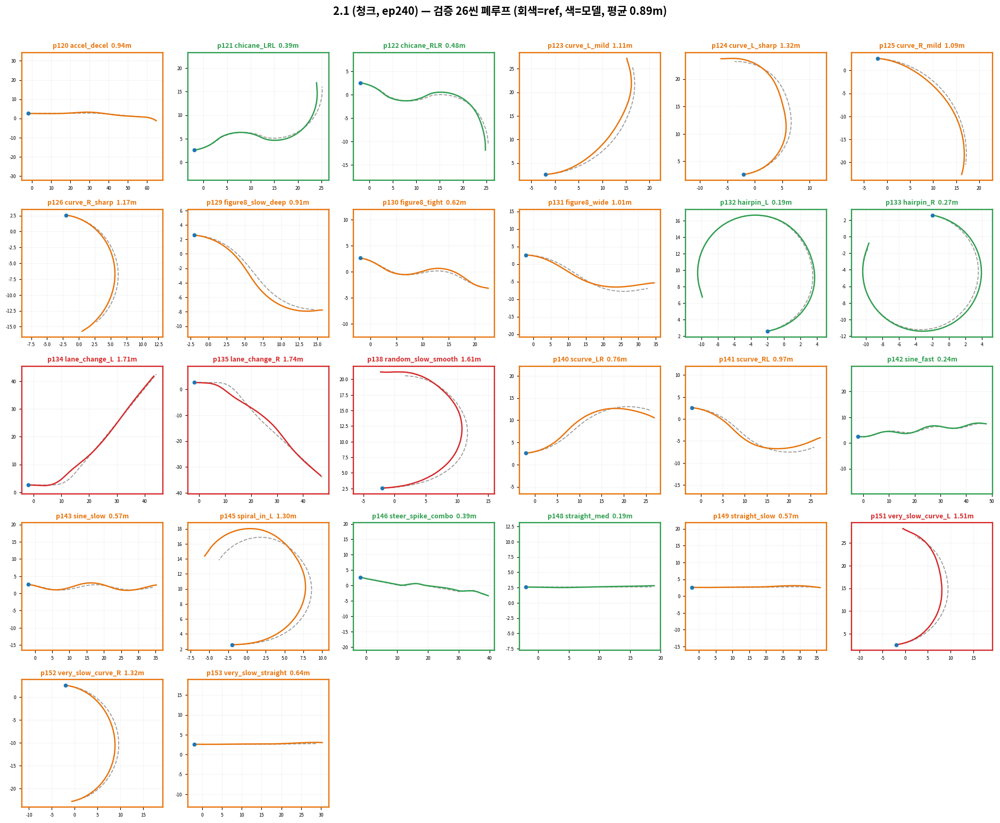 

* (T,S) 제어값의 오버랩을 시켜 스무딩 효과

#### prev 5 frame 추가 & prev(s,t) 제거 (2.2_train.py)
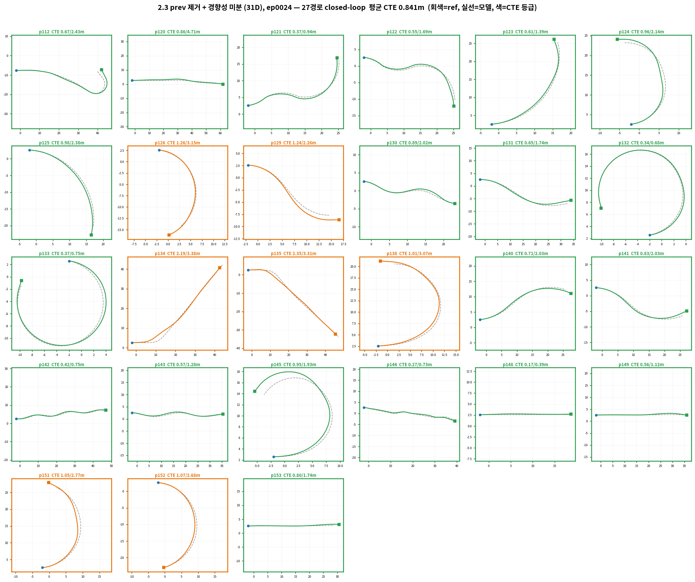

* prev $(S,T)$(data leakage) 제거 후, `prev 5 frame`의 `경향성`을 input으로 넣어 `prev state` 고려한 미래 10frame의 제어값 $(S,T)$

#### checkpoint 비교 영상 (2.0, 2.1, 2.2)
https://github.com/user-attachments/assets/6103ad6f-9538-481e-93c3-e8ca63dad50e 

<video src="../res_wjdaksry/0701/cmp_p124.mp4" controls width="400"></video>

https://github.com/user-attachments/assets/e1ecc386-0f91-4078-b687-7fe5fe2c16e4

<video src="../res_wjdaksry/0701/cmp_p125.mp4" controls width="400"></video>

https://github.com/user-attachments/assets/ef931e00-9b6d-4db7-b944-771a0b269e46

 <video src="../res_wjdaksry/0701/cmp_p132.mp4" controls width="400"></video>

https://github.com/user-attachments/assets/fe213fe6-d32d-4c8e-8fd9-15a7c9d4d3e5 

<video src="../res_wjdaksry/0701/cmp_p142.mp4" controls width="400"></video>

https://github.com/user-attachments/assets/90b6d246-6c1a-4dd4-89af-92bf8040ffb3 

<video src="../res_wjdaksry/0701/cmp_p148.mp4" controls width="400"></video>

https://github.com/user-attachments/assets/71e8b4a8-ae65-40c8-a0a6-9b5a6673089b 

<video src="../res_wjdaksry/0701/cmp_p153.mp4" controls width="400"></video>

## 4. 평가 기준: validation loss 로 모델을 선발하면 안 되는 이유

Behavior Cloning 계열 모델의 평가에서 **"검증 데이터에서 다음 프레임을 얼마나 잘 예측하는가"** (val loss) 와 **"실제로 그 모델을 물리 환경에서 돌렸을 때 궤적을 얼마나 잘 따라가는가"** (closed loop 성능) 는 **서로 다른 지표**다. (ex: LLM의 perplexity)

* 완주율 
* 평균 CTE
* 평균 HE
* 마지막 프레임 도달 거리 

기준으로 평가

## 5. dual_scene 성능 비교

| | single_scene (genesis 1.0.0) | dual_scene (1.2.0 + SDK 1.1.9) |
|---|---|---|
| 성능 평가 (1024env, 287frame 전체) | 707 s | **86 s (×8.2배 빠름)** |
| 풀 마이닝 1씬(2048env, 287 frame 기준) | ~33 분 | ~4 분 |

## 6. DAgger (진행 중)

-

#### 참고

* 깃허브에 올라와 있지 않은 나머지 주행영상 drive 에 존재