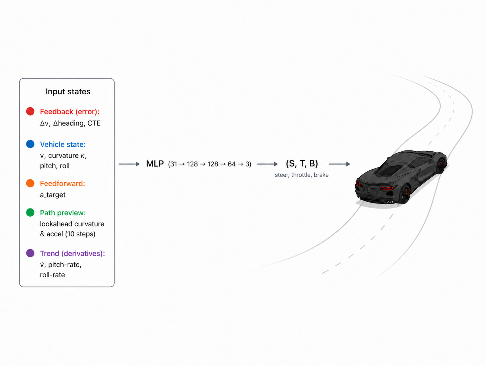
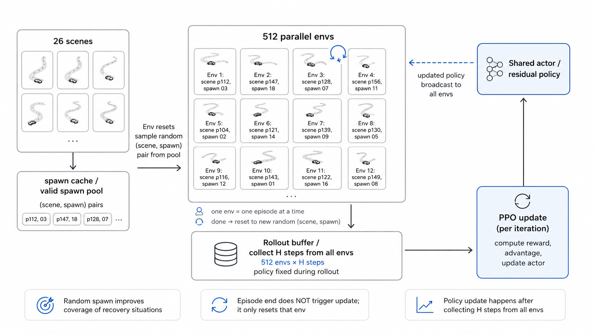
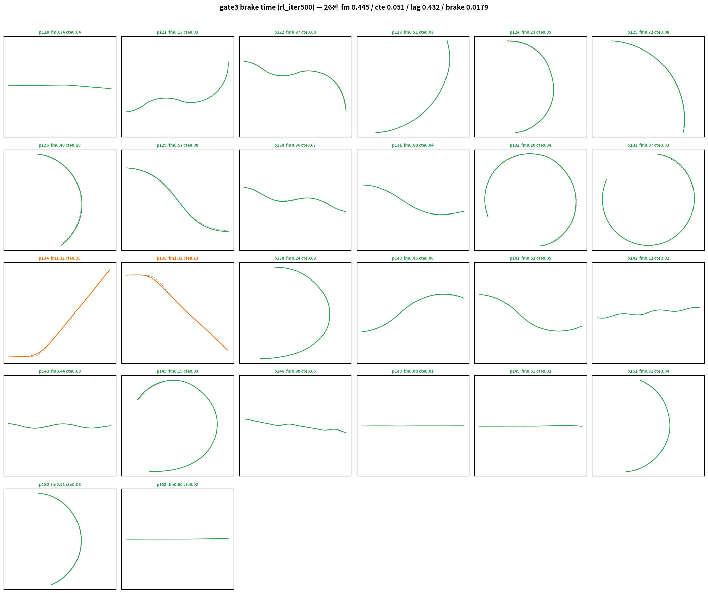
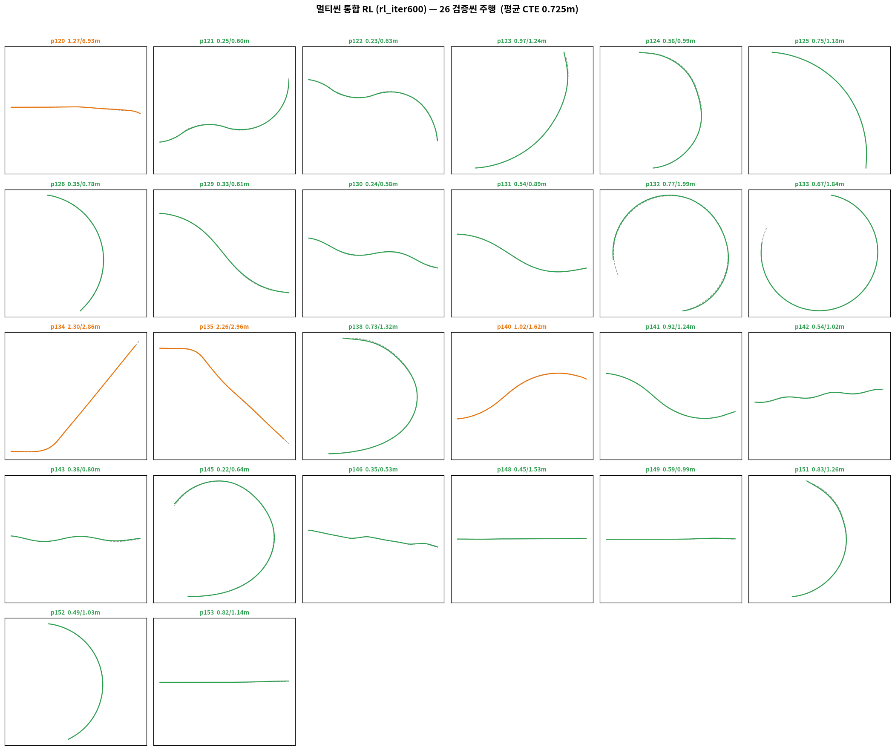

# Adding Residual RL(PPO) on BC Mapper

```
              ┌────────────────────┐
s_bc ────────>│ frozen BC Mapper    │
              │ no gradient update  │
              └─────────┬──────────┘
                        │
                        │ base action
                        │ [T_BC, S_BC]
                        ▼
              ┌────────────────────┐
s_rl ────────>│ RL residual policy  │
              │ PPO로 학습          │
              └─────────┬──────────┘
                        │
                        │ residual
                        │ [Δu, ΔS]
                        ▼

u = T_BC + Δu
S = S_BC + ΔS

# 가속 & 제동 분리 로직
if u >= 0:
    throttle = u
    brake = 0
else:
    throttle = 0
    brake = -u

# u: BC + RL 보정을 거친 최종 longitudinal command
```

----------


## Residual RL — Frozen BC + Residual PPO

> BC Mapper의 경로 추종 능력은 준수하나 곡률 추종, 속도 변경·고속 추종 능력을 국소  교정 * 강화하기 위해, 학습이 끝난 **BC Mapper 를 Freeze** 하고 그 위에
**잔차(residual) 정책**만 PPO 로 학습한다. 최종 행동 = BC 기본행동 + 잔차.
→ BC 의 전역 안정성을 보존하면서, RL 은 "얼마나 더/덜 밟고 꺾을지"의 **작은 보정**만 담당한다.


###  Policy : Actor - Critic

| - | 구조 | 비고 |
|---|---|---|
| **Actor (행동 결정자)** | 31 → 128 → 128 → 2 (ELU) | 행동 생성 (Residual Δu,ΔS) |
| **Critic (평가자)** | (31 + 추가 33) → 256 → 256 → 1 (ELU) | 현재 상태 평가 V(s) |
| PPO | proximal update | Actor 업데이트를 안정화 |


Critic 입력 = 31 + 33 = 64D: 같은 31D에 더해, 시뮬레이터 안에서만 알 수 있는 "추가(특권 - privileged)" 정보 33차원을 추가로 받습니다:

| 특권 정보 | 차원 | 내용 |
|---|---|---|
| `last_distances` | 4 | 바퀴별 레이캐스트 지면 거리 |
| `omega` | 4 | 바퀴별 회전 각속도 (휠스핀/슬립 감지) |
| `last_compression` | 4 | 바퀴별 서스펜션 압축량 (접지 상태) |
| `k_ex` | 10 | 먼 미래 곡률 (t+11~t+20 — actor의 lookahead보다 멀리) |
| `a_ex` | 10 | 먼 미래 가속도 (t+11~t+20) |
| `lag` | 1 | 스케줄 지연(m) |
| **합계** | **33** | Critic 전용 특권 관측 |


### 브레이크 설계

```
u = T_BC + Δu      S = S_BC + ΔS
비대칭 잔차 cap:  Δu ∈ [−0.7, +0.3]   ΔS ∈ [−0.25, +0.25]   (감속 방향 여유를 크게)
게이팅:  u ≥ 0 → throttle=u, brake=0
         u < 0 → throttle=0, brake=−u
```

> PPO 보상 설계에서 Action의 변경은 최소한으로 하지만, 실제 주행 중 감속은 빠르게 변화가 나타나야 하므로, 비대칭 보상치를 부여

* 가속(+Δu)은 좁게(0.3)
* 감속/브레이크(−Δu)는 넓게(0.7) 
    * 안전측(감속) 보정을 더 허용


### 브레이크 로직


1. BC의 감속 의도:  감속 구간에서 T_BC가 작아짐 (golden의 감속 패턴)
2. RL이 눌러서: Δu ∈ [−0.7, +0.3] — RL이 최대 −0.7까지 내림
   * (비대칭 cap: T_BC가 +0.5여도 0.5 − 0.7 = −0.2 → 브레이크 도달 가능)

발동 상황: 
* 고속 → 저속 코너 진입. v가 v_target보다 빠른데(velocity 초과 벌점) 
* 앞 프리뷰(a_look)가 감속을 예고 → BC가 T를 내리고 + RL이 Δu를 음수로 → u<0 → 브레이크. 코너 지나면 u가 다시 양수로 → catch-up 가속.


추가 디테일 2개

1. brake 크기 = |u| (0~0.8 연속값) — on/off가 아니라 세기 조절. 영상 HUD의 br=0.02 같은 값이 그것.
2. 저속 + 강한 브레이크의 특수동작: brake > 0.3 이고 v < 0.5면 SDK의 `StaticFrictionLock`(주차 스프링 락)이 걸립니다 — 정지 유지용.


------


### State Sheet (31D — BC와 동일 구조)
`state7`(Δv, Δheading, CTE, v_long, κ, pitch, roll) + `k_look×10` + `a_look×10` + `a_target` + `deriv3`(v̇, ṗ, ṙ, backward-slope K=5)



| 그룹 | Dim | 피처 | 설계 의도 |
|---|---|---|---|
| **FeedBack** | 3 | `delta_v`, `delta_heading`, `cte` | 누적 오차 명시 → PID 의 오차 항을 신경망으로 |
| **Current Dynamic State** | 4 | `v_long`, `kappa`, `pitch`, `roll` | Genesis 차량의 현재 물리 상태 |
| **Current FF** | 1 | `a_target` | 현재 스텝 FF (직접 참조) |
| **FeedForward k** | 10 | `k_target[t+1..t+10]` | 10-step 미래 곡률 — 사전 조향 준비 |
| **FeedForward a** | 10 | `a_target[t+1..t+10]` | 10-step 미래 가속 — 사전 스로틀 준비 |
| **경향성 미분** | 3 | `dv_rate`, `pitch_rate`, `roll_rate` | 상태 변화 방향 (관측 스파이크 흡수) |


### Reward 설계

> 1 Episode : Scene 전체의 frame(ex: 480f)을 기준으로 보상 설계 


| 항 | weight | 정의 / 목적 |
|---|---|---|
| Progress (+) | **+1.0** | 차량이 목표 경로를 따라 계속 전진하도록 유도합니다. 한 번에 너무 멀리 점프해서 점수를 얻는 것을 막기 위해 프레임당 최대 전진량을 제한 |
| CTE (−) | **2.0** | 경로에서 벗어나면 큰 감점 |
| Heading (−) | **0.8** | 차량의 방향이 경로 방향과 다르면 감점 |
| Velocity (−) | **0.5** | 코너에서는 천천히 가는 것이 자연스러우므로 느린 것은 비교적 관대하게 보고, 과속은 크게 감점합니다. 단, **뒤처짐(lag) 중에는 lag 1m당 +1m/s 초과속도를 허용(catch-up, 상한 +2)** — 감속 후 다시 따라잡는 행동이 벌점받지 않도록. |
| Lag (−) | **0.6** | 시간표(스케줄)를 따라가지 못하는 것을 방지합니다. 차량의 실제 최근접 프레임 기준 signed lag — **뒤처짐(+)과 앞섬(−) 모두 대칭 벌점**, time·position 모드 공통 활성. |
| Backward (−) | 0.5 | 후진(Δs<−0.05 & v<0.1)만 벌점 |
| Smooth / Res / Brake (−) | 0.05 / 0.1 / 0.02 | 핸들을 갑자기 꺾거나, RL이 너무 큰 보정을 하거나, 브레이크를 과도하게 사용하는 것을 억제 |
| 종료 벌점 | **−10** | \|cte\|>3.0m or \|roll\|>45° or \|pitch\|>45° 크게 실패하면 큰 감점 후 종료 |


### PPO 학습 설정

> PPO 핵심 용어(GAE · clip)는 [PPO terminology 정리](tech/%5B26-07-12%5D_PPO_terminology.md) 참고

* 병렬 env **512**
* GAE advantage
* **clip 0.2**(정책+가치 동시 클리핑)
* value clipping
* Adam **lr 3e-4 (0.0003, linear decay)**
* minibatch 4096
* grad-norm clip 0.5
* entropy 0.01(0 &rarr; 0.1 &rarr; 0.01 로 튜닝)
* **Curricum Learning**: 허용 최대 속도 점진 상승(학습 안정성)
    * CNN의 점진 학습 처럼 쉬운 데이터 부터 학습
      * 최대속도 5m/s 
      * 최대속도 8m/s
      * 최대속도 12m/s 등 허용 속도 점진 증가


### RL 학습 과정



1. 초기화:
  512 env 생성

2. 각 env reset:
랜덤 scene(p120) + 랜덤 spawn(위치) 선택

3. rollout:
512 env가 동시에 closed-loop 주행
각 step마다 state → BC → RL residual → physics → reward

4. episode 종료 시:
끝난 env만 즉시 새 scene/spawn으로 reset

5. iteration 종료 시:
512 env × H step 데이터로 PPO update

6. 다음 iteration:
업데이트된 policy로 다시 rollout

* spawn 지점 속도 등 state 주입
* settled 안정화 상태로 스폰 
* `Raycast Distance Cache` 재사용 하여 연산 비용 최적화


### RL 학습 구조 이해 정리 — 중간 스폰(spawn)과 PPO 업데이트 주기

> 목적: residual RL 학습에서 "경로 중간 스폰"의 의미를 잘못 이해했던 지점 기록

---
#### Q: 처음의 오해 — "모자이크" 걱정

**오해했던 내용**: 경로 중간 지점에서 에피소드를 시작하면, 서로 다른 위치의 프레임들을 독립적으로 계산해 이어붙이는 것(모자이크)이 되어, open loop 주행과 같은 오차가 생성 되는 것이 아닌가?

* golden data mining 관점에서 비슷한 상황 : 최적화 시 경로를 분할하여 partial 구간 마다 최적화 후 경합 했더니 open loop 오차가 발생하여 사용하지 못하는 데이터가 됨.

#### A: spawn 은 초기조건, 에피소드는 연속 물리

**Random spawn 의 정확한 의미**: reference path 위의 특정 지점에 대해 **미리 settle 시킨 상태**(state cache에 저장), 복원하여 주행 이어나감


**파이프라인 원칙과의 정합**: 이는 우리가 전 단계(Blender 데이터, RL 설계)에서
못 박은 원칙 그대로다 — *에피소드 시작 시 spawn/reset 은 허용, 주행 중 pose
강제 이식은 절대 금지.* 

* 초반 pose, state만 set, 이후 주행은 BC + RL policy 로 closed loop 주행
---

#### Q 왜 frame 1 부터 시작하지 않는가 — 학습 효율

- 어려운 구간(예: 700프레임 근처 고속 코너)이 경로 뒤쪽에 있으면, 시작점
  고정 시 매 에피소드 0→700 을 달려야 그 경험을 얻는다.
- 중간 스폰(spawn 690)이면 즉시 고속 코너 진입부 경험을 수집한다.
- 부수 효과: 시작점 고정 시 초반 구간 데이터만 과잉 축적되는 불균형도 해소.
- 초기 속도도 커리큘럼 분포에서 샘플되므로, "그 지점을 그 속도로 지나는"
  다양한 초기조건이 만들어진다.


#### A: 랜덤 spawn 효과

> **배우는 것**: 에피소드 내부의 누적 오차와 그 보정, 복구(recovery) 능력

* 경로 중 랜덤한 위치에서 시작된 에피소드 당연히 오차가 생김
* 해당 오차를 RL policy가 보정하며, 오차에 대한 복구 능력이 생김

---

#### PPO 업데이트 주기 — episode 종료 후 env 는 새로운 episode 비동기 진행

> 업데이트 주기: "에피소드가 끝나면 그때 actor 를 업데이트하나?"

**정확한 구조** (for iteration k):

* iteration : 업데이트 주기

1. actor θ_k 고정
2. 512 env 를 H(=128) step 병렬 rollout 실행
3. rollout 중 done 된 env 는 그 env 만 즉시 reset (새 scene/spawn)
4. H step 이 찰 때까지 계속 수집
5. H size 가 채워지면 `done` 경계 표시 → advantage(score) 계산 시 경계 너머로
   주행평가(advantage)를 계산하지 않음 → policy update 에 오염 방지
6. 512env × H transition 으로 actor policy 1회 update
7. move to #2

> 한 iteration 안에서 한 env 가 여러 에피소드를 끝내도 무방, `done` 마스크가 policy update시 오염이 되지 않도록 방지

예시
```
H = 128

env 7:
step 0   episode A 시작
...
step 39  episode A 종료, done=True
step 40  즉시 reset → episode B 시작
step 41
...
step 127 episode B 계속 진행 중

→ 여기까지 128 step 채움
→ PPO update
```

#### 그렇다면 episode 주행 중 PPO update 가 일어난다면 어떻게 되는가?

* `Policy_t` 가 주행 중 `policy update`가 일어난다면 운전자가 바뀐 것 이므로, `policy_t+1`이 중간에 주행하게 됨
* 1개의 episode 에서 2개의 data 가 되는 셈

---

### DAgger 와 유사 역할

**핵심 통찰 (맞는 부분)**: BC 의 근본 약점은 covariate shift — expert 분포에서만
배우므로, 자기 실수로 분포 밖 상태에 들어가면 복구를 모른다. DAgger 는 "정책이
실제로 방문하는 상태"에서 학습 데이터를 얻어 이를 고친다. 


다양한 초기조건(오차가 있는 상태
포함)에서 시작해, 정책 자신의 분포에서 복구 행동을 학습한다. "중간에서 시작한
에피소드가 그 뒤의 경로를 보정하며 복구 능력을 만든다"는 이해가 정확하다.

**차이점**

- DAgger: 정책 방문 상태에서 **expert(MPPI)를 다시 질의**해 라벨을 받아
  지도학습 — 교정 신호 = expert 라벨.
- 본 RL: expert 질의 없이 **reward(MPPI cost 반전)** 로부터 교정 신호를 얻음.
- 실용적 함의: DAgger 는 상태마다 MPPI 마이닝 비용이 들지만, RL 은 마이닝 없이
  같은 목적함수로 폐루프 최적화를 이어간다. golden 이 없는 영역(고속·브레이크)
  까지 확장 가능한 이유가 여기에 있다 — "MPPI 가 못다 한 최적화의 연장".


## Generalized Mapper(BC Freeze + RL_PPO)

MLP 처럼 **통합 데이터 주행 policy**

### time vs position

RL 상태 구성 시 레퍼런스 프레임을 고르는 두 방식:
- **time 모드**: 시간에 따라 `현재 위치 vs 목표 위치` 목표 위치에 위치해 있는가?
  * 해당 지점에 있는가?
  * 미리 꺾기 가능
- **position 모드**: 시간에 무관하게 `현재위치 vs 경로 위 점` 가장 가까운 경로 위 점에 있는가?
  * 경로에 붙어서 주행하는가?
  * 주어진 프레임에서 약간의 미완주 가능


### 정량 평가: BC VS BC+RL

> 재현: (BC=2.3 frozen / RL time it500(lagfix, brake on) / RL pos it600)

| 지표 | BC (2.3) | RL time | RL pos | BC 대비 개선 |
|---|---|---|---|---|
| **frame 거리오차 fm (m)** | 0.855 | **0.448** | 0.721 | **−48%** |
| **횡오차 CTE (경로선 붙음, 실차 핵심, m)** | 0.232 | **0.051** | 0.059 | **−78%** |
| **heading 오차 HE (°)** | 1.74 | 0.69 | **0.67** | **−62%** |
| **lag (종방향 오차, m)** | 0.752 | **0.434** | 0.697 | **−42%** |

- **핵심 성과**: 잔차 RL 이 BC 를 전 지표 개선 — **횡오차 −78%**(0.23→0.05), **fm −48%**(0.86→0.45). 경로선 추종과 스케줄 추종 모두 근본적으로 향상.
- lag 도 **−42%**(0.75→0.43) — lag 보상 활성화 + catch-up 허용으로 종방향 병목을 절반으로. 잔여 lag 는 BC 자체의 고속 속도부족이 바닥 (고속 golden 재마이닝이 근본 해법).


### 결과: RL_time vs RL_position (설계 선택 근거)

| 지표 | time | position | 판정 |
|---|---|---|---|
| **frame 거리오차 fm (m)** | **0.448** | 0.721 | **time 압도 (−38%)** |
| **횡오차 CTE (경로선 붙음, 실차 핵심, m)** | **0.051** | 0.059 | **time** (횡추종까지 역전, 하지만 코너에서 `미리 돌기` 현상은 미해결) |
| **lag (종방향 오차, m)** | **0.434** | 0.697 | **time (−38%)** |


 
* time 기반


* position 기반


-  `position` 은 **lag 를 동등하게 유지하면서 횡오차를 더 낮춤** = 스케줄 추종은 동등한데 경로선엔 더 정확 
   * `lagfix`(lag 시 과속 허용 해주며 `time`방식 역전)
- 코너에서 `time` 기반 RL은 위상이 기다려주지 않으므로, steering이 선제적으로 일어나는 현상은(`미리꺾기`) 미해결


### 주행 영상 (BC vs RL_time vs RL_pos)


https://github.com/user-attachments/assets/71cc1e65-3f56-4483-8360-11ecb3ae9b70


https://github.com/user-attachments/assets/a0754bc0-e6c2-4506-8eb2-0e0a33a8e847


https://github.com/user-attachments/assets/9f65966d-c26f-4e25-a943-f459964363e0


https://github.com/user-attachments/assets/db20bac4-2ecb-4941-87bf-bea269eb739d


#### 미학습 경로 추론


https://github.com/user-attachments/assets/bb4b323a-b73d-4e65-a5d0-ae6fc0183bbf

* time 기반 추론


https://github.com/user-attachments/assets/ffa6aa49-b46c-4d2d-a1b5-9801272a0c9c

* position 기반 추론