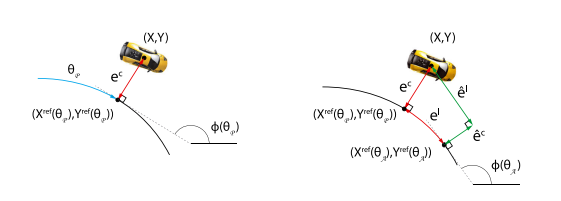
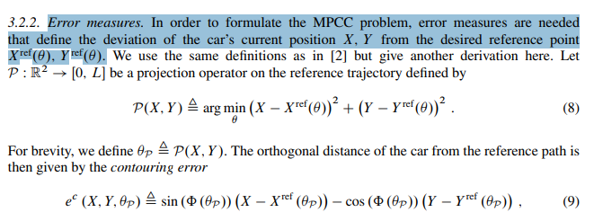
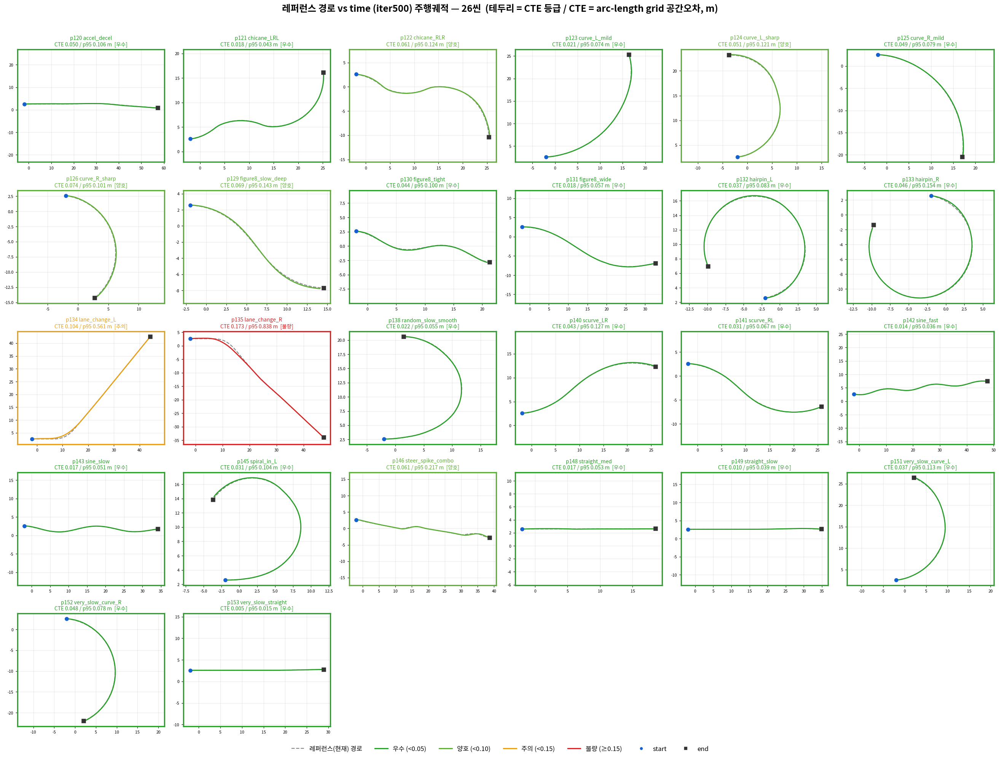
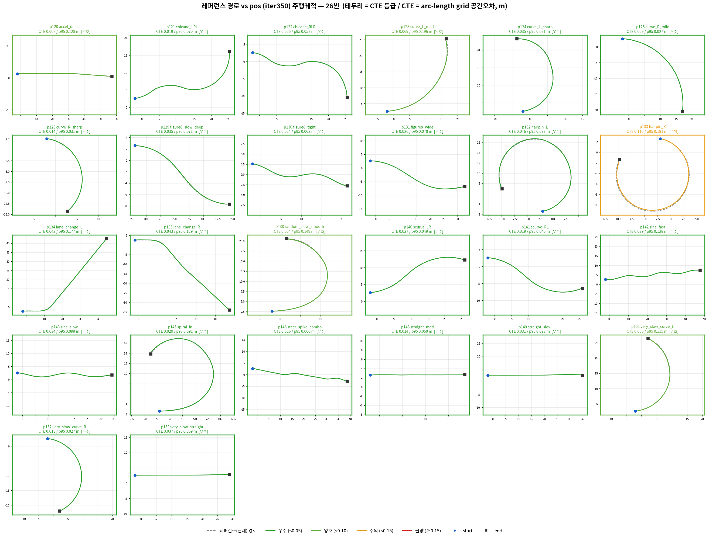

# Path-Following Evaluation and Disturbance-Robust RL Training

## 평가 지표 변경 (Path-Following 표준)

### metric 변경의 필요성

https://github.com/user-attachments/assets/71cc1e65-3f56-4483-8360-11ecb3ae9b70

* 위 영상에선 코너에서 time mode가 선제적으로 조향을 함
* 그럼에도 기존 정량 측정 지표로는 time mode 가 pos보다 우세하게 나옴 &rarr; 측정 오류가 있음

#### 기존 metric  

| 지표 | BC (2.3) | RL time | RL pos | BC 대비 개선 | 
|---|---|---|---|---| 
| **frame 거리오차 fm (m)** | 0.855 | **0.448** | 0.721 | **−48%** | 
| **횡오차 CTE (경로선 붙음, 실차 핵심, m)** | 0.232 | **0.051** | 0.059 | **−78%** | 
| **heading 오차 HE (°)** | 1.74 | 0.69 | **0.67** | **−62%** | 
| **lag (종방향 오차, m)** | 0.752 | **0.434** | 0.697 | **−42%** |

> $$\text{fm}^2 \approx \text{cte}^2 + \text{lag}^2$$

**문제점**: 너무 time 추종에 유리한 metric이며, CTE/HE 등이 차량이 목표점(ref car pos)를 time serial 하게 잘 추종한다면 오류가 없지만, 조금이라도 뒤쳐지는 순간 feedback이 오염이 발생.

* 실제 viewer를 통해 확인 시 경로 추종 능력은 `RL Pos`가 더 우수
     * 커브길에서 선제 조향 나타나지 않음 : time mode은 발생
* 잘못된 정량 지표 측정

#### 실제 RL의 목표

**RL의 목표**: 속도 오차가 있더라도, 해당 경로를 어떤 상황에서도 잘 따라가도록 하는 것, 외란 같이 특수한 상황이 발생했을때 이를 반영하여 경로 추종 능력을 유지하여 오차를 복구하는 것이 RL의 목표이다.

### Fair한 정량 측정 지표

**Optimization-based autonomous racing of 1:43 scale RC cars,2015** 선행 연구 참고

> 이 관점은 본 보고서의 metric 변경 방향과 연결된다. 즉, 고속 path-following 평가는 “같은 frame에서 reference와 얼마나 가까운가”가 아니라, **경로 상의 동일한 위치를 얼마나 잘 따라갔는가**, 그리고 **그 위치에 도달하는 pace가 reference 주행과 얼마나 다른가**를 분리해서 봐야 한다. 

1. pace : 경로 추종이 중요하더라도, time을 아예 무시할 순 없음 , path만 잘 따라도 너무 느리게 기어가면 좋은 주행이라고 보기 어렵고, sim2real 차량 제어에서도 reference speed profile을 어느 정도 따라야 하기 때문
>동일 기하의 주행에도 스포츠카의 주행과 자전거의 주행은 다르다

> 단 fair한 측정을 위해
* time: 같은 프레임에 어디에 있었는가 (x)
* **fair** : 동일 point x에 도달하는데 걸린 시간 (o)

2. arc-length average CTE/HE : 경로를 구간별로 분할하여, 해당 구간 길이 별 CTE/HE의 평균을 측정한다

    

projection하는 연산 P(X,Y)를 정의하고, reference path로부터의 orthogonal distance를 contouring error로 정의함. 이게 우리 nearest-point CTE (논문)

> frame 단위 평균은 “시간별 평균”이고, arc length average CTE/HE는 “경로 길이 기준 평균”

* cte,he 는 현재 차량의 위치에 nearest point를 기준으로 측정된다
* 지연에 따른 측정 오류를 막기 위함

## new metric

RL closed loop 성능 비교를 위한 최종 평가 기준이다.

#### 구조

| 구분 | 역할 | 승패 반영 |
|---|---|---|
| **Gate0** | 주행이 평가 가능한 정상 run인지 확인 | pass/fail 조건 |
| **Primary Path Metrics(main)** | 경로를 얼마나 잘 따라갔는지 평가 | main 평가 |
| **Primary Feasibility Metrics(main)** | 곡률 대비 말 되는 속도로 달렸는지 평가 | main 평가 |
| **Secondary Pace Metrics** | reference다운 속도/pace였는지 평가 | 보조 평가 |

- **Primary**: 메인 평가 기준, 경로를 얼마나 잘 따라갔는가
- **Feasibility**: 그 속도가 곡률 대비 물리적으로 말이 되는가
- **Secondary**: 그 경로를 얼마나 reference다운 pace로 달렸는가

**공간 기반 path-following 지표**로 판단하고, 시간 성능은 별도 표에서 해석한다.  
기존 `frame distance`, `lag`처럼 시간 인덱스에 묶인 지표는 primary에서 제외한다.

---

## 1. Gate0 — Gate fail이면 평가하지 않음
 
| 항목 | 기준 | 비고 |
|---|---|---|
| Completion | 완주율 | **시간 무관** — 공간 도달로만 판정 |
| Coverage | `coverage_ratio ≥ 0.90` | 아래 정의 참조 |
| Spinout | yaw rate + sideslip β 복합 판정 | 아래 정의 참조 |
| 전복 | \|roll\| > 0.8 rad | |

**coverage_ratio 정의**

횡방향 오차 비율을 넘지 않으며 `|CTE| < c_coverage` 방문한 s-grid cell 의 길이 비율.

**Spinout 정의 (복합)**

기준 heading 보다 커지면 차가 스핀 했다고 판단: `|yaw_rate| > N rad/s` 

## 2. Primary Metrics(메인 평가 지표)
 
| 지표 | 정의 |
|---|---|
| spatial \|CTE\| mean / p95 / max | s-grid 셀 평균 / 95분위 / 최대 |
| spatial \|HE\| mean / p95 / max | 위와 동일, 단위 deg |
| curve-only \|CTE\|/\|HE\| mean / p95 / max | \|κ\| 상위 30% 구간 / threshold 기반 |
| **pre-corner cutting** mean / max / integral | s-grid 구간 에서 `inside_cut = max(0, dir_inside · CTE_signed)` — 아래 부호 규약 |

**부호 규약**
> CTE>0 (경로 좌측): 좌커브 +1 / 우커브 −1 

ISO 8855 sign convention end-to-end: +X forward, +Y left, +Z up, +steer = right turn, +throttle = forward

구현 기준: `CTE_signed = -dx·sin θ + dy·cos θ` (θ = 경로 접선각, (dx,dy) = 차량 − 경로점).
법선 `(-sin θ, cos θ)` 는 heading 을 +90° 회전한 **좌측 법선**이므로 → **CTE_signed > 0 = 경로 좌측**.

 
## 3. Primary — Feasibility (참조속도 오차의 대체)
 
"곡률에 맞는 말이 되는 속도"의 직접 채점 — v_ref 대비 감속은 벌점이 아니다.
> reference가 17m/s로 지나가는데, 어떤 policy가 곡률/접지 상태를 보고 14m/s로 감속해서 path를 안정적으로 따라갔다면 이건 나쁜 게 아님.

| 지표 | 정의 |
|---|---|
| feasible overspeed mean / p95 / max | `max(0, v − v_feasible(s_hat))`, `v_feasible = √(a_safe / max(\|κ\|, 1e-3))` |
| a_lat violation ratio | `v²\|κ(s_hat)\| > a_safe` 인 방문 셀 길이 / 방문 총길이 |
 
* v_feasible: `가능한 속도` 라는 것인데, SDK에서 lateral 방향 그립력을 계산해서 `a_safe`를 측정하여 곡률에 맞는 속도를 계산

## 4. Secondary — Pace / Time (승패 미결정, 별도 표)
 
"스포츠카를 자전거 속도로 몰면 안 된다"의 채점 자리 — 단 정의는 공간 인덱스 기준.

| 지표 | 정의 |
|---|---|
| point-to-point time | checkpoint s ∈ {0.25S, 0.5S, 0.75S, S} 도달시각의 ref 대비 오차 RMS |
| finish time ratio | 완주시간 / ref 완주시간. **> 1.5 는 ⚠ 경고 표기 (탈락 아님)** |

## 5. Disturbance Recovery — 외란 주행 전용 평가

Disturbance Recovery는 RL의 핵심 목표인 “외란 발생 후 경로 추종 오차를 복구하는 능력”을 평가하기 위한 지표
>이 항목은 외란을 인위적으로 주입한 run에서만 산출하며, 무외란 run의 기본 평가표에는 포함하지 않는다.

외란은 고정된 path progress 위치 `s/S ∈ {0.30, 0.60}`에서 world 횡방향 선속도 임펄스로 주입한다.  
크기는 `Δv_lat ∈ {1.5, 3.0, 5.0} m/s`이며, 좌/우 양방향을 모두 평가한다.  
* 외란 주입 직전 `|CTE| < 0.3 m` 조건을 만족해야 한다. 이미 흐트러진 상태에 외란을 추가하면 복구 능력이 아니라 누적 실패를 측정하게 되기 때문이다.

복구 성능은 시간 기준이 아니라 arc-length 기준으로 측정한다. 

| 지표 | 정의 | 의미 |
|---|---|---|
| `peak` |CTE| after disturbance` | 외란 이후 recovery window 안의 최대 `|CTE|` | 외란 직후 최대 이탈량 |
| `recovery distance d_rec` | `s0`부터 |CTE|<`c_rec`로 복귀하고 일정 거리 유지될 때까지의 arc-length | **정상 path-following 상태로 돌아오는 데 필요한 거리** |
| `recovery success rate` | recovery window 안에 복귀한 run 비율 | 외란 복구 성공률 |
| `excursion area` | `∫` |CTE(s)| ds, `s0`부터 복귀점까지 | 이탈 크기와 지속 거리를 함께 반영한 누적 복구 비용 |

`c_rec`은 복구 판정용 임계값이며, coverage 계산에 사용하는 `c_coverage`와 별도로 정의한다.  
일시적인 threshold 통과를 복구로 오판하지 않기 위해, 복귀 후 `L_hold` m 이상 `|CTE| < c_rec` 상태를 유지해야 한다.

Recovery window 안에 복귀하지 못한 run은 실패로 처리하며, `d_rec = NaN`으로 기록하고 `recovery success rate`에만 반영한다. 실패 run을 평균 `d_rec`에 섞으면 실패가 은폐될 수 있기 때문이다.

## 결과: 26씬 정량 측정

측정 대상: **pos(iter350) vs time(iter500)**, 동일 BC+RL, brake on. 26씬(train) 개루프 주행 후 **arc-length grid(Δs=0.25m) 재파라미터화**로 공간 기준 산출(시간프레임 편향 제거). 완주(DNF) 0/26 — 두 모드 모두 전 씬 완주.

### 요약 — 26씬 평균

| 표 | 지표 | pos | time |
|---|---|---|---|
| A | Primary \|CTE\| mean (m) | **0.036** | 0.044 |
| B | 곡률존 \|CTE\| (m) | **0.041** | 0.066 |
| C | Primary \|HE\| (°) | **5.60** | 5.83 |
| D | Feasibility a_lat 위반율 (%) | 0.7 | 0.8 |
| E | Secondary 조향 (mrad/m) | **194** | 257 |

pos 가 전 지표 우세 — 곡률존 −38%, 조향 −25%, |CTE| −18%. time 은 p134·p135 고곡률에서 붕괴.

#### 표 비교

| 구분 | time 기반 | **position 기반** |
|:---:|:---:|:---:|
| 이전 metric  (before) |  |  |
| **새 metric**  (after) |  |  |

**요약**: pos 가 전 지표 우세. 곡률존 추종 −38%(0.041 vs 0.066), 조향 매끄러움 −25%(194 vs 257), |CTE| −18%(0.036 vs 0.044). time 은 p134·p135 고곡률 구간에서 붕괴(곡률 CTE 0.24·0.39). feasibility 위반은 두 모드 모두 p134·p135(고곡률)에서만 발생.

씬별 상세 표 A~E 펼치기

### 표 A — Primary |CTE| mean (m)
| 모드 | p120 | p121 | p122 | p123 | p124 | p125 | p126 | p129 | p130 | p131 | p132 | p133 | p134 | p135 | p138 | p140 | p141 | p142 | p143 | p145 | p146 | p148 | p149 | p151 | p152 | p153 | **평균** |
|---|---|---|---|---|---|---|---|---|---|---|---|---|---|---|---|---|---|---|---|---|---|---|---|---|---|---|---|
| pos | 0.062 | 0.019 | 0.025 | 0.069 | 0.035 | 0.009 | 0.014 | 0.035 | 0.024 | 0.026 | 0.046 | 0.116 | 0.042 | 0.043 | 0.054 | 0.027 | 0.019 | 0.039 | 0.034 | 0.029 | 0.026 | 0.014 | 0.031 | 0.050 | 0.018 | 0.037 | **0.036** |
| time | 0.050 | 0.018 | 0.061 | 0.021 | 0.051 | 0.049 | 0.074 | 0.069 | 0.044 | 0.018 | 0.037 | 0.046 | 0.104 | 0.173 | 0.022 | 0.043 | 0.031 | 0.014 | 0.017 | 0.031 | 0.061 | 0.017 | 0.010 | 0.037 | 0.048 | 0.005 | **0.044** |

### 표 B — 곡률존 |CTE| mean (m) — |κ| 상위 30% 구간
| 모드 | p120 | p121 | p122 | p123 | p124 | p125 | p126 | p129 | p130 | p131 | p132 | p133 | p134 | p135 | p138 | p140 | p141 | p142 | p143 | p145 | p146 | p148 | p149 | p151 | p152 | p153 | **평균** |
|---|---|---|---|---|---|---|---|---|---|---|---|---|---|---|---|---|---|---|---|---|---|---|---|---|---|---|---|
| pos | 0.062 | 0.013 | 0.018 | 0.121 | 0.043 | 0.009 | 0.014 | 0.014 | 0.010 | 0.024 | 0.048 | 0.130 | 0.076 | 0.069 | 0.025 | 0.033 | 0.019 | 0.053 | 0.022 | 0.033 | 0.036 | 0.012 | 0.049 | 0.068 | 0.016 | 0.046 | **0.041** |
| time | 0.044 | 0.011 | 0.067 | 0.040 | 0.069 | 0.047 | 0.071 | 0.094 | 0.060 | 0.034 | 0.051 | 0.033 | 0.244 | 0.388 | 0.026 | 0.072 | 0.026 | 0.017 | 0.025 | 0.050 | 0.098 | 0.012 | 0.022 | 0.055 | 0.049 | 0.009 | **0.066** |

### 표 C — Primary |HE| mean (deg)
| 모드 | p120 | p121 | p122 | p123 | p124 | p125 | p126 | p129 | p130 | p131 | p132 | p133 | p134 | p135 | p138 | p140 | p141 | p142 | p143 | p145 | p146 | p148 | p149 | p151 | p152 | p153 | **평균** |
|---|---|---|---|---|---|---|---|---|---|---|---|---|---|---|---|---|---|---|---|---|---|---|---|---|---|---|---|
| pos | 1.35 | 7.50 | 7.71 | 4.19 | 8.22 | 4.56 | 9.19 | 8.56 | 7.83 | 3.68 | 10.97 | 11.01 | 1.26 | 1.84 | 7.55 | 4.99 | 5.26 | 4.01 | 4.26 | 10.61 | 3.81 | 2.51 | 1.54 | 6.53 | 6.43 | 0.34 | **5.60** |
| time | 1.35 | 7.55 | 8.18 | 4.55 | 8.36 | 4.66 | 9.36 | 8.69 | 8.14 | 3.68 | 10.97 | 11.05 | 2.03 | 2.67 | 7.77 | 5.25 | 5.30 | 4.07 | 4.54 | 10.75 | 5.07 | 2.59 | 1.49 | 6.76 | 6.46 | 0.28 | **5.83** |

### 표 D — Feasibility a_lat 위반율 (%) — v²|κ| > 4.0 m/s²
| 모드 | p120 | p121 | p122 | p123 | p124 | p125 | p126 | p129 | p130 | p131 | p132 | p133 | p134 | p135 | p138 | p140 | p141 | p142 | p143 | p145 | p146 | p148 | p149 | p151 | p152 | p153 | **평균** |
|---|---|---|---|---|---|---|---|---|---|---|---|---|---|---|---|---|---|---|---|---|---|---|---|---|---|---|---|
| pos | 0.0 | 0.0 | 0.0 | 0.0 | 0.0 | 0.0 | 0.0 | 0.0 | 0.0 | 0.0 | 0.0 | 0.0 | 9.0 | 9.4 | 0.0 | 0.0 | 0.0 | 0.0 | 0.0 | 0.0 | 0.0 | 0.0 | 0.0 | 0.0 | 0.0 | 0.0 | **0.7** |
| time | 0.0 | 0.0 | 0.0 | 0.0 | 0.0 | 0.0 | 0.0 | 0.0 | 0.0 | 0.0 | 0.0 | 0.0 | 10.2 | 9.8 | 0.0 | 0.0 | 0.0 | 0.0 | 0.0 | 0.0 | 0.0 | 0.0 | 0.0 | 0.0 | 0.0 | 0.0 | **0.8** |

### 표 E — Secondary 조향 effort (mrad/m) — 거리기준
| 모드 | p120 | p121 | p122 | p123 | p124 | p125 | p126 | p129 | p130 | p131 | p132 | p133 | p134 | p135 | p138 | p140 | p141 | p142 | p143 | p145 | p146 | p148 | p149 | p151 | p152 | p153 | **평균** |
|---|---|---|---|---|---|---|---|---|---|---|---|---|---|---|---|---|---|---|---|---|---|---|---|---|---|---|---|
| pos | 81 | 237 | 216 | 203 | 254 | 184 | 290 | 268 | 247 | 163 | 218 | 198 | 107 | 111 | 255 | 223 | 200 | 138 | 155 | 227 | 181 | 141 | 140 | 231 | 200 | 177 | **194** |
| time | 113 | 281 | 254 | 293 | 323 | 215 | 311 | 399 | 343 | 251 | 292 | 182 | 138 | 133 | 310 | 288 | 299 | 176 | 257 | 306 | 238 | 215 | 254 | 277 | 212 | 311 | **257** |

#### 고속 주행 및 다양한 경로 데이터 추가

> 기존 checkpoint: RL_pos(iter350) 으로 미학습 고속 데이터 추론 결과
* 고속 + 커브 + 속도 변화

위와 같은 다양한 고속 데이터 주행 추가 중

---

## 학습 방법: PPO vs MPPI optimization Based

* **PPO** : 일반화 된 주행 모델을 만들기 위해서 env 별로 (scene,spawnpoint(frame))을 샘플링 하여 랜덤 소환 후, batch 단위로 업데이트
* **MPPI like Optimization** : 동일 scene에 여러 env를 병렬로 배치하고, 서로 다른 `residual/action` 후보 또는 `perturbation`을 주입한 뒤, `closed-loop path-following score`가 가장 좋은 후보를 선택·갱신한다. 이후 다른 scene에 대해서도 같은 최적화 과정을 반복한다.

#### MPPI Optimization Based 장점
* 특정 커브, 특정 고속 구간, 특정 지형에서 실패하는 이유를 집중 학습 가능
* state perturbation에 대한 복구 능력 향상
* hard case를 빠르게 개선 가능

#### 단점
* scene-specific overfitting
* 다음 scene으로 넘어갈 때 catastrophic forgetting
* curriculum 순서에 민감
* batch 다양성 감소

#### 의문점 : 복구 능력이 목표라면 GA(유전 알고리즘)이 더 낫지 않나?
> 아이디어 : scene 에 multi env로 병렬적으로 노이즈를 주어 복구 능력을 강화시킨다

* 특정 어려운 case들은 잘 고칠 수 있음
* scene에 과적합될 수 있음
* 다음 scene으로 넘어가며 같은 residual network를 계속 업데이트하면 이전 scene에서 배운 복구 전략이 덮어써질 수 있음

### PPO vs MPPI like Optimization based

| 항목        | PPO Residual Policy                                       | Scene-wise GA / MPPI-like Optimization                     |
| --------- | --------------------------------------------------------- | ---------------------------------------------------------- |
| 기본 아이디어   | 여러 scene/spawn 경험을 모아 공유 residual policy를 gradient update | 동일 scene/hard segment에서 여러 후보 보정을 병렬 rollout하고 best 후보를 선택 |
| 학습/최적화 단위 | shared policy                                             | scene 또는 hard segment                                      |
| 장점        | 일반화된 residual stabilizer 학습                               | 특정 failure case 집중 개선                                      |
| 위험        | reward/critic 설계 민감                                       | scene-specific overfitting, 순차 업데이트 시 forgetting           |
| 적합한 용도    | sim2real generalist policy                                | hard-case recovery tuning / failure-case optimizer         |

#### 관련 연구

Reinforcement Learning-Based Robust Vehicle Control for Autonomous Vehicle Trajectory Tracking, 2024

* RL 기반 model + Robust Optimization(correction) - 우리와 구조는 반대(MLP + RL PPO)
> 이 논문은 pure RL과 robust/model-based supervisor를 결합한 구조임. RL agent는 reward 기반으로 lap time이나 tracking을 최적화하지만, supervisor는 model-based prediction과 optimization constraints로 path tracking error를 제한함. 논문에서는 pure RL이 더 빠르지만 corner cutting과 tracking error violation이 발생할 수 있고, supervisor-based 구조는 lap time은 느려져도 tracking error 제한을 더 잘 만족한다고 설명함.

---

A Tube Linear Model Predictive Control Approach for Autonomous Vehicles Subjected to Disturbances, 2024

* MPC/optimization 기반 disturbance recovery : optimization 기반 외란 복구
> 논문은 disturbance가 autonomous vehicle path tracking과 obstacle avoidance 성능을 떨어뜨린다고 보고, tube linear MPC를 사용해 common disturbance 조건에서 constraint를 만족시키는 구조를 제안함. disturbance 조건에서 tube MPC는 모든 trajectory가 obstacle avoidance에 성공했지만, traditional MPC는 약 80%만 성공했다고 보고함
---

Reaching the Limit in Autonomous Racing: Optimal Control versus Reinforcement Learning, Science Robotics 2023

autonomous racing에서 optimization-based control과 RL을 직접 비교함. 분야는 차량이 아니라 drone racing
> 논문 설명에 따르면 optimal control은 trajectory 같은 중간 표현을 두고 planning/control을 분리하는데, 이 구조가 unmodeled effect나 한계 주행에서 표현 가능한 행동을 제한할 수 있다고 해석함. 반면 RL은 task-level objective를 직접 최적화하고 domain randomization으로 model uncertainty에 더 강한 반응을 찾을 수 있다고 설명

## privilige 정보 수정

### 이전 privilige 설계 (33D)
| 특권 정보 | 차원 | 내용 | 유지 여부 |
|---|---|---|---|
| `last_distances` | 4 | 바퀴별 레이캐스트 지면 거리 &rarr; real-world에서 practical하다고 보기 어려움 | 
| `omega` | 4 | 바퀴별 회전 각속도 (휠스핀/슬립 감지 &rarr; privilige 정보 아님) | 
| `last_compression` | 4 | 바퀴별 서스펜션 압축량 (접지 상태) &rarr;  privilige 정보 아님 | 
| `k_ex` | 10 | 먼 미래 곡률 (t+11~t+20 — actor의 lookahead보다 멀리) &rarr; 경로 preview 이지, 특권정보는 아님 |
| `a_ex` | 10 | 먼 미래 가속도 (t+11~t+20) &rarr; 경로 preview 이지만, 이는 reference속도에 time을 따라가라 라는 강한 제약 가능성 |
| `lag` | 1 | 스케줄 지연(m) |

#### 제거항목
| 항목                      | 이유                                           | 최종 판단            |
| ----------------------- | -------------------------------------------- | ---------------- |
| `last_distances`        | 바퀴별 raycast 지면 거리. real-world practical하지 않음 | **삭제**           |
| `lag`                   | time-schedule 기반 정보. path-first 목적과 충돌 가능    | **삭제**           |
| `exact future state`    | 미래 실제 상태는 oracle leakage                     | **사용 금지**        |
| `future reward/success` | 성공 여부 oracle                                 | **사용 금지**        |

### 수정 설계 (Privilege → Critic Observation, 21D)

> Privilege라는 표현은 과함 &rarr; **Critic Obs**로 변경.
> 선정 원칙 3가지:
> 1. `Real2Sim/Sim2Real` 관점에서 실차에서 practical하게 얻을 수 있는 신호만 사용 
> 2. **비중복 기준**: 다른 입력으로부터 한 스텝(선형/준선형)에 유도 가능한 항목은 제외  
> 3. critic에는 clean 값 사용 (노이즈 주입은 actor 승격 시에만). 정규화 필수 (omega ~수십 rad/s vs compression ~수 cm)

| 항목 | 차원 | Source | 분류 | 최종 판단 |
| --- | -: | --- | --- | --- |
| `suspension_compression` | 4 | suspension travel sensor | deployable sensor obs | **사용** — **하중이동** 직접 신호. 좌우 비대칭이 코너 정보: 4D 유지 |
| `wheel_omega` | 4 | wheel encoder / motor RPM | deployable sensor obs | **사용** — **슬립** 간접 신호 (v_long과의 조합은 네트워크에 위임) |
| `body_accel` | 3 | IMU | deployable sensor obs | **사용** — a_y(횡가속)가 핵심 신규 신호, a_z는 **접지**/요철 |
| `yaw_rate` | 1 | IMU gyro | deployable sensor obs | **사용** — actor에 없는 유일한 gyro 신규 신호. 정상 선회 관계 yaw_rate ≈ v·κ의 이탈 = 오버/언더스티어 감지 → 외란 복구 학습의 핵심 |
| `v_lat` | 1 | VIO/GPS+IMU 융합 추정 | estimated obs | **사용** — 슬립각의 **현재값**. 원신호들과 적분 관계(한 스텝 유도 불가)라 직접 제공 가치 있음. 실차 표준 추정량 |
| `k_ex` (5pt 서브샘플, t+12~+20) | 5 | planner path preview | planner-provided preview | **사용** — preview는 매끄러워 10→5 압축 손실 미미 |
| `time_to_next_hard_curve` | 1 | planner preview 유도 | planner-provided preview | **사용** — 10pt preview의 argmax·거리 환산이라는 **비자명 조합** → 비중복 기준 통과. value가 배워야 할 것("곧 비싸진다")의 스칼라 요약 = credit assignment 가속 |
| `next_curve_severity` | 1 | planner preview 유도 (max\|κ\| ahead) | planner-provided preview | **사용** — 위와 동일 논리 (**강한 곡률** 요약) |
| `progress (s/S)` | 1 | 학습 시 계산 | episode context | **사용** — 랜덤 spawn 커리큘럼의 return 분산을 critic이 흡수 |
| `spawn_init_speed / stage` | 1 | 학습 시 계산 | episode context | **사용** |

**합계 21D** = compression 4 + omega 4 + accel 3 + yaw_rate 1 + v_lat 1 + k_ex 5 + curve 요약 2 + context 2

**제외 이력 (ablation 후보 순위)**: ① slip_proxy 2D ② pitch/roll rate 2D ③ a_ex 10D : 대비 격차가 유의하면 이 순서로 복원 실험

## 외란 설계

https://github.com/user-attachments/assets/aac06905-8f9d-4323-bf87-891eaa3697ea

https://github.com/user-attachments/assets/ffd92700-8d7c-4d82-9331-04514bec7300

RL-외란 의 목표는 nominal 궤적을 그대로 재현하는 게 아니라 **교란이 있어도 경로 추종을 유지·복구**하는 것이다. 이를 위해 주행 중 무작위 외란을 주입하고 그로부터 복구하는 법을 학습시킨다.

**공통 원칙**

- 모든 주행 중 외란은 **정상 추종 상태(경로 이탈이 작을 때)에서만** 발동한다. 이미 흐트러진 상태에 외란을 더하면 "복구"가 아니라 "누적 실패"를 학습하기 때문.
- 강도는 학습 초반 0에서 시작해 서서히 키운다(커리큘럼). 처음부터 최대 외란을 주면 아직 미숙한 정책이 붕괴한다.
- 일부 env 만 교란하고 나머지는 무외란으로 둔다 — 외란 대응에만 과보수화되어 정상 주행이 나빠지는 것을 막는 baseline.

### 외란 종류

| 외란 | 모사하는 실제 상황 | 무엇을 교란하나 | 강도 | 발동 시점 | 상태 |
|---|---|---|---|---|---|
| **초기조건** (spawn) | 출발 지점의 위치·자세·속도 오차 | 에피소드 시작 상태 | 횡 ±0.8m, 방향 ±8°, 속도 ±20% | 리셋 시 | 채택 |
| **횡충격** (kick) | 옆바람·노면 단차에 차가 옆으로 밀림 | 주행 중 횡방향 속도 | 0.5~2.0 m/s, 좌우 랜덤 | 정상 주행 중 | 채택 |
| **조향교란** (steer) | 빙판·단차·조향 글리치로 핸들이 튐 | 주행 중 조향 입력 | ≈6~14°, 좌우 랜덤, 약 0.08초 지속 | 정상 주행 중 | **진행중** |
| **강제제동** (brake) | 급제동·브레이크 끌림 | 브레이크 강제 인가 | — | — | **보류** — 지속 제동이 데드락 심화 |

**핵심 구분**: 외란은 "차가 실제로 겪을 수 있는 물리적 사건"이어야 한다

| 외란 조합 | 결과 |
|---|---|
| 횡충격만 / 초기조건만 / **횡충격+초기조건** | 전부 생존 (최대 강도까지 안정) |
| **횡충격+초기조건+자세회전** | 전부 데드락 |

### 단계적(staged) 학습 

curriculum learning : 쉬운 disturb부터 단계적으로 학습

| 단계 | 출발점 | 주입 외란 | 목적 | 영상(클릭 시 재생) |
|---|---|---|---|
| **A** | 깨끗한 추종본 | 초기조건 + 횡충격 | 외란 강건 정책 확보 (검증된 안전 구성) | - |
| **B** | **A 결과 정책** | + 조향교란 | 핸들 튐 복구까지 학습 | -|
| **C** | **B 결과 정책** | + 강제제동 | 급제동·브레이크 끌림 복구까지 학습 | - |

### 발동 조건 완화 (커버리지)

* 횡충격의 발동 게이트가 너무 엄격하면(이탈이 아주 작을 때만) 직선·완만한 구간에만 외란이 몰림 → **커브 중 복구를 학습하지 못함** 
* 게이트를 넓혀(이탈 허용폭 확대) 커브·회복 중 상태까지 외란 허용