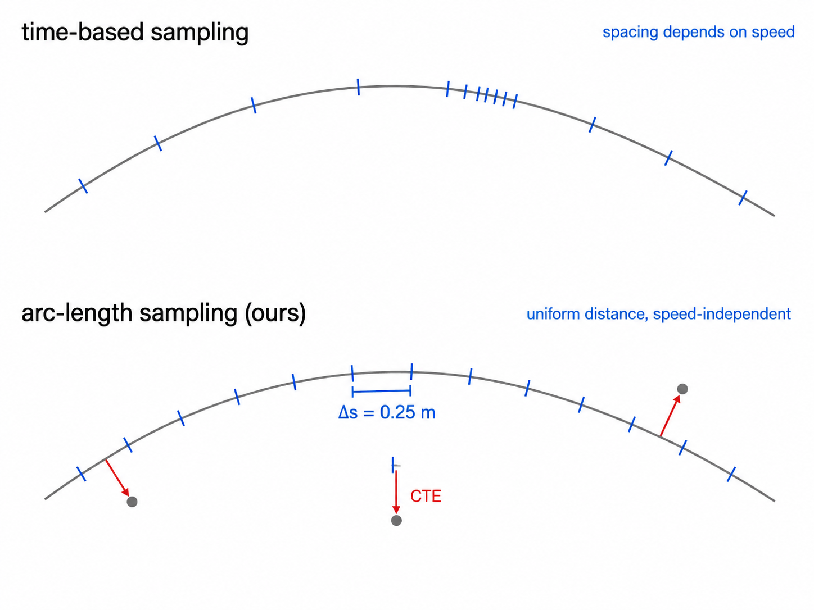
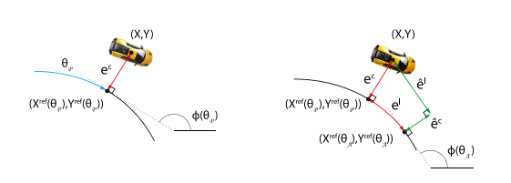
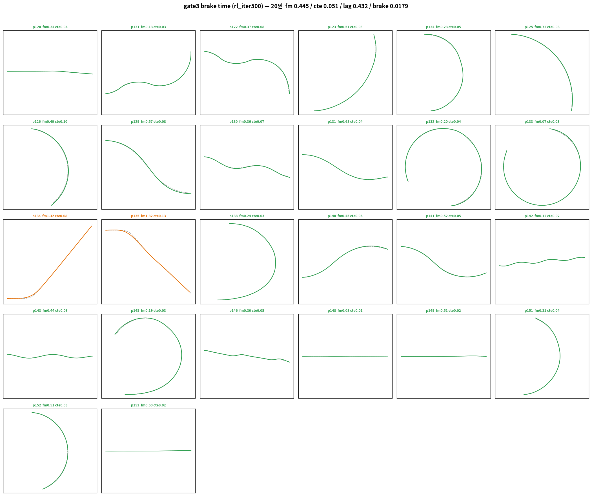
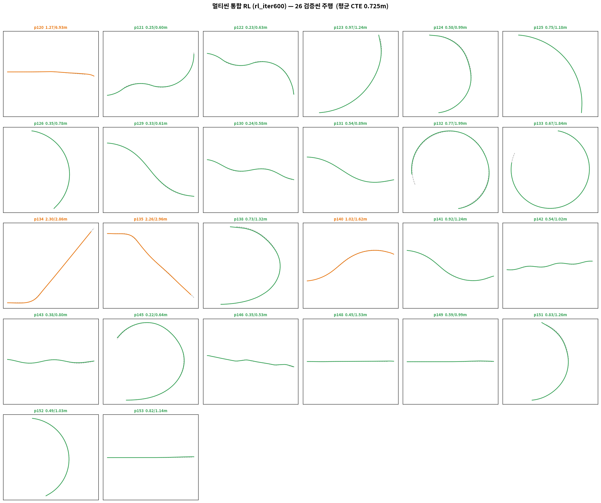
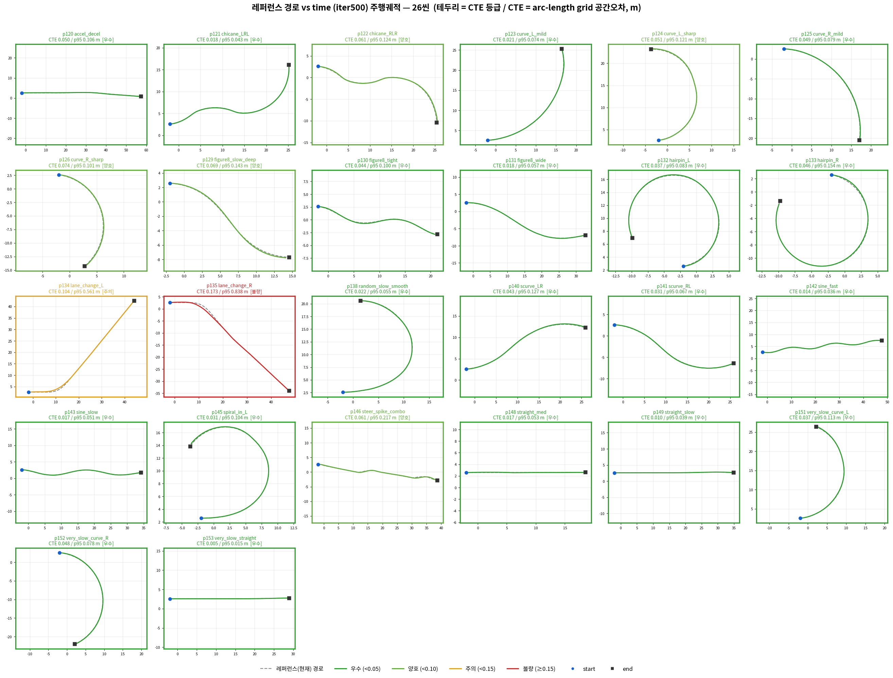
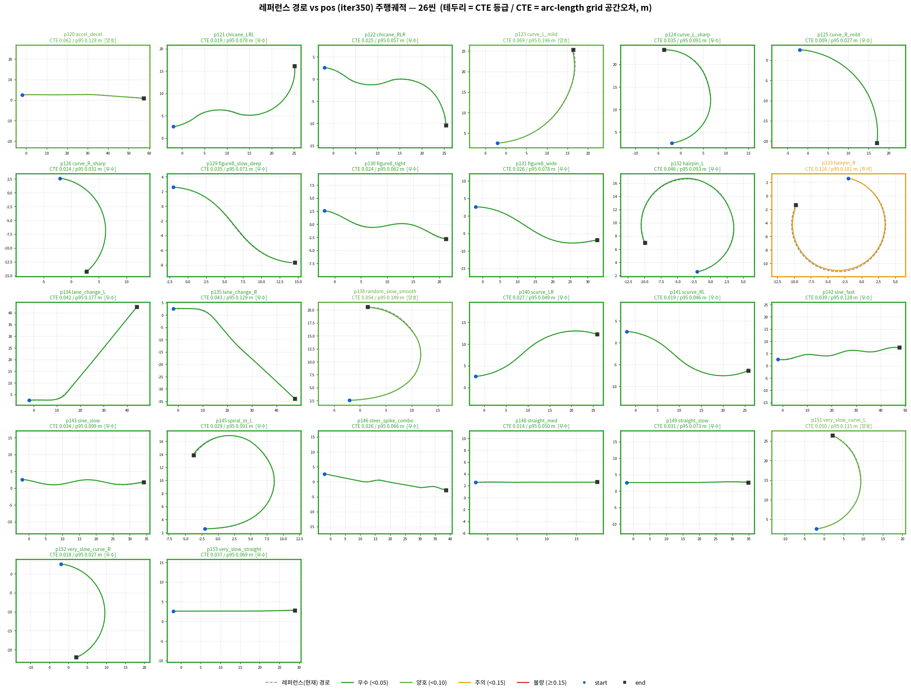
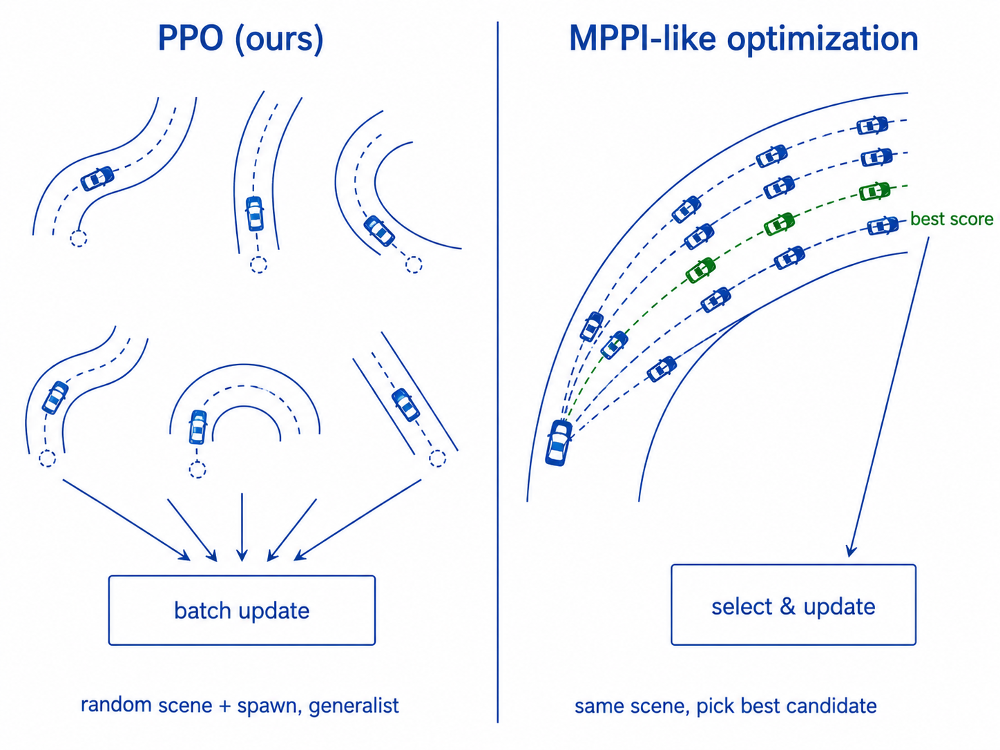
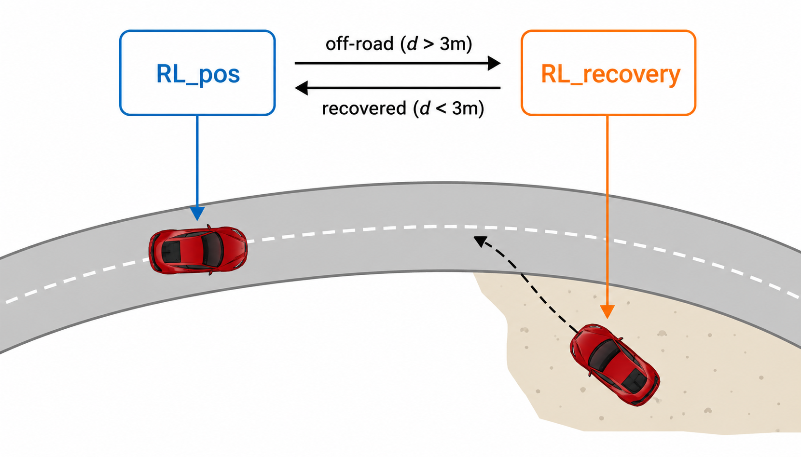
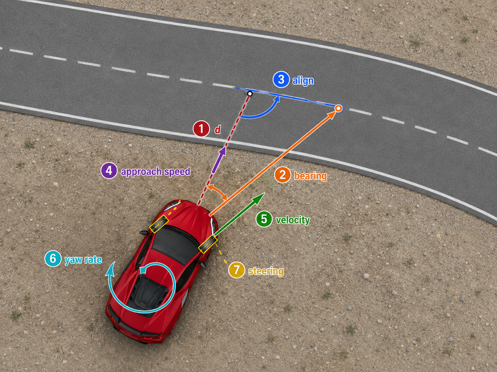

# Path-Following Evaluation and Disturbance-Robust RL Training

## 평가 지표 변경 (Path-Following 표준)

### metric 변경의 필요성

https://github.com/user-attachments/assets/71cc1e65-3f56-4483-8360-11ecb3ae9b70

* 코너 구간에서 `time mode`의 선제적 조향 발생
* 그럼에도 기존 정량 측정 지표로는 `time mode` > `pos`보다 우세하게 나옴 &rarr; 측정에 문제가 있음을 발견

#### 기존 metric  

| 지표 | BC (2.3) | RL time | RL pos | BC 대비 개선 | 
|---|---|---|---|---| 
| **frame 거리오차 fm (m)** | 0.855 | **0.448** | 0.721 | **−48%** | 
| **횡오차 CTE (경로선 붙음, 실차 핵심, m)** | 0.232 | **0.051** | 0.059 | **−78%** | 
| **heading 오차 HE (°)** | 1.74 | 0.69 | **0.67** | **−62%** | 
| **lag (종방향 오차, m)** | 0.752 | **0.434** | 0.697 | **−42%** |

> $$\text{fm}^2 \approx \text{cte}^2 + \text{lag}^2$$

**문제점**: 너무 time 추종에 유리한 metric이며, CTE/HE 등이 차량이 목표점(ref car pos)를 time serial 하게 잘 추종한다면 오류가 없지만, 조금이라도 뒤쳐지는 순간 feedback이 오염이 발생.

* 정량 평가는 `time`이 우세했지만, 실제 viewer를 통해 확인 시 경로 추종 능력은 `RL Pos`가 더 우수
* 잘못된 정량 지표 측정
  * 문제: 커브길에서 선제 조향 나타나지 않음 : time mode은 발생

#### RL의 목표 정리

* 속도 오차가 있더라도, 해당 경로를 **어떤 상황에서도** 잘 따라가도록 하는 것, 
* **외란** 같이 특수한 상황이 발생했을때 이를 반영하여 **경로 추종 능력**을 유지하여 **오차를 복구**하는 것이 RL의 목표이다.

### Fair한 정량 측정 지표

**Optimization-based autonomous racing of 1:43 scale RC cars,2015** 선행 연구 참고

> 이 관점은 본 보고서의 metric 변경 방향과 연결된다. 즉, 고속 path-following 평가는 “같은 frame에서 reference와 얼마나 가까운가”가 아니라, **경로 상의 동일한 위치를 얼마나 잘 따라갔는가**, 그리고 **그 위치에 도달하는 pace가 reference 주행과 얼마나 다른가**를 분리해서 봐야 한다. 

1. pace : 경로 추종이 중요하더라도, time을 아예 무시할 순 없음 , path만 잘 따라도 너무 느리게 기어가면 좋은 주행이라고 보기 어려움. 

>동일 궤적의 주행이더라도, 스포츠카의 주행과 자전거의 주행은 다르다

* time: 같은 프레임에 어디에 있었는가 (x)
* **fair** : 동일 point x에 도달하는데 걸린 시간 (o)

2. arc-length average CTE/HE : 경로를 **구간별로 분할**하여, 해당 구간 길이 별 CTE/HE의 평균을 측정한다

> 기존 metric 평균은 “시간별 평균”이고, arc length average CTE/HE는 “경로 길이 기준 평균”

3. CTE/HE 계산은 차량과 heading 방향과 나란한 nearest point(ref point) 기준으로 계산

* 속도 지연에 따른 측정 오류를 막기 위함

## new metric 

RL closed loop 성능 비교를 위한 최종 평가 기준이다.

#### 단계

| 구분 | 역할 | 승패 반영 |
|---|---|---|
| **Gate0** | 주행이 평가 가능한 정상 run인지 확인 | pass/fail 조건 |
| **Primary Path Metrics(main)** | 경로를 얼마나 잘 따라갔는지 평가 | main 평가 |
| **Primary Feasibility Metrics(main)** | 곡률 대비 말 되는 속도로 달렸는지 평가 | main 평가 |
| **Secondary Pace Metrics** | reference다운 속도/pace였는지 평가 | 보조 평가 |

- **Primary**: 메인 평가 기준, 경로를 얼마나 잘 따라갔는가
- **Feasibility**: 그 속도가 곡률 대비 물리적으로 말이 되는가
- **Secondary**: 그 경로를 얼마나 reference다운 pace로 달렸는가

**공간 기반 path-following 지표**로 판단하고, 시간 성능은 별도 표에서 해석한다.  
기존 `frame distance`, `lag`처럼 시간 인덱스에 묶인 지표는 primary에서 제외한다.

---

## 1. Gate0 — Gate fail이면 평가하지 않음(평균 오염 방지)
 
| 항목 | 기준 | 비고 |
|---|---|---|
| Completion | 완주율 | **시간 무관** — 공간 도달로만 판정 |
| Coverage | `coverage_ratio ≥ 0.90` | 외란 평가시 미사용 |
| Spinout | yaw rate + sideslip β 복합 판정 | 외란 평가시 미사용 |
| 전복 | \|roll\| > 0.8 rad | |

**coverage_ratio 정의**

횡방향 오차 비율을 넘지 않으며 `|CTE| < c_coverage` 방문한 s-grid cell 의 길이 비율.

**Spinout 정의 (복합)**

기준 heading 보다 커지면 차가 스핀 했다고 판단: `|yaw_rate| > N rad/s` 

## 2. Primary Metrics(메인 평가 지표)
 
| 지표 | 정의 |
|---|---|
| spatial \|CTE\| mean / p95 / max | s-grid 셀 평균 / 95분위 / 최대 |
| spatial \|HE\| mean / p95 / max | 위와 동일, 단위 deg |
| curve-only \|CTE\|/\|HE\| mean / p95 / max | \|κ\| 상위 30% 구간 / threshold 기반 |
| **pre-corner cutting** mean / max / integral | s-grid 구간 에서 `inside_cut = max(0, dir_inside · CTE_signed)` — 아래 부호 규약 |

**부호 규약**
> CTE>0 (경로 좌측): 좌커브 +1 / 우커브 −1 

ISO 8855 sign convention end-to-end: +X forward, +Y left, +Z up, +steer = right turn, +throttle = forward

구현 기준: `CTE_signed = -dx·sin θ + dy·cos θ` (θ = 경로 접선각, (dx,dy) = 차량 − 경로점).
법선 `(-sin θ, cos θ)` 는 heading 을 +90° 회전한 **좌측 법선**이므로 → **CTE_signed > 0 = 경로 좌측**.

 
## 3. Primary — Feasibility (참조속도 오차의 대체)
 
"곡률에 맞는 말이 되는 속도"의 직접 채점 — v_ref 대비 감속은 벌점이 아니다.
> reference가 17m/s로 지나가는데, 어떤 policy가 곡률/접지 상태를 보고 14m/s로 감속해서 path를 안정적으로 따라갔다면 이건 나쁜 게 아님.

| 지표 | 정의 |
|---|---|
| feasible overspeed mean / p95 / max | `max(0, v − v_feasible(s_hat))`, `v_feasible = √(a_safe / max(\|κ\|, 1e-3))` |
| a_lat violation ratio | `v²\|κ(s_hat)\| > a_safe` 인 방문 셀 길이 / 방문 총길이 |
 
* v_feasible: `가능한 속도` 라는 것인데, SDK에서 lateral 방향 그립력을 계산해서 `a_safe`를 측정하여 곡률에 맞는 속도를 계산

## 4. Secondary — Pace / Time (승패 미결정, 별도 표)
 
"스포츠카를 자전거 속도로 몰면 안 된다"의 채점 자리 — 단 정의는 공간 인덱스 기준.

| 지표 | 정의 |
|---|---|
| point-to-point time | checkpoint s ∈ {0.25S, 0.5S, 0.75S, S} 도달시각의 ref 대비 오차 RMS |
| finish time ratio | 완주시간 / ref 완주시간. **> 1.5 는 ⚠ 경고 표기 (탈락 아님)** |

## 5. Disturbance Recovery — 외란 주행 전용 평가

Disturbance Recovery는 RL의 핵심 목표인 “외란 발생 후 경로 추종 오차를 복구하는 능력”을 평가하기 위한 지표
>이 항목은 외란을 인위적으로 주입한 run에서만 산출하며, 무외란 run의 기본 평가표에는 포함하지 않는다.

외란은 고정된 path progress 위치 `s/S ∈ {0.30, 0.60}`에서 world 횡방향 선속도 임펄스로 주입한다.  
크기는 `Δv_lat ∈ {1.5, 3.0, 5.0} m/s`이며, 좌/우 양방향을 모두 평가한다.  
* 외란 주입 직전 `|CTE| < 0.3 m` 조건을 만족해야 한다. 이미 흐트러진 상태에 외란을 추가하면 복구 능력이 아니라 누적 실패를 측정하게 되기 때문이다.

복구 성능은 시간 기준이 아니라 arc-length 기준으로 측정한다. 

| 지표 | 정의 | 의미 |
|---|---|---|
| `peak` |CTE| after disturbance` | 외란 이후 recovery window 안의 최대 `|CTE|` | 외란 직후 최대 이탈량 |
| `recovery distance` | `s0`부터 |CTE|<`c_rec`로 복귀하고 일정 거리 유지될 때까지의 arc-length | **정상 상태로 돌아오는 데 필요한 거리** |
| `recovery success rate` | recovery window 안에 복귀한 run 비율 | 외란 복구 성공률 |
| `excursion area` | `∫` |CTE(s)| ds, `s0`부터 복귀점까지 | 이탈 크기와 지속 거리를 함께 반영한 누적 복구 비용 |

`c_rec`은 복구 판정용 임계값이며, coverage 계산에 사용하는 `c_coverage`와 별도로 정의한다.  
일시적인 threshold 통과를 복구로 오판하지 않기 위해, 복귀 후 `L_hold` m 이상 `|CTE| < c_rec` 상태를 유지해야 한다.

Recovery window 안에 복귀하지 못한 run은 실패로 처리하며, `d_rec = NaN`으로 기록하고 `recovery success rate`에만 반영한다. 실패 run을 평균 `d_rec`에 섞으면 실패가 은폐될 수 있기 때문이다.

## 결과: 26씬 정량 측정

측정 대상: **pos(iter350) vs time(iter500)**

### 요약 — 26씬 평균

| 표 | 지표 | pos | time |
|---|---|---|---|
| A | Primary \|CTE\| mean (m) | **0.036** | 0.044 |
| B | 곡률존 \|CTE\| (m) | **0.041** | 0.066 |
| C | Primary \|HE\| (°) | **5.60** | 5.83 |
| D | Feasibility a_lat 위반율 (%) | 0.7 | 0.8 |
| E | Secondary 조향 (mrad/m) | **194** | 257 |

**pos 가 전 지표 우세** 

* 곡률존 오차 38% 우위
* 조향 −25% 우위
* |CTE| 18% 우위
* time 은 p134·p135 고곡률에서 붕괴.

#### 표 비교

| 구분 | time 기반 | **position 기반** |
|:---:|:---:|:---:|
| 이전 metric  (before) |  |  |
| **새 metric**  (after) |  |  |

씬별 상세 표 A~E 펼치기

### 표 A — Primary |CTE| mean (m)
| 모드 | p120 | p121 | p122 | p123 | p124 | p125 | p126 | p129 | p130 | p131 | p132 | p133 | p134 | p135 | p138 | p140 | p141 | p142 | p143 | p145 | p146 | p148 | p149 | p151 | p152 | p153 | **평균** |
|---|---|---|---|---|---|---|---|---|---|---|---|---|---|---|---|---|---|---|---|---|---|---|---|---|---|---|---|
| pos | 0.062 | 0.019 | 0.025 | 0.069 | 0.035 | 0.009 | 0.014 | 0.035 | 0.024 | 0.026 | 0.046 | 0.116 | 0.042 | 0.043 | 0.054 | 0.027 | 0.019 | 0.039 | 0.034 | 0.029 | 0.026 | 0.014 | 0.031 | 0.050 | 0.018 | 0.037 | **0.036** |
| time | 0.050 | 0.018 | 0.061 | 0.021 | 0.051 | 0.049 | 0.074 | 0.069 | 0.044 | 0.018 | 0.037 | 0.046 | 0.104 | 0.173 | 0.022 | 0.043 | 0.031 | 0.014 | 0.017 | 0.031 | 0.061 | 0.017 | 0.010 | 0.037 | 0.048 | 0.005 | **0.044** |

### 표 B — 곡률존 |CTE| mean (m) — |κ| 상위 30% 구간
| 모드 | p120 | p121 | p122 | p123 | p124 | p125 | p126 | p129 | p130 | p131 | p132 | p133 | p134 | p135 | p138 | p140 | p141 | p142 | p143 | p145 | p146 | p148 | p149 | p151 | p152 | p153 | **평균** |
|---|---|---|---|---|---|---|---|---|---|---|---|---|---|---|---|---|---|---|---|---|---|---|---|---|---|---|---|
| pos | 0.062 | 0.013 | 0.018 | 0.121 | 0.043 | 0.009 | 0.014 | 0.014 | 0.010 | 0.024 | 0.048 | 0.130 | 0.076 | 0.069 | 0.025 | 0.033 | 0.019 | 0.053 | 0.022 | 0.033 | 0.036 | 0.012 | 0.049 | 0.068 | 0.016 | 0.046 | **0.041** |
| time | 0.044 | 0.011 | 0.067 | 0.040 | 0.069 | 0.047 | 0.071 | 0.094 | 0.060 | 0.034 | 0.051 | 0.033 | 0.244 | 0.388 | 0.026 | 0.072 | 0.026 | 0.017 | 0.025 | 0.050 | 0.098 | 0.012 | 0.022 | 0.055 | 0.049 | 0.009 | **0.066** |

### 표 C — Primary |HE| mean (deg)
| 모드 | p120 | p121 | p122 | p123 | p124 | p125 | p126 | p129 | p130 | p131 | p132 | p133 | p134 | p135 | p138 | p140 | p141 | p142 | p143 | p145 | p146 | p148 | p149 | p151 | p152 | p153 | **평균** |
|---|---|---|---|---|---|---|---|---|---|---|---|---|---|---|---|---|---|---|---|---|---|---|---|---|---|---|---|
| pos | 1.35 | 7.50 | 7.71 | 4.19 | 8.22 | 4.56 | 9.19 | 8.56 | 7.83 | 3.68 | 10.97 | 11.01 | 1.26 | 1.84 | 7.55 | 4.99 | 5.26 | 4.01 | 4.26 | 10.61 | 3.81 | 2.51 | 1.54 | 6.53 | 6.43 | 0.34 | **5.60** |
| time | 1.35 | 7.55 | 8.18 | 4.55 | 8.36 | 4.66 | 9.36 | 8.69 | 8.14 | 3.68 | 10.97 | 11.05 | 2.03 | 2.67 | 7.77 | 5.25 | 5.30 | 4.07 | 4.54 | 10.75 | 5.07 | 2.59 | 1.49 | 6.76 | 6.46 | 0.28 | **5.83** |

### 표 D — Feasibility a_lat 위반율 (%) — v²|κ| > 4.0 m/s²
| 모드 | p120 | p121 | p122 | p123 | p124 | p125 | p126 | p129 | p130 | p131 | p132 | p133 | p134 | p135 | p138 | p140 | p141 | p142 | p143 | p145 | p146 | p148 | p149 | p151 | p152 | p153 | **평균** |
|---|---|---|---|---|---|---|---|---|---|---|---|---|---|---|---|---|---|---|---|---|---|---|---|---|---|---|---|
| pos | 0.0 | 0.0 | 0.0 | 0.0 | 0.0 | 0.0 | 0.0 | 0.0 | 0.0 | 0.0 | 0.0 | 0.0 | 9.0 | 9.4 | 0.0 | 0.0 | 0.0 | 0.0 | 0.0 | 0.0 | 0.0 | 0.0 | 0.0 | 0.0 | 0.0 | 0.0 | **0.7** |
| time | 0.0 | 0.0 | 0.0 | 0.0 | 0.0 | 0.0 | 0.0 | 0.0 | 0.0 | 0.0 | 0.0 | 0.0 | 10.2 | 9.8 | 0.0 | 0.0 | 0.0 | 0.0 | 0.0 | 0.0 | 0.0 | 0.0 | 0.0 | 0.0 | 0.0 | 0.0 | **0.8** |

### 표 E — Secondary 조향 effort (mrad/m) — 거리기준
| 모드 | p120 | p121 | p122 | p123 | p124 | p125 | p126 | p129 | p130 | p131 | p132 | p133 | p134 | p135 | p138 | p140 | p141 | p142 | p143 | p145 | p146 | p148 | p149 | p151 | p152 | p153 | **평균** |
|---|---|---|---|---|---|---|---|---|---|---|---|---|---|---|---|---|---|---|---|---|---|---|---|---|---|---|---|
| pos | 81 | 237 | 216 | 203 | 254 | 184 | 290 | 268 | 247 | 163 | 218 | 198 | 107 | 111 | 255 | 223 | 200 | 138 | 155 | 227 | 181 | 141 | 140 | 231 | 200 | 177 | **194** |
| time | 113 | 281 | 254 | 293 | 323 | 215 | 311 | 399 | 343 | 251 | 292 | 182 | 138 | 133 | 310 | 288 | 299 | 176 | 257 | 306 | 238 | 215 | 254 | 277 | 212 | 311 | **257** |

#### 고속 주행 및 다양한 경로 데이터 추가

https://github.com/user-attachments/assets/c8fbfca5-eb12-4e2c-8bd0-d3595012f5c5

> 기존 checkpoint: RL_pos(iter350) 으로 미학습 고속 데이터 추론 결과
* 고속 + 커브 + 속도 변화

위와 같은 다양한 고속 데이터 주행 추가 중

---

## 학습 방법: PPO vs MPPI optimization Based

* **PPO** : 일반화 된 주행 모델을 만들기 위해서 env 별로 (scene,spawnpoint(frame))을 샘플링 하여 랜덤 소환 후, batch 단위로 업데이트
* **MPPI like Optimization** : 동일 scene에 여러 env를 병렬로 배치하고, 서로 다른 `residual/action` 후보 또는 `perturbation`을 주입한 뒤, `closed-loop path-following score`가 가장 좋은 후보를 선택·갱신한다. 이후 다른 scene에 대해서도 같은 최적화 과정을 반복한다.

#### MPPI Optimization Based 장점
* 특정 커브, 특정 고속 구간, 특정 지형에서 실패하는 이유를 집중 학습 가능
* state perturbation에 대한 복구 능력 향상
* hard case를 빠르게 개선 가능

#### 단점
* scene-specific overfitting
* 다음 scene으로 넘어갈 때 catastrophic forgetting
* curriculum 순서에 민감
* batch 다양성 감소

#### 의문점 : 복구 능력이 목표라면 GA(유전 알고리즘)이 더 낫지 않나?
> 아이디어 : scene 에 multi env로 병렬적으로 노이즈를 주어 복구 능력을 강화시킨다

* 특정 어려운 case들은 잘 고칠 수 있음
* scene에 과적합될 수 있음
* 다음 scene으로 넘어가며 같은 residual network를 계속 업데이트하면 이전 scene에서 배운 복구 전략이 덮어써질 수 있음

### PPO vs MPPI like Optimization based

| 항목        | PPO Residual Policy                                       | Scene-wise GA / MPPI-like Optimization                     |
| --------- | --------------------------------------------------------- | ---------------------------------------------------------- |
| 기본 아이디어   | 여러 scene/spawn 경험을 모아 공유 residual policy를 gradient update | 동일 scene/hard segment에서 여러 후보 보정을 병렬 rollout하고 best 후보를 선택 |
| 학습/최적화 단위 | shared policy                                             | scene 또는 hard segment                                      |
| 장점        | 일반화된 residual stabilizer 학습                               | 특정 failure case 집중 개선                                      |
| 위험        | reward/critic 설계 민감                                       | scene-specific overfitting, 순차 업데이트 시 forgetting           |
| 적합한 용도    | sim2real generalist policy                                | hard-case recovery tuning / failure-case optimizer         |

#### 관련 연구

Reinforcement Learning-Based Robust Vehicle Control for Autonomous Vehicle Trajectory Tracking, 2024

* RL 기반 model + Robust Optimization(correction) - 우리와 구조는 반대(MLP + RL PPO)
> 이 논문은 pure RL과 robust/model-based supervisor를 결합한 구조임. RL agent는 reward 기반으로 lap time이나 tracking을 최적화하지만, supervisor는 model-based prediction과 optimization constraints로 path tracking error를 제한함. 논문에서는 pure RL이 더 빠르지만 corner cutting과 tracking error violation이 발생할 수 있고, supervisor-based 구조는 lap time은 느려져도 tracking error 제한을 더 잘 만족한다고 설명함.

---

A Tube Linear Model Predictive Control Approach for Autonomous Vehicles Subjected to Disturbances, 2024

* MPC/optimization 기반 disturbance recovery : optimization 기반 외란 복구
> 논문은 disturbance가 autonomous vehicle path tracking과 obstacle avoidance 성능을 떨어뜨린다고 보고, tube linear MPC를 사용해 common disturbance 조건에서 constraint를 만족시키는 구조를 제안함. disturbance 조건에서 tube MPC는 모든 trajectory가 obstacle avoidance에 성공했지만, traditional MPC는 약 80%만 성공했다고 보고함
---

Reaching the Limit in Autonomous Racing: Optimal Control versus Reinforcement Learning, Science Robotics 2023

autonomous racing에서 optimization-based control과 RL을 직접 비교함. 분야는 차량이 아니라 drone racing
> 논문 설명에 따르면 optimal control은 trajectory 같은 중간 표현을 두고 planning/control을 분리하는데, 이 구조가 unmodeled effect나 한계 주행에서 표현 가능한 행동을 제한할 수 있다고 해석함. 반면 RL은 task-level objective를 직접 최적화하고 domain randomization으로 model uncertainty에 더 강한 반응을 찾을 수 있다고 설명

## privilige 정보 수정

### 이전 privilige 설계 (33D)
| 특권 정보 | 차원 | 내용 | 유지 여부 |
|---|---|---|---|
| `last_distances` | 4 | 바퀴별 레이캐스트 지면 거리 &rarr; real-world에서 practical하다고 보기 어려움 | 
| `omega` | 4 | 바퀴별 회전 각속도 (휠스핀/슬립 감지 &rarr; privilige 정보 아님) | 
| `last_compression` | 4 | 바퀴별 서스펜션 압축량 (접지 상태) &rarr;  privilige 정보 아님 | 
| `k_ex` | 10 | 먼 미래 곡률 (t+11~t+20 — actor의 lookahead보다 멀리) &rarr; 경로 preview 이지, 특권정보는 아님 |
| `a_ex` | 10 | 먼 미래 가속도 (t+11~t+20) &rarr; 경로 preview 이지만, 이는 reference속도에 time을 따라가라 라는 강한 제약 가능성 |
| `lag` | 1 | 스케줄 지연(m) |

#### 제거항목
| 항목                      | 이유                                           | 최종 판단            |
| ----------------------- | -------------------------------------------- | ---------------- |
| `last_distances`        | 바퀴별 raycast 지면 거리. real-world practical하지 않음 | **삭제**           |
| `lag`                   | time-schedule 기반 정보. path-first 목적과 충돌 가능    | **삭제**           |
| `exact future state`    | 미래 실제 상태는 oracle leakage                     | **사용 금지**        |
| `future reward/success` | 성공 여부 oracle                                 | **사용 금지**        |

### 수정 설계 (Privilege → Critic Observation, 21D)

Privilege → Critic Observation

> 선정 원칙 3가지:
> 1. `Real2Sim/Sim2Real` 관점에서 실차에서 practical하게 얻을 수 있는 데이터
> 2. **비중복 기준**: 다른 입력으로부터 한 스텝(선형/준선형)에 유도 가능한 항목은 제외  
> 3. critic에는 노이즈 주입 X, 단위 정규화(omega ~수십 rad/s vs compression ~수 cm)

| 항목 | 차원 | 분류 | 채택 이유 (한 줄) |
| --- | -: | --- | --- |
| `suspension_compression` | 4 | 센서 (서스 트래블) | 차량 하중과 접지 상태 신호 |
| `wheel_omega` | 4 | 센서 (휠 엔코더) | 슬립 간접 신호 |
| `body_accel` | 3 | 센서 (IMU) | a_y=횡가속 핵심, a_z=접지·요철 |
| `yaw_rate` | 1 | 센서 (IMU gyro) | yaw_rate≈v·κ 이탈 = 오버/언더스티어 감지 |
| `v_lat` | 1 | 추정 (VIO/GPS+IMU) | 슬립각 현재값 — 원신호에서 한 스텝 유도 불가 |
| `k_ex` (t+12~+20, 5pt) | 5 | planner preview | 매끄러워 10→5 압축 손실 미미 |
| `time_to_next_hard_curve` | 1 | preview 유도 | 곧 급커브 |
| `next_curve_severity` | 1 | preview 유도 | 전방 최대 곡률 요약 |
| `progress (s/S)` | 1 | episode context | 랜덤 spawn 의 return 분산 흡수 |
| `spawn_init_speed` | 1 | episode context | 커리큘럼 문맥 |

**합계 21D**

> 주의점 : 미팅 피드백 후 반영 예정

## 외란 설계

https://github.com/user-attachments/assets/aac06905-8f9d-4323-bf87-891eaa3697ea

https://github.com/user-attachments/assets/ffd92700-8d7c-4d82-9331-04514bec7300

RL-외란 의 목표는 nominal 궤적을 그대로 재현하는 게 아니라 **교란이 있어도 경로 추종을 유지·복구**하는 것이다. 이를 위해 주행 중 무작위 외란을 주입하고 그로부터 복구하는 법을 학습시킨다.

**공통 원칙**

- 모든 주행 중 외란은 **정상 추종 상태(경로 이탈이 작을 때)에서만** 발동한다. 이미 흐트러진 상태에 외란을 더하면 "복구"가 아니라 "누적 실패"를 학습하기 때문.
- 강도는 학습 초반 0에서 시작해 서서히 키운다(커리큘럼). 처음부터 최대 외란을 주면 아직 미숙한 정책이 붕괴한다.
- 일부 env 만 교란하고 나머지는 무외란으로 둔다 — 외란 대응에만 과보수화되어 정상 주행이 나빠지는 것을 막는 baseline.

### Disturbance Types

| disturbance | 모사하는 실제 상황 | 무엇을 교란하나 | 강도 | 발동 시점 | 상태 |
|---|---|---|---|---|---|
| **spawn**(초기조건) | 출발 지점의 위치·자세·속도 오차 | 에피소드 시작 상태 | 횡 ±0.8m, 방향 ±8°, 속도 ±20% | 리셋 시 | 채택 |
| **kick**(횡충격) | 옆바람·노면 단차에 차가 옆으로 밀림 | 주행 중 횡방향 속도 | 0.5~2.0 m/s, 좌우 랜덤 | 정상 주행 중 | 채택 |
| **steer**(조향교란) | 빙판·단차·조향 글리치로 핸들이 튐 | 주행 중 조향 입력 | ≈6~14°, 좌우 랜덤, 약 0.08초 지속 | 정상 주행 중 | **진행중** |
| **brake**(강제제동) | 급제동·브레이크 끌림 | 브레이크 강제 인가 | — | — | **보류** — 지속 제동이 데드락 심화 |

| disturbance 조합 | 결과 |
|---|---|
| **kick**(횡충격)만 / **spawn**(초기조건)만 / **kick+spawn** | 전부 생존 (최대 강도까지 안정) |
| **kick+spawn+spin**(자세회전) | 전부 데드락 |

### 단계적(staged) 학습 

curriculum learning : 쉬운 외란부터 단계적으로 학습

| stage | warm-start | 주입 외란 | 목적 | 영상(클릭 시 재생) |
|---|---|---|---|---|
| **A** | 깨끗한 추종 policy | **spawn**(초기조건) + **kick**(횡충격) | 외란 강건 policy 확보 (검증된 안전 구성) | - |
| **B** | **A 결과 policy** | + **steer**(조향교란) | 핸들 튐 복구까지 학습 | -|
| **C** | **B 결과 policy** | + **brake**(강제제동) | 급제동·브레이크 끌림 복구까지 학습 | - |

### 발동 조건 
> |cte| < 0.3 m
* 횡충격의 발동 게이트가 너무 엄격하면 직선·완만한 구간에만 외란이 몰림  
* 게이트를 넓혀(이탈 허용폭 확대) 커브·회복 중 상태까지 외란 허용

---
## 7. 복구 정책 분리 — Recovery RL 구조 전환 

> 외란 대응을 주행 정책에 계속 욱여넣는 대신, "경로 복귀"만 배우는 두 번째 정책을 분리했다. 무외란 성능은 구조적으로 무손실, 미학습 씬 대이탈에서 완주 여부가 갈린다.

단일 모델에 외란을 쌓을수록 횡방향 추종능력이 감소했고, 선행 연구를 찾아본 결과 문헌이 그 원인을 트레이드오프로 설명했다. 이에 따라 여러 model 의 switching을 통한 주행을 시도해보았다.

## 7.1 단일 모델 결과 평가 : pos looked better

> 처음 주행 task + 외란 복구 를 하나의 체크포인트로 모두 하게 하여 주행 성능을 측정해 보았다.

* 외란 학습한 모델보다 기존 RL_pos의 주행이 훨씬 더 합리적이고 현실적으로 보임
* 이는 위 영상의 씬 뿐만 아니라 다른 주행에서도 동일하게 나타남

#### 학습량 및 환경

| 모델 | 구성 | 학습량 (env × horizon × iter) | 환경 상호작용 샘플 | 학습 시간 (RTX 4090 실측) |
|---|---|---|---|---|
| RL_pos | 무외란, 보상 v1 | 512 × 128 × 350 (총 700it 중 iter350 채택) | ~23M | 총 **≈1.8h** (9.3 s/it 실측 × 700it; 채택 시점 iter350 은 ≈0.9h) |
| RL_recover_F | RL_pos을 warm-start 로 추가 학습 4096 × 128 × 300iter | 누적 ~288M | **4.2h 실측**(warmstart 누적 5.1h) |

### **표 1 — 일반 주행 (무외란)**

| 조건 | 지표 | RL_pos | RL_recover_F(외란학습 모델) |
|---|---|---|---|
| 학습 26씬 | \|CTE\| mean/p95 (m) | **0.036 / 0.091** | 0.050 / 0.103 |
| 학습 26씬 | 곡률존 \|CTE\| | **0.041** | 0.063 |
| 학습 26씬 | 완주비 | **0.97** (정시) | 0.91 (과속 경향) |
| 학습 26씬 | 조향 (mrad/m) | **194**(부드러움) | 274(과도한 조향) |
| 학습 26씬 | 씬별 CTE 우위 | 16/26 | 10/26 |
| **미학습 p161** | \|CTE\| mean/p95 | 0.309 / 0.428 (오프셋 주행) | **0.087 / 0.121** |
| 미학습 p161 | 곡률존 \|CTE\| | 0.090 | **0.049** |

### **표 2 — 외란 주행**

| 시험 | RL_pos | RL_recover_F(외란학습 모델) | 지표 의미 | 
|---|---|---| --- |
| kick 복구 벤치 24회 — 성공률 | 96% (23/24) | 96% (23/24) | 24회 중 복구 한 씬 수 |
| kick — 평균 복구거리 / total | **9.0 m / 4.55** | 9.3 m / 5.24 | 외란 수습하는데 도로 몇 미터를 소모했는가 |
| kick — peak \|CTE\| 평균/최대 | 0.80 / 3.00 m | **0.76 / 2.57 m** | 횡방향 오차|
| 스핀 2.5 (p120 학습씬) | **완주 1.78배** | 완주 2.18배 | ref 대비 프레임 배율 |
| 스핀 4.0 (p120 학습씬) | 완주 2.01배 (21m 루프 우연 재진입) | **DNF** | did not finish |
| 스핀 4.0 (p161 미학습씬) | DNF | DNF | did not finish |

#### 해석
1. 학습 씬 일반 주행은 RL_pos 우위
2. **미학습 씬 일반 주행은 F 가 3.5배 우위** — 외란학습이 정규화로 작동해 일반화를 얻고 학습 씬 정밀도를 소폭 내준 것. 
3. 외란 주행에서 kick 급은 동급이지만, 대이탈(스핀 4.0)은 **양쪽 모두 실패** 

https://github.com/user-attachments/assets/dc0ebd77-4658-4136-ae94-51ae82c39a01

* 무외란 주행

https://github.com/user-attachments/assets/ed8d96e6-e9de-4cf7-8529-9fe317d670af

* 외란 복구 주행

### 7.2 왜 분리인가 — 문헌 근거

기존 주행은 RL_pos 를 사용하고 외란이 발생 시 RL_recovery 로 policy 전환하여 경로까지 복귀 후 RL_pos로 재전환 후 주행.
> Recovery RL 과 기존 task에 관한 선행 연구를 찾아보았다

- **Recovery RL** (Thananjeyan et al., RA-L 2021): Task·Recovery를 한 보상으로 공동 최적화하면 균형이 무너진다 → task Policy + recovery Policy 분리 + 임계점에서 Policy 전환이 공동 최적화 5종을 전 도메인에서 상회.
- **Heading Spin** 격리실험에서 OOD: 기존 보상 설계 및 BC는 대이탈 영역에서 무의미(OOD) → 복구 불가

**핵심 아이디어**: 주행 정책(RL_pos)은 건드리지 않는다. 복구는 전 거리에서 유계·유의미한 복구형 Policy(12D: 경로 방위각, 포화 거리 tanh(d/5), 접선 정렬)으로 따로 배우고, Dist< 3m 기존 Policy로 전환

### Switch: Recovery Policy State

> 설계 원칙: **OOD시에 발동되는 조건**이므로 기존 RL이 학습하지 않은 범위의 입력에서도 무너지지 않아야함

| # | 피쳐 | 정의 | 대이탈에서 살아있는 이유 |
|---|---|---|---|
| 1~2 | ang_bear | `sin/cos(bearing)`, 현재 차량 heading기준으로 잰 나아가야 할 각도 | 각도라 항상 [−π,π], "경로는 왼쪽 40°"가 1m든 30m든 같은 의미 |
| 3 | unsign_cte_close | `tanh(d/5)` | 경로 최근접점까지의 미세조정용 거리(0~5m) |
| 4 | unsign_cte_far | `tanh(d/20)` | 경로 최근접점까지의 대이탈 거리(5m 이상) |
| 5~6 | align | `sin/cos(align)`, align = 경로 접선 − 차 heading | 각도라 유계. "경로 방향과 얼마나 틀어졌나" — 안착 직전 정렬용 |
| 7 | v_lat | `clamp(d_rate/5, ±2)` | 경로 복귀 중 미리 감속하여 지나치지 않도록 방지 (오버슛·지그재그 방지) |
| 8 | v_long | `v_long/10` | 속도상한(v3) 판단 기준 |
| 9 | yaw_rate | `clamp(yaw_rate/3, ±2)` | 스핀 직후 회전 상태 감지 — 자세 안정화용 |
| 10~11 | pos | `pitch`, `roll` | 전복 임박 감지 (라디안, 소각이라 자연 유계) |
| 12 | prev_steer | `prev_steer/MAX_STEER` | 조향 연속성(스무드) 확보 |

- **핵심 대비**: **경로가 어느 방향인지를** 가리켜, 뒤돌아 운전해 가야 하는 상황도 표현
- **tanh** 사용 이유: 가까운 거리에선 정밀하게, 먼 거리에선 이탈 정보만 사용
- **이중 거리 정보(3·4)**: tanh 하나면 5m 밖이 전부 ≈1 로 뭉개진다. 5m·20m 두 스케일로 근거리 미세조정과 원거리 대세를 모두 관측.
- **복구용 정책 분리**: OOD시 복구할 수 있는 단독 policy

#### RL_recovery 학습 설계(v3)

| 항목 | 설계 |
|---|---|
| 정책 구조 | **경로 복구용 policy** (12D → 128 → 128 → 2, actor 72 KB) — BC/RL_pos와 분리 |
| 관측 | 나침반 12D (아래 표) — 조준점 = **최근접점** |
| 에피소드 | 정상 스폰 → 즉시 물리 충격(횡속 0.5~8 m/s + yaw ±1~4 rad/s, 커리큘럼 80it 램프) → 복귀가 과제. 텔레포트 없음 — 지형 정합 보장 |
| 성공 판정 | **armed**: 3m 이탈을 실제로 겪은 뒤 d<2.5m 를 12프레임 유지 (조기인계 배포와 정합. 스폰 직후 공짜 성공 차단) |
| 보상 | 접근 potential `2.0·Δd` + 근접 정렬 `−0.8·e^(−d/3)·\|align\|` + **속도상한 초과 벌점** `−0.15·relu(v−(3+0.8d))²` + 접선 진행 + 저속 벌점(정차 함정 방지) + 조향 스무드 |
| 종결 | \|roll\|·\|pitch\|>0.8 / d>40m / 물리 정지 96프레임 / 타임아웃 720프레임 |
| 학습량 | 26씬 × 4096env × 128 × **250it** ≈ 131M 샘플, **≈3.5h 실측** (RTX 4090) |

* OOD가 발생했을때 복구할 observation의 필요성

**체크포인트 용량 — 스위칭 부담**

| 구성 | 배포 가중치 (actor) | 전체 파일 (actor+critic+optimizer) |
|---|---|---|
| RL_pos 단독 | 82 KB (파라미터 20,868개) | 1.2 MB |
| RL_pos + RL_recovery | 82 + 72 = **154 KB** (+20,868 → 39,304개) | 1.5 MB |

복구 정책은 관측 12D 의 소형 MLP(12→128→128→2)라 추가 용량이 **72 KB** — 임베디드 배포에도 부담이 없다. 스위칭 로직 자체는 if 문 수준(전역 최근접 거리 계산 포함)으로 연산 오버헤드도 무시 가능.

### 03 single policy vs switch policy

* single policy : RL_pos warmstart + 외란 주입 학습
* switch policy : RL_pos &lrarr; (OOD시 RL_recovery)

https://github.com/user-attachments/assets/f9397816-2e80-4e4f-8e50-3d573d2d7f0a

**정량 비교 — single(F) vs switch(pos+v3)**

| 시험 | single policy (F) | switch policy (pos+v3) |
|---|---|---|
| 무외란 26씬 \|CTE\| | 0.050 | **0.036** (= RL_pos 그대로, 오발동 0회 실측) |
| 스핀 2.5 (p120 학습씬) | 완주 2.18배 | **완주 1.49배** |
| 스핀 4.0 (p120 학습씬) | **DNF**(fail) | **완주 1.93배** |
| 스핀 4.0 (p161 미학습씬) | **DNF**(fail) | **완주 1.66배** |

* 전 항목 switch 우위: 평시는 무손실(RL_pos 그대로), 대이탈은 single 이 도달 못 한 복구를 달성 — 288M 샘플의 단일 모델이 못 한 것을 72KB 분리 정책이 해결.

> 작은 외란에서는 기존 강화학습이 어느정도 복구 가능했지만, 외란이 크게 영향을 주었을때는 OOD 발생으로 인한 recovery 로직이 필요했다

#### 문제인식 : 경로 방향 observation을 포함한 단일 모델 학습 필요
>정량 평가를 하던 중, 7.2에서 봤던 선행연구에 너무 초점이 맞춰져 있다는 것을 깨달음

1. RL_pos에 OOD에 대비할 observation이 없으니 당연히 강한 외란에 대처하지 못함
2. 테슬라의 자율주행 시스템도 단일모델 + 데이터로 강건성

### single model 학습 재설계
> RL_pos 구조(31D) + 외란 복구용 경로 방향 obs(5D) = 36D

| 구성요소 | 설계 | 근거 |
|---|---|---|
| 관측 | 잔차 actor/critic 31D → **36D** (나침반 5D 상시 추가: sin/cos(bearing), tanh(d/5), tanh(d/20), sin(align)). BC/RL 은 31D 유지 | 경로 obs 추가 |
| warm-start | **RL_pos(iter350)** | RL_pos + 관측 추가 |
| 보상 | $$r = w(d)\cdot r_{\text{base}} ;+; \big(1-w(d)\big)\cdot\big(r_{\text{rec}} + \mathbb{1}[\text{term}]\cdot(-200)\big)$$  | (**경로위**: RL_pos보상 구조 `/` **경로이탈**: RL_recovery 보상 구조 ) 블렌딩 |
| 종결 | clean env 3m / 외란 env **20m** (env별 임계) | kick 8 이 만드는 8~15m 대이탈의 복구를 실제 경험하려면 종결이 그보다 커야 함 — clean 분포는 3m 로 보존 |
| 외란 | (spawn + kick + 스핀) 등 v3와 동일 | OOD가 날 정도의 외란, v3과 동일 크기 \|cte\|<0.8 정상 상태에서만 주입 |
| 학습량 및 시간 | 26씬 × 4096env × 128 × **1000it** (<시간 기입 필요>)| — |

#### 성능 비교

<!-- 학습 완료 후 결과 표 여기 채우기 (자동 평가 체인: clean 26씬 → p161 clean → 스핀 3종 → kick 벤치) -->

### friction 학습 비교 : 노면 별 동일 지정 속도(ref) 슬립 확인

