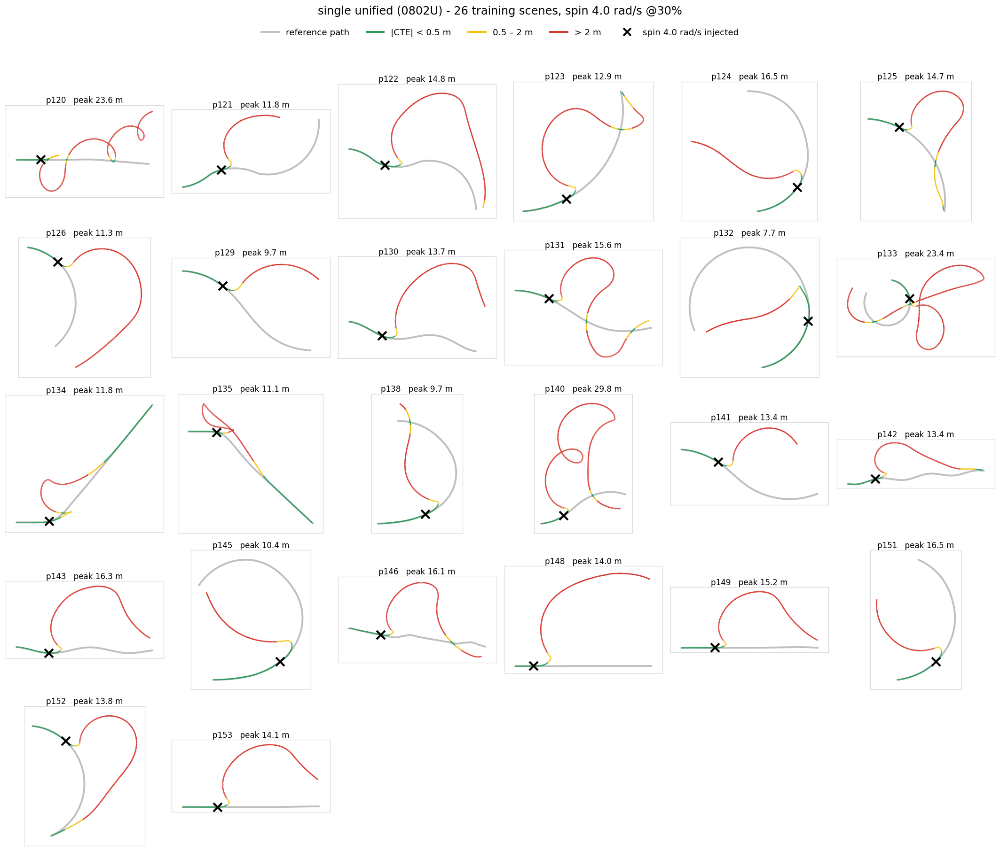
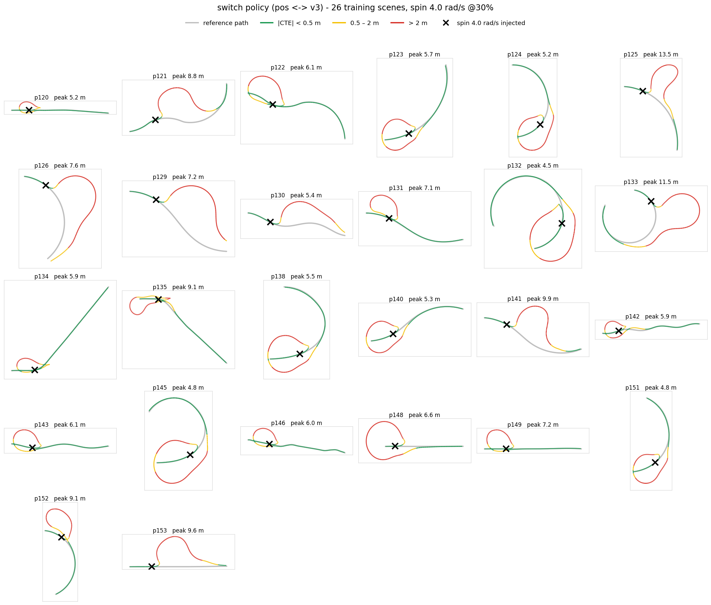
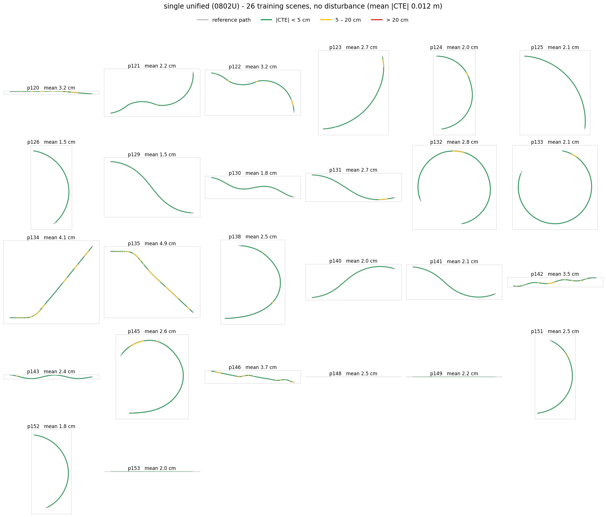
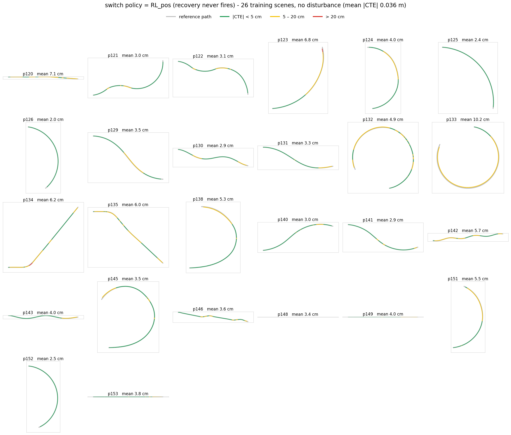

# Disturbance-Robust RL Training - single vs switch policy

## Switch Policy: Recovery Policy State &lrarr; RL_pos

> 외란 대응을 주행 정책에 추가하는 대신, "경로 복귀"만 배우는 두 번째 policy를 사용하여 실험

근거: 
- **Recovery RL** (Thananjeyan et al., RA-L 2021): Task·Recovery를 한 보상으로 공동 최적화하면 균형이 무너진다 → task Policy + recovery Policy 분리 + 임계점에서 Policy 전환이 공동 최적화 5종을 전 도메인에서 상회.(domain: 로봇/네비게이션)

**핵심 아이디어**: 주행 정책(RL_pos)은 건드리지 않는다. 복구는 전 거리에서 유계·유의미한 복구형 Policy(12D: 경로 방위각, 포화 거리 tanh(d/5), 접선 정렬)으로 따로 배우고, Dist< 3m 기존 Policy로 전환

---

### Recap: RL_pos vs RL_F(단일 모델: 경로 + 외란 학습)

> 처음 주행 task + 외란 복구 를 하나의 체크포인트(model F)로 모두 하게 하여 주행 성능을 측정해 보았다.

https://github.com/user-attachments/assets/ed8d96e6-e9de-4cf7-8529-9fe317d670af

* RL_recover_F는 코너 진입 시 조향 수정 빈도가 높고, 직선 구간에서도 미세 조향이 반복됨
* RL_pos는 동일 구간에서 조향 변화가 더 작고 경로 중심을 안정적으로 유지함

---

#### 학습량 및 환경

| 모델 | 구성 | 학습량 (env × horizon × iter) | 환경 상호작용 샘플 | 학습 시간 (RTX 4090 실측) |
|---|---|---|---|---|
| RL_pos | 무외란, 보상 v1 | 512 × 128 × 350 (총 700it 중 iter350 채택) | ~23M | 총 **≈1.8h** (9.3 s/it 실측 × 700it; 채택 시점 iter350 은 ≈0.9h) |
| RL_F | 외란 |RL_pos을 warm-start 로 추가 학습 4096 × 128 × 300iter | 누적 ~288M | **4.2h 실측**(warmstart 누적 5.1h) |

---

### **표 1 — 일반 주행 (무외란)**

| 조건 | 지표 | RL_pos | RL_F(외란학습 모델) |
|---|---|---|---|
| 학습 26씬 | \|CTE\| mean | **0.036** | 0.050 |
| 학습 26씬 | 곡률존 \|CTE\| | **0.041** | 0.063 |
| 학습 26씬 | 완주비 | **0.97** (정시) | 0.91 (과속 경향) |
| 학습 26씬 | 조향 (mrad/m) | **194**(부드러움) | 274(과도한 조향) |
| 학습 26씬 | 씬별 CTE 우위 | 16/26 | 10/26 |
| **미학습 p161** | \|CTE\| mean | 0.309 | **0.087** |
| 미학습 p161 | 곡률존 \|CTE\| | 0.090 | **0.049** |

---

### **표 2 — 외란 주행**

| 시험 | RL_pos | RL_F(외란학습 모델) | 지표 의미 | 
|---|---|---| --- |
| kick 복구 벤치 24회 — 성공률 | 96% (23/24) | 96% (23/24) | 24회 중 복구 한 씬 수 |
| kick — 평균 복구거리 / total | **9.0 m / 4.55** | 9.3 m / 5.24 | 외란 수습하는데 도로 몇 미터를 소모했는가 |
| kick — peak \|CTE\| 평균/최대 | 0.80 / 3.00 m | **0.76 / 2.57 m** | 횡방향 오차|

> **완주 시간 배율** = 기준 경로 추종 시간 대비 완주 시간 배율. 1에 가까울수록 빠름. **timeout** = 제한 시간(clean 1.5배·spin 3.5배 프레임) 내 경로 끝 미도달. (이하 모든 표 동일)

| 시험 | RL_pos 완주 시간 배율 | RL_F 완주 시간 배율 |
|---|---|---|
| Spin 2.5 (p120 학습씬) | **1.78×** | 2.18× |
| Spin 4.0 (p120 학습씬) | 2.01× (21m 루프 우연 재진입) | **timeout** |
| Spin 4.0 (p161 미학습씬) | timeout | timeout |

---

#### 해석
1. 학습 씬 일반 주행은 RL_pos 우위
2. **미학습 씬 일반 주행은 F 가 우위** — 외란학습이 정규화로 작동해 일반화를 얻고 학습 씬 정밀도를 소폭 내준 것. 
3. 외란 주행에서 kick 급은 동급이지만, spin외란(4.0rad)은 **양쪽 모두 실패** 

https://github.com/user-attachments/assets/dc0ebd77-4658-4136-ae94-51ae82c39a01

* 무외란 주행

https://github.com/user-attachments/assets/ed8d96e6-e9de-4cf7-8529-9fe317d670af

* 외란 복구 주행

---

### Recovery Policy: Recovery Observation State

> 설계 원칙: **OOD시에 발동되는 조건**이므로 기존 RL이 학습하지 않은 범위의 입력에서도 무너지지 않도록 관측 정보 추가

| # | 피쳐 | 정의 | 대이탈에서 살아있는 이유 | 가중치 |
|---|---|---|---|---|
| 1~2 | ang_bear | `sin/cos(bearing)`, nearest point와 차량 위치를 이은 각도와 차량 heading 차이 | [−π,π] | — |
| 3 | unsign_cte_close | `tanh(d/5)` | 경로 최근접점까지의 미세조정용 거리(0~5m) | 2.0 |
| 4 | unsign_cte_far | `tanh(d/20)` | 경로 최근접점까지의 대이탈 거리(5m 이상) | 2.0 |
| 5~6 | align | `sin/cos(align)`, align = 경로 접선 − 차 heading | 각도라 유계. "경로 방향과 얼마나 틀어졌나" — 안착 직전 정렬용 | 0.8 |
| 7 | v_lat | `clamp(d_rate/5, ±2)` | 경로 복귀 횡방향 속도, 미리 감쇠를 주어 overcorrection 방지 (오버슛·지그재그 방지) | 0.05 |
| 8 | v_long | `v_long/10` | 현재 차량 속도: 과속, 주차 방지 | 0.15  |
| 9 | yaw_rate | `clamp(yaw_rate/3, ±2)` | 스핀 직후 차량 상태 감지용 — 자세 안정화 | — |
| 10~11 | pos | `pitch`, `roll` | 전복 임박 감지 (자세 안정화 목적) | 50 |
| 12 | prev_steer | `prev_steer/MAX_STEER` | 조향 연속성(스무드) 확보 | 0.5 |

- **핵심 대비**: **경로가 어느 방향인지를** 가리켜, 뒤돌아 운전해 가야 하는 상황도 표현
- **tanh**: 하이퍼볼릭 탄젠트, 가까운 거리에선 정밀하게, 먼 거리에선 이탈 정보만 사용
- **이중 거리 정보(3·4)**: tanh 하나면 5m 밖이 전부 ≈1 로 뭉개진다. 5m·20m 두 스케일로 근거리 미세조정과 원거리 대세를 모두 관측.
- **복구용 정책 분리**: OOD시 복구할 수 있는 단독 policy(위치 보정용 policy와 독립)

---

### RL_recovery 학습 설계

* 복구용 정책으로, RL_pos와 별개의 network

| 항목 | 설계 |
|---|---|
| policy 구조 | **recovery policy** (12D → 128 → 128 → 2, actor 72 KB) — BC/RL_pos와 분리 |
| observation | 나침반 12D (아래 표) — 조준점 = **최근접점** |
| episode | 정상 스폰 → 즉시 물리 충격(횡속 0.5–8 m/s + yaw ±1–4 rad/s, 커리큘럼 80it 램프) → 복귀가 과제. 텔레포트 없음 — 지형 정합 보장 |
| pass/fail 판정 | **armed**: 3m 이탈을 실제로 겪은 뒤 d<2.5m 를 12프레임 유지 (조기인계 배포와 정합. 스폰 직후 공짜 성공 차단) |
| reward | 접근 potential `2.0·Δd` + 근접 정렬 `−0.8·prox·\|align\|` + 감쇠 `−0.05·prox·d_rate²` + 접선 진행 `+0.4·e^(−d/2)·tang` + 속도상한 초과 `−0.15·relu(v−(3+0.8d))²` + 저속 벌점 `−0.08` + 조향 스무드 `−0.5·ΔS²` + 시간 벌점 `−0.01/f`. 종료: 성공 **+30** / 실패 **−50** |
| 종료 | \|roll\|·\|pitch\|>0.8 / d>40m / 물리 정지 96프레임 / 타임아웃 720프레임 &rarr; 벌점 후 재시작 |
| 학습량 | 26씬 × 4096env × 128 × **250it** ≈ 131M 샘플, **≈3.5h 실측** (RTX 4090) |

* OOD가 발생했을때 복구할 observation의 필요성

**체크포인트 용량 — 스위칭 부담**

| 구성 | 배포 가중치 (actor) | 전체 파일 (actor+critic+optimizer) |
|---|---|---|
| RL_pos 단독 | 82 KB (파라미터 20,868개) | 1.2 MB |
| RL_pos + RL_recovery | 82 + 72 = **154 KB** (+20,868 → 39,304개) | 1.5 MB |

* 복구 정책은 관측 12D 의 소형 MLP(12→128→128→2)라 추가 용량이 **72 KB** 
* 스위칭 로직 자체는 if 문 수준(전역 최근접 거리 계산 포함)
* actor - critic 은 동일 구조(privilige 없음)

---

### single policy vs switch policy 결과 비교

* single policy(F) : RL_pos 기반 외란 주입 추가 학습
* switch policy : RL_pos &lrarr; (OOD시 RL_recovery)

https://github.com/user-attachments/assets/ce8c5beb-758a-49ac-8693-8e7b0b865fe5

* 미학습 씬 **spin** : pos는 복구 실패, switching은 복구 성공

https://github.com/user-attachments/assets/75189ab4-97fc-4eab-b781-e001117439ad

* **kick** : 보다 자연스러운 switching 복구

**정량 비교 — single(F) vs switch(pos+v3)**

| 시험 | single policy (F) | switch policy (pos &lrarr; v3) |
|---|---|---|
| 무외란 26씬 \|CTE\| (m) | 0.050 | **0.036** (= RL_pos 그대로, 오발동 0회 실측) |
| 무외란 26씬 곡률존 \|CTE\| (m) | 0.063 | **0.041** |
| kick 복구 벤치 24회 — 성공률 | 96% (23/24) | **100%** (24/24) |
| kick — peak \|CTE\| 평균 / 최대 (m) | **0.76 / 2.57** | 0.80 / 3.00 |
| Spin 2.5 (p120 학습씬) — 완주 시간 배율 | 2.18× | **1.49×** |
| Spin 4.0 (p120 학습씬) — 완주 시간 배율 | **timeout** | **1.93×** |
| Spin 4.0 (p161 미학습씬) — 완주 시간 배율 | **timeout** | **1.66×** |
| 배포 actor | **1개 (82 KB)** | 2개 (154 KB) + 전환 로직 |

* **spin 급 대이탈은 switch 만 복구** — F 는 학습·미학습 씬 모두 timeout 이다. 288M 샘플을 쓴 단일 모델은 실패, 분리 정책은 성공
* **평시 주행도 switch 가 무손실** — RL_pos 를 그대로 쓰므로 \|CTE\| 0.036 을 유지한다. F 는 외란 학습 대가로 0.050 으로 내줬다.
* F 가 앞서는 곳은 kick 급 소외란의 peak \|CTE\| 와 배포 단순성(체크포인트 1개)뿐이다.

> 작은 외란에서는 기존 강화학습이 어느정도 복구 가능했지만, 외란이 크게 영향을 주었을때는 OOD 발생으로 인한 recovery 로직이 필요했다

---

#### 문제인식 : 경로 방향 observation을 포함한 단일 모델 학습 필요
>정량 평가를 하던 중, policy를 분리해야한다는 선행연구에 너무 초점이 맞춰져 있다는 것을 깨달음

1. 기존 model F에는 OOD에 대비할 observation이 없으니 당연히 강한 외란에 대처하지 못함
2. 테슬라의 자율주행 시스템도 **단일모델** + 데이터로 강건성을 얻는 구조

---

### observation 포함 통합 모델 학습 재설계
> 단일 모델로 2가지 태스크 모두 수행: RL_pos 구조(31D) + 외란 복구용 경로 방향 observation(5D) = 36D

| 구성요소 | 설계 | 근거 |
|---|---|---|
| observation | 입력 정보 31D → **36D** (5D 추가: sin/cos(bearing), tanh(d/5), tanh(d/20), sin(align) 등 복귀 방향 정보) | 경로 obs 추가 |
| reward| $$r = w(d)\cdot r_{\text{base}} + \big(1-w(d)\big)\cdot\big(r_{\text{rec}} - 200\cdot\mathbb{1}[\text{term}]\big)$$  | (**경로위**: RL_pos보상 구조 `/` **경로이탈**: RL_recovery 보상 구조 )를 거리에 따라 블렌딩 |
| w(d) 정의 | $$w(d) = \exp\big(-\max(0,\,d-1)/2\big)$$ — **smooth blending** (hard switch 아님). d=0→**1.0**, d=3→**0.37**, d=20→**≈0** | 경로 1m 이내는 w=1 로 기존 보상 완전 보존, 멀어질수록 지수 감쇠로 복구 보상이 지배 |
| 종결 벌점 위치 | −200 은 recovery 항 안에만 명시 — r_base 에는 종결 벌점이 **이미 내장**되어 있어, 대이탈(w≈0)에서 r_base 몫과 함께 벌점이 희석되는 것을 막기 위해 recovery 쪽에 다시 넣음 | 어느 d 에서든 총 종결 벌점 = −200 유지 (블렌딩은 셰이핑 항에만 적용) |
| switch policy standard | clean env: 0–3m  &lrarr; disturb env **3–20m** (env별 임계) | kick/spin 이 만드는 8~15m OOD 복구를 실제 경험하려면 종결이 그보다 커야 함 |
| disturb | (spawn + kick + brake + spin) 등 v3와 동일 | OOD가 날 정도의 외란, v3과 동일 크기 \|cte\|<0.8 정상 상태에서만 주입 |
| 학습량 및 시간 | 26씬 × 4096env × 128 × **1000it** = 누적 ~524M 샘플, **14.1h** (RTX 4090) | — |

---

### 통합 모델(single0727) 성능 비교

**단일 모델(주행+외란) 4종 복구 (학습 경로, best it999)**

https://github.com/user-attachments/assets/7fb8592a-ad21-48ba-9dc1-07ff0e9038a9

* spawn 횡 0.8m 오프셋 (p120) → 완주 0.97배, cte 0.02

https://github.com/user-attachments/assets/ae20e932-2f87-4c4f-a373-52c26f00998f

* kick 5.0 m/s (p124) → 완주 0.80배, cte 0.32

https://github.com/user-attachments/assets/6e6e8055-6f26-4440-9dd4-46aaa3720cea

* brake 1.0 강제제동(75f, p134) → 완전 정차(v=0) 후 재출발 → 완주 1.19배

https://github.com/user-attachments/assets/c6d19dc3-408a-497b-8eda-5b9b367424e9

---

**미학습 경로 스핀 — 실패**

https://github.com/user-attachments/assets/ba043352-a086-43ee-99f8-c21b20704ed2

* spin 4.0 (p161 미학습) → timeout: 3m 까지 복구 후 catch-up 과속으로 재발산.

---

#### 원인
> 학습 로그를 통해 분석해보았다

| | 스위칭모델(pos &lrarr; recovery) | 단일통합모델 (0727) |
|---|---|---|
| 재진입 속도 | ~3–5 m/s | 8–10 m/s, 상승 중 (catch-up이 각인) |
| 재진입 정렬 | 보장됨  | 무보장 — 3m에서 45° 각도로 진입 시도 |
| 인계 후 base가 받는 상태 | 근접·정렬·저속 = pos의 학습 분포 안 (스폰 직후와 유사) | 고속이라 OOD |

* 단일 모델은 외란에서 복구 중 보상 구조의 혼란이 생겨 불완전한 액션이 학습
* 08/02 보상구조의 수정을 거쳐 보완(0802)

<b>0802U 복구 영상</b> (펼치기)

https://github.com/user-attachments/assets/98715e19-537e-4019-b05b-895efc5c225d

* **미학습 씬 p161, spin 4.0** — 전 설계가 실패했던 최강 판별 시험. 이탈 후 감속 없이 최근접점으로 복귀해 1.44× 완주.

https://github.com/user-attachments/assets/829fd4bb-c2e3-4784-aa37-3c5458179397

* **학습 씬 p120, spin 4.0** — 0729U·0801U 가 각각 기어가기·정차로 timeout 이던 시험의 첫 완주.

https://github.com/user-attachments/assets/c12be5ef-7505-438c-a0e0-6fdc4a7b364d

* 비교용 **0801U 동일 시험(2.45×)** — 복귀 경로는 같지만 속도가 낮아 완주 시간이 1.7배 길다. 0802U 의 시간벌점이 만든 차이가 두 영상의 대비로 드러난다.

---

### recovery 성능 비교: switch vs single(0802)

학습 26씬 전체에 동일 외란(spin 4.0 rad/s, 진행률 30% 지점)을 주입한 주행 궤적.
회색 = 기준 경로, 색 = 실제 주행(\|CTE\| 0.5m 미만 초록 / 2m 미만 노랑 / 이상 빨강), X = 외란 주입 지점.

* **single 통합 (0802U)** — 대부분의 씬에서 크게 원을 그리며 이탈하고 빨간 채로 끝난다. 종료 시 \|CTE\| < 2m 는 8/26.

* **switch (pos &lrarr; v3)** — 이탈 폭이 절반 이하(peak 평균 7.1m 대 14.7m)이고 26씬 전부 2m 이내, 23씬은 초록으로 복귀한다.

<b>무외란 주행 궤적 (26씬)</b> — 평시 정밀도 비교 (펼치기)

외란 없이 같은 26씬을 주행한 궤적. 오차 규모가 두 자릿수 작아 색 구간을 **5cm / 20cm** 로 세분했다(외란 그림의 0.5m/2m 기준이면 양쪽 다 전부 초록이라 변별되지 않는다). switch 의 무외란 주행은 복구 정책이 발동하지 않으므로 RL_pos 와 동일하다(오발동 0회 실측).

* **single 통합 (0802U)** — 26씬 평균 \|CTE\| **0.012 m**. 거의 전 구간이 5cm 이내다.

* **switch (= RL_pos)** — 26씬 평균 \|CTE\| 0.036 m. 곡률 구간에서 노란 구간(5–20cm)이 눈에 띄게 늘어난다.

---

### recovery 정량 비교 : switch vs single(0802)

씬 2개(학습 씬 1개, 미학습 씬 1개) × 주입 2곳(30%,60% 지점) × 스핀 2회(2.5, 4.0 rad/s) = **정책당 8회**.

| 정책 | 복구 성공률(아래 참고) | 평균 복구거리 | excursion ∫\|CTE\|ds | 평균 peak \|CTE\| | 최대 peak \|CTE\| |
|---|---|---|---|---|---|
| RL_pos | 1/8 (12%) | 87.0 m | 827 | 21.3 m | 40.2 m |
| **switch (pos &lrarr; v3)** | **5/8 (62%)** | **47.7 m** | **126** | **6.6 m** | **9.3 m** |
| 0729U | 0/8 | — | 813 | 16.0 m | 26.5 m |
| 0801U (it700) | 3/8 (38%) | 81.5 m | 761 | 15.1 m | 35.1 m |
| 0802U | 0/8 | — | 1361 | 19.1 m | 38.8 m |

**복구 성공 판정 기준** — 아래를 모두 만족해야 성공.

1. **armed** — 외란 후 \|CTE\| > 1m 를 실제로 겪을 것 (약한 외란의 공짜 성공 배제)
2. **복귀** — 이후 \|CTE\| < 0.1m 로 내려올 것
3. **유지** — 복귀 시점부터 10프레임 동안 \|CTE\| < 0.3m 유지 (일시 통과 배제)
4. **시간·이탈** — 위를 20초 이내에 만족하고, \|CTE\| > 40m 이탈이 없을 것

* **복귀 정확도는 switch 우위** — peak \|CTE\| 6.6m 대 19.1m 는 판정 임계와 무관한 생값이라 기준을 바꿔도 뒤집히지 않는다.
* **완주와 평시 정밀도는 0802U 우위** — 다른 질문이다. 이탈 폭이 안전 제약이면 switch, 단일 모델 배포가 우선이면 0802U.

---

#### 현재 결론

* 외란 학습(데이터)만 추가한 단일 모델(F)은 spin 급 대이탈을 학습·미학습 씬 모두 복구하지 못했다. 

* 경로 방향 관측(5D)과 보상 구조를 세 차례 고친 통합 단일 모델(0802U)은 **spin 4.0 을 학습·미학습 씬 모두 완주**했고, 평시 정밀도도 \|CTE\| 0.012 로 역대 최고다. 관측 결함이었다는 가설은 입증됐다.

* **다만 "완주"와 "복귀"는 다른 질문이다.** 학습 26씬에 동일 외란을 주고 복구 자체를 재면 switch 가 압도적 우위

* switch는 평시 정밀도는 RL_pos를 따르지만, 이도 학습을 더 시키면 개선 가능성이 매우 높음

