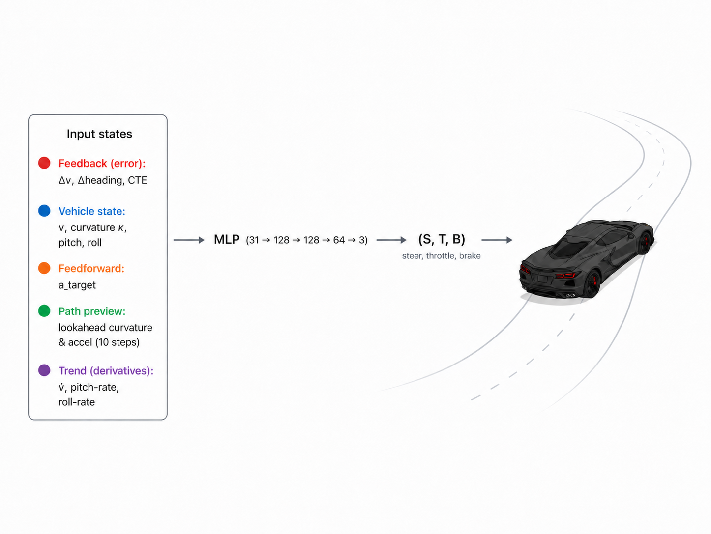
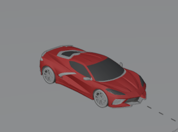
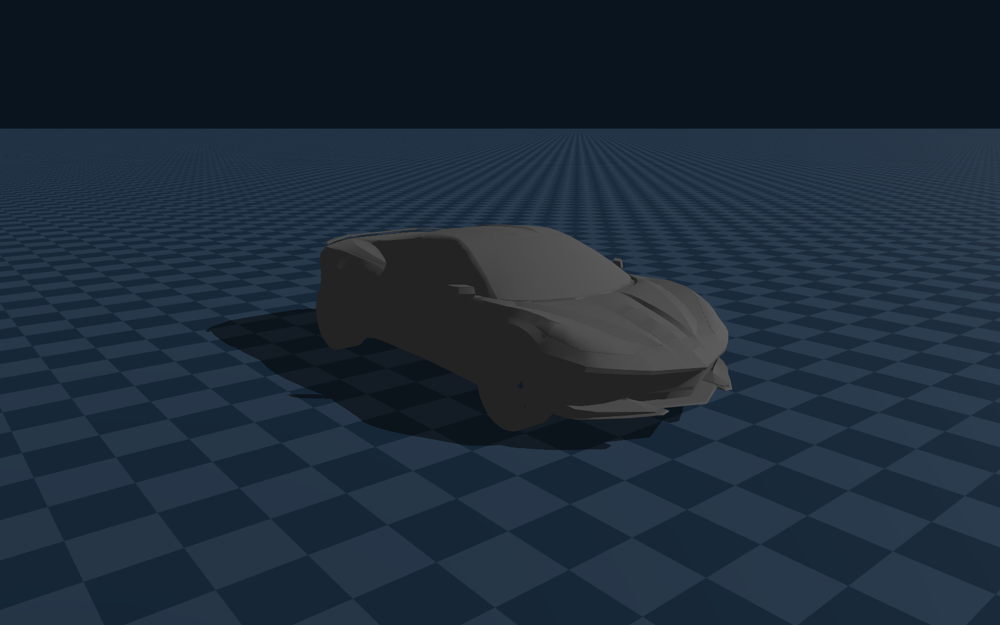
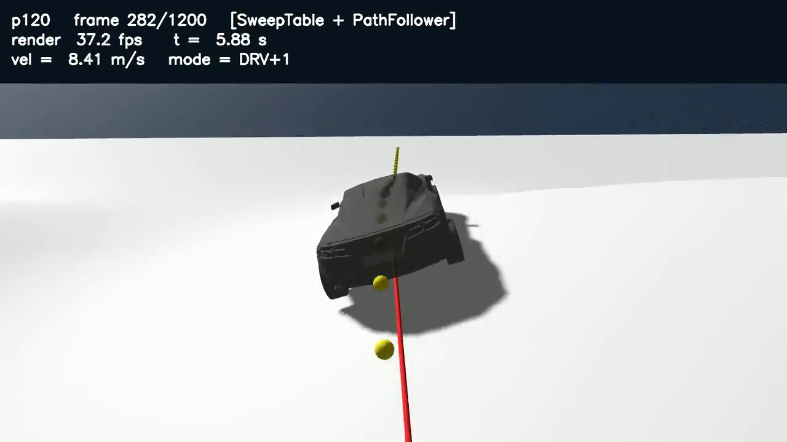
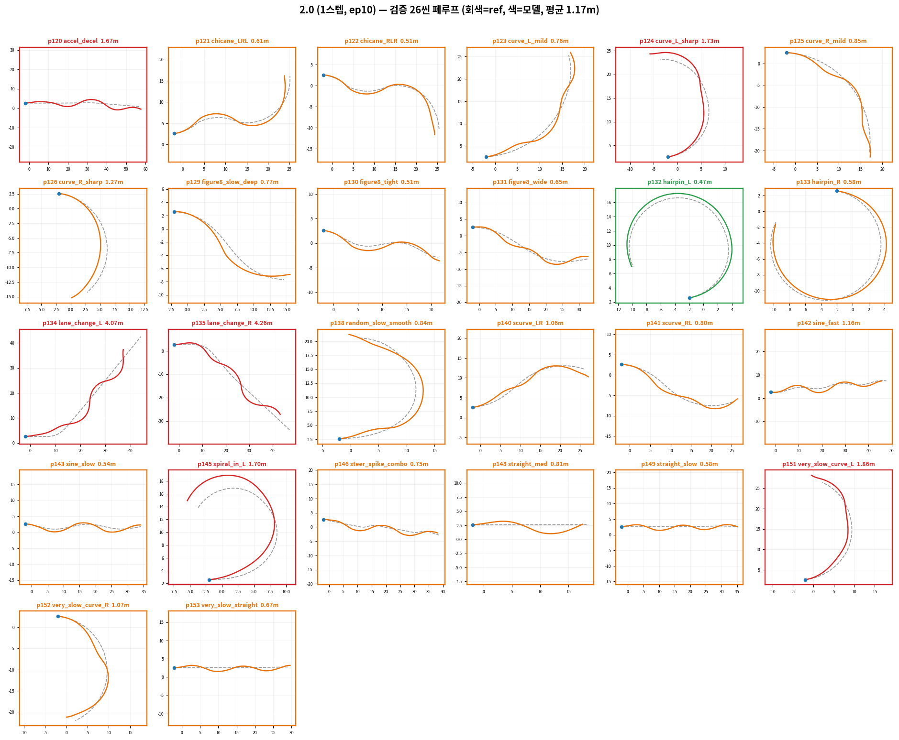
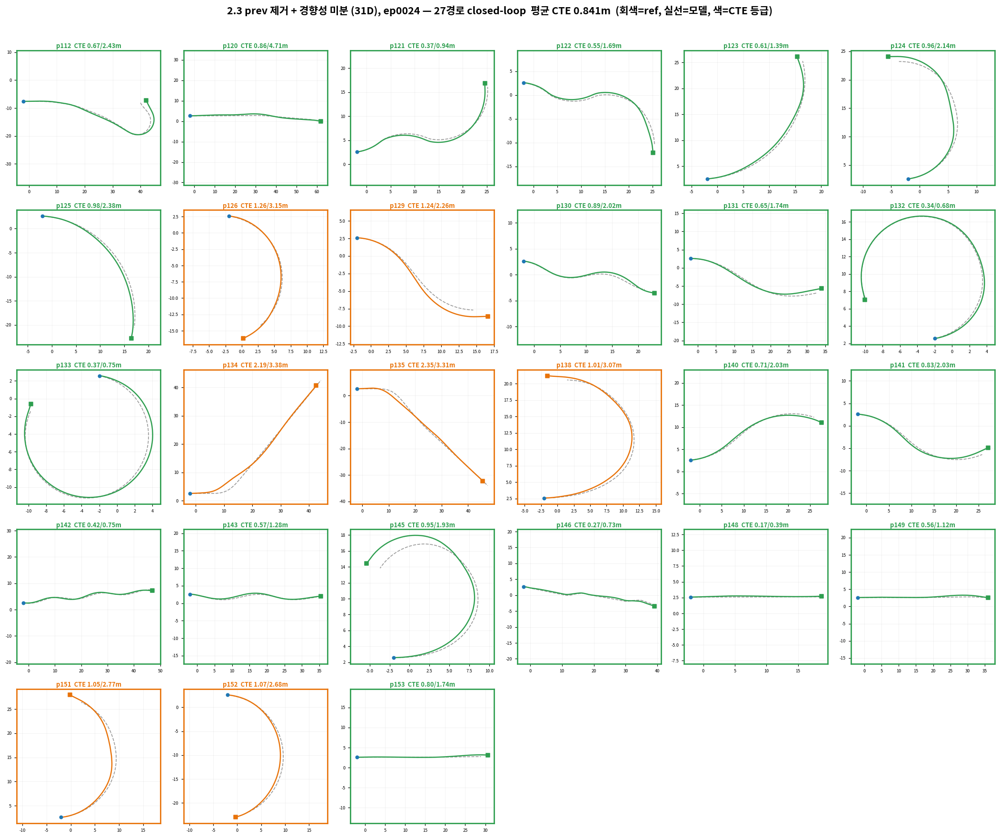
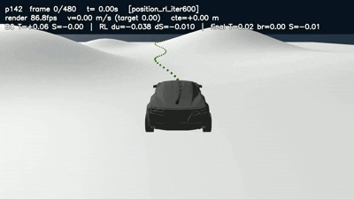
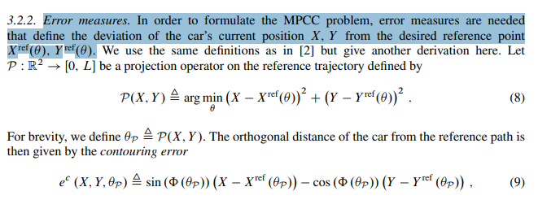

# Physics-Grounded Driving Policy via MPPI Label Mining

> **대규모 병렬 물리 시뮬레이션의 최적 제어를, 실시간 주행 정책으로 증류한다.**
> Blender ↔ Genesis sim2sim 정합 → MPPI 골든 라벨 채굴 → BC Mapper 지도학습 → BC freeze + Residual PPO → 외란 복구 강화학습까지의 전 과정 정리.


*매 스텝 2048개의 후보 미래를 병렬 물리로 시뮬레이션하고, 최적 궤적 하나를 선택해 지형을 주행하는 MPPI — 반투명 고스트는 컨트롤러가 "상상한" 미래들.*

---

## 전체 파이프라인

자율주행 경로 추종 제어기를 **물리적으로 실현 가능한(physically feasible) 데이터**로 학습한다.



| 단계 | 역할 |
|---|---|
| **1. Reference 생성** | Blender 표준 지형 위 순수 물리 주행 궤적 추출 — kinematic 이식 배제 |
| **2. 골든 라벨 채굴** | MPPI 가 2048 병렬 env 로 reference 를 재추종 → 전문가 라벨 $(T,S)$ |
| **3. BC Mapper 학습** | 라벨 지도학습 → 단일 신경망 추론만으로 실시간 추종 |
| **4. Residual RL** | BC freeze + PPO 잔차 보정, brake 추가 → $(S,T,B)$ 완전 제어 |
| **5. 외란 강건화** | 외란 주입 학습 + Recovery Policy → OOD 복구 능력 |

> 학습 라벨이 이상적 궤적이 아니라 **물리 응답**(경사 등판·하중 이동·타이어 슬립)을 담고 있어,
> 험지·비정형 지형에서의 일반화를 겨냥한다. 현재의 Blender→Genesis 정합 방법론은
> 그대로 Real2Sim→Sim2Real 전이 루프의 리허설이 된다.

---

## 1. Sim2Sim 정합 — Blender ↔ Genesis

> 두 물리 세계를 "API 단위"에서 맞춘다: 좌표계·시간 스텝(48Hz)·지형 mesh·차량 파라미터 정합

### 1.1 역할 분담

| | Blender | Genesis |
|---|---|---|
| 목적 | Data-driven physics — **ground-truth 생성기** | Goal-driven control — **정책 학습 환경** |
| 주행 방식 | RBC Rig Car 가 guide path 를 물리로 추종 | policy 가 매 프레임 $(T,S)$ 직접 생성 |
| 추출 데이터 | 6DoF state·바퀴 토크·steering·모든 프레임의 물리량 | 학습된 정책의 closed-loop 주행 |

* Blender 에 가상 센서를 만들어 매 프레임 선속도·각속도·토크·조향각을 추출
* 두 환경 모두 **"조향 + 가속 입력"** 이라는 동일 인터페이스 유지 → 포맷이 어긋나면 policy 전이가 무너짐

### 1.2 차량 설계 — URDF

| reference 차량 (Blender) | 초기 box URDF | 현재 차량 (Genesis 이식) |
| - | - | - |
|  |  |  |

*좌: Blender reference 차량 / 중: URDF 차체+바퀴+Joint 구조 검증용 box 차량 / 우: 차량 mesh 를 URDF 로 변환해 Genesis 에 이식한 현재 차량*

| 구성 | 정의 |
|---|---|
| `base_link` (차체) | box geometry + collision 히트박스 + 질량·관성(inertial) |
| `wheel_fl/fr/rl/rr` | cylinder, 90° 회전 배치 — 반지름·두께·마찰 정의 |
| **drive joint** | 4바퀴 `continuous` — 토크(throttle) 입력 |
| **steering** | 앞바퀴 조향각 입력 — 이후 차량에서 조향 joint 로 확장 |

* 시작은 단순 box URDF 로 Genesis 에서 "굴리는 것"부터 검증 → 이후 Blender 차량 mesh 를 URDF 로 변환해 이식
* 제어 인터페이스는 처음부터 $(Steer, Throttle)$ 로 고정 — 이후 모든 단계(BC·RL)가 이 위에서 동작

| 초기 URDF 주행 테스트 | 현재 차량 주행 (PathFollower) |
| - | - |
|  |  |

*좌: box URDF 의 Genesis 주행 테스트 / 우: 현재 차량의 경로 추종 주행 — 빨간 선 = reference 경로, 노란 마커 = lookahead*

### 1.3 물리 정합 ① — Ray-Wheel 충돌 구조

> Genesis 의 `cylinder ↔ terrain 3D` collision 은 contact normal 불안정·heightfield 변환 손실·substep=50 부담의 한계
> → 바퀴 collision 을 제거하고 **raycast hit point 를 충돌 판정에 사용**하는 ray-wheel 구조로 전환 (CARLA 방식에서 아이디어)

| | 기존 (cylinder↔mesh) | Ray-Wheel |
|---|---|---|
| 충돌 계산 | GJK/SDF penetration, contact 최대 5개/쌍 | 바퀴 중심 −z 방향 **Ray 1개** ↔ BVH 교차 |
| 연산량 | mesh vertex 비례 × substep 반복 | mesh 100만 개도 log₂ ≈ 20스텝 — 바퀴 4개 = Ray 4개 |
| 접지 판정 | penetration depth | `compression = tire_radius − hit_distance` |


*Genesis Lidar 센서로 구현 — attach 된 entity 자동 self-ignore 검증, n_envs=2001 배치 지원 확인*

* compression 에 **spring + 비대칭 damper** (압축 시 강하게 충격 흡수, 신장 시 약하게 반동 억제) 적용 → 서스펜션 역할 대체
* 연산이 가벼워 같은 예산으로 substep 증가·**2000 env 병렬** 가능 → MPPI·RL 의 대규모 롤아웃 기반

### 1.4 물리 정합 ② — Pacejka Anisotropic Tire Model

> 타이어는 단순 Coulomb friction 이 아니다 — 회전 방향(traction)과 횡방향(slip angle 변형)의 응답이 서로 달라,
> isotropic 마찰로는 재현 불가. **수직력은 suspension, 수평력은 Pacejka** 로 분리한다.

$$F = D \cdot \sin\!\Big(C \cdot \arctan\big(B \cdot s - E \cdot (B \cdot s - \arctan(B \cdot s))\big)\Big)$$

| 요소 | 정의 |
|---|---|
| 종방향 slip $\kappa$ | $(R\omega - v_{long}) / \|v_{long}\|$ — κ>0 휠스핀, κ<0 제동 슬립 |
| 횡방향 slip angle $\alpha$ | 타이어가 향한 방향 vs 실제 이동 방향의 각 |
| $B, C, D, E$ | 초기 강성 / 곡선 형상 / 피크 마찰 / 피크 이후 감쇠 — 종·횡 **별도 파라미터셋** |

| Pacejka 곡선 | slip angle 정의 |
| - | - |
|  |  |

* 두 채널은 **수직항력 N 을 매개로 결합** — $D = \mu \cdot N$: 코너에서 차체가 쏠리면 외측 바퀴 N 증가 → 그립 한계 상승 → **weight transfer 거동이 자연스럽게 재현**
* raycast hit point + 차량 속도로 종/횡 slip 을 직접 계산하므로 anisotropic 모델 적용이 가능해짐 (입체 충돌은 isotropic Coulomb 만 지원)

### 1.5 정합 검증

* Blender ↔ Genesis 간 좌표계·timestep(1/48s)·지형 mesh·차량 파라미터(질량·서스펜션·마찰) 정렬
* 정합 평가: 동일 제어 입력에 대한 slope·kappa RMSE 로 검증

관련 문서: `[25-10-14] genesis_car_urdf` · `[26-03-15] Sim2Sim Calibration` · `[26-05-02] ray_wheel` · `[26-05-07] pacejka_model`

---

## 2. 골든 라벨 채굴 — MPPI on Terrain

### 2.1 MPPI 정의

> "수많은 미래를 실행해보고, 그중 잘된 것들을 가중평균해서 지금 뭘 할지 정하는" sampling 기반 MPC.

1. **병렬 샘플링**: 2048개의 '유령 차'가 동시에 미래 horizon 스텝을 주행
2. **롤아웃**: 후보 제어 시퀀스를 실제 물리로 전개
3. **비용 계산**: 각 샘플의 cost 합산
4. **가중평균 선택**: temperature $\lambda = 0.01$ — 비용이 낮은 샘플에 가중치가 몰리게
5. **업데이트**: 최적 제어 $(T,S)$ 한 스텝 적용 후 반복

* MPC 는 비선형 최적화를 CPU 에서 순차 해결 → 튜닝 비용 5~36시간. **GPU 병렬 MPPI 로 전환**
* 미분 불필요 — Genesis 물리가 blackbox 여도 "앞으로 굴려보기"만 되면 됨

### 2.2 Cost 설계

$$cost = \sum_{h} \big[\, w_{dist}\cdot dist + w_{heading}|\Delta\theta| + w_{vel}|\Delta v| + w_{pitch}|\Delta pitch| + w_{roll}|\Delta roll| + w_{rate}|\Delta u| + \cdots \,\big]$$

| 가중치 | 값 | 역할 |
|---|---|---|
| `w_dist` | 6000 | 경로 이탈 ← 최우선 |
| `w_heading` | 4000 | 차가 향한 방향 |
| `w_vel` | 2500 | 속도 추종 |
| `w_pitch` / `w_roll` | 800 / 600 | 언덕·좌우 자세 |
| `w_rate` | 150 | 조작 부드러움 |
| `w_kappa` / `w_accel` | 50 / 1 | 곡률·가속 프로파일 |

> cost 는 $w \cdot |\text{오차}|$ 형태 — 각 항의 **단위**와 평소 **오차 크기**가 달라,
> 실제 기여량은 **`w × 그 항의 평소 오차`** 로 봐야 한다. (방향 오차는 rad 라 작아서 가중치를 크게)

### 2.3 데이터 스케일링

시드 기반 heading perturbation 으로 하나의 terrain mesh 위에 경로를 무한 생성:

| topview | sideview |
| - | - |
|  |  |


*단일 terrain 위에 생성한 대량 경로 — 지형 물리를 고정하고 경로 다양성만 분리*

* Claude MCP → Blender 로 $s,t$ 를 직접 주입, 한국도로공사 규격 곡률·시케인·헤어핀 경로 생성
* **35개 시나리오** (p112 + p120~p153), 씬당 ~480 frames
* 마이닝 고속화: dual_scene 전환으로 1씬 33분 → **4분 (×8.2)**, 전면 재마이닝 19h → 2.5h

| 항목 | 값 |
|---|---|
| 병렬 롤아웃 | 2048 env × horizon |
| 경로 유형 | 직진 / 커브 / 시케인 / 헤어핀 |
| mean drift | 0.01 ~ 0.36 m (경로별) |

관련 문서: `[26-02-22] MPPI` · `[26-06-01] MPPI_onTerrain` · `[26-06-24] data`

---

## 3. BC Mapper — 골든 라벨 지도학습

> Behavior Cloning: 채굴된 golden $(T,S)$ 를 정답 라벨로, Reference 공간의 움직임을 zero-shot 으로 모사하는 policy(ST Mapper)를 학습

### 3.1 Input State (31D)

| 그룹 | Dim | 피처 | 설계 의도 |
|---|---|---|---|
| **FeedBack** | 3 | `delta_v`, `delta_heading`, `cte` | 누적 오차 명시 → PID 의 오차 항을 신경망으로 |
| **Current State** | 4 | `v_long`, `kappa`, `pitch`, `roll` | 차량의 현재 물리 상태 |
| **FeedForward k** | 10 | `k_target[t+1..t+10]` | 미래 곡률 — 사전 조향 준비 |
| **FeedForward a** | 10 | `a_target[t+1..t+10]` | 미래 가속 — 사전 스로틀 준비 |
| **Current FF** | 1 | `a_target` | 현재 스텝 FF 직접 참조 |
| **경향성 미분** | 3 | `dv_rate`, `pitch_rate`, `roll_rate` | 상태 변화 방향 — 관측 스파이크 흡수 |

핵심 설계 판단 두 가지:

1. **prev $(S,T)$ 제거** — 이전 제어값을 입력하는 순간 `copycat` / `data leakage` 가 됨.
   대신 **prev 5 frame 의 평균 변화율**(미분 3D)로 경향성만 주입 — dt(1/48)가 작아 단일 프레임 미분은 노이즈이므로 5프레임 스무딩
2. **출력을 액션 청크로** — 1:1 프레임 학습은 MPPI 라벨의 프레임별 노이즈를 그대로 흡수한다.
   출력을 $(T,S)$ × **10스텝 오버랩 청크**(Tanh, [-1,1])로 바꿔 시퀀스 구조 안에서 평균화 → 자체 스무딩

### 3.2 학습 설정

* 좌우반전 증강(2배), 노이즈 주입(heading/cte/pitch/roll), StandardScaler 정규화
* trajectory 단위 train/val 분할 (temporal leakage 방지)
* Adam lr=5e-4, wd=1e-3 — early stop 제거, **300 epoch 전부 학습 후 best 만 저장** (선발은 val loss 가 아니라 폐루프 CTE)

> **평가 기준 교훈**: "다음 프레임을 잘 예측하는가"(val loss)와 "실제로 돌렸을 때 궤적을 잘 따라가는가"(closed loop)는
> 서로 다른 지표다. 주행은 시퀀스 롤아웃 — 모델의 출력이 다음 입력 분포를 바꾼다(covariate shift).

### 3.3 A/B 결과 (동일 26씬)

| 지표 | 1스텝 | 액션 청크 | 청크+경향성 |
|---|---|---|---|
| 폐루프 robust score | 1.458 | 0.667 (−54%) | **0.627 (−57%)** |
| 검증 26경로 평균 CTE | 1.17 m | 0.89 m | **0.73 m (−38%)** |
| 학습 후반 안정성 | ep10 후 붕괴 | 건강 | **건강** |

| 기존(1스텝) | 청크+경향성 |
| - | - |
|  |  |

관련 문서: `[26-07-07] multi-frame_mlp`

---

## 4. Residual RL — Frozen BC + PPO

> BC Mapper 의 경로 추종은 준수하나 곡률·고속 추종을 국소 교정하기 위해, 학습이 끝난 **BC Mapper 를 Freeze** 하고
> 그 위에 **잔차(residual) 정책**만 PPO 로 학습한다. 최종 행동 = BC 기본행동 + 잔차.
> → BC 의 전역 안정성을 보존하면서, RL 은 "얼마나 더/덜 밟고 꺾을지"의 **작은 보정**만 담당.

### 4.1 구조 정의

```
u = T_BC + Δu      S = S_BC + ΔS
비대칭 잔차 cap:  Δu ∈ [−0.7, +0.3]   ΔS ∈ [−0.25, +0.25]
게이팅:  u ≥ 0 → throttle=u, brake=0
         u < 0 → throttle=0, brake=−u
```

* 감속(−Δu)의 폭을 넓게(0.7) — 안전측(감속) 보정을 더 허용
* **Brake 게이팅**으로 BC 가 다루지 않던 제동까지 행동 공간 확장 → $(S,T,B)$ 완전 제어

| 구성 | 구조 | 역할 |
|---|---|---|
| **Actor** | 31 → 128 → 128 → 2 (ELU) | 잔차 $(\Delta u, \Delta S)$ 생성 |
| **Critic** | (31 + Critic Obs 21) → 256 → 256 → 1 | 상태 가치 $V(s)$ 평가 |

* Critic Obs(21D): 실차에서 practical 하게 얻을 수 있는 신호만 — suspension 압축(4)·wheel omega(4)·IMU accel/gyro(4)·v_lat(1)·경로 preview 요약(7)·episode context(1). asymmetric actor-critic 관행(rsl_rl)

### 4.2 PPO 학습 설정

| 항목 | 값 |
|---|---|
| 병렬 env | 512 (씬·spawn 랜덤) |
| advantage | GAE |
| clip | 0.2 (정책+가치 동시) |
| lr | 3e-4, linear decay |
| minibatch / grad clip | 4096 / 0.5 |
| **Curriculum** | 허용 최대 속도 점진 상승 (5 → 8 → 12 m/s) |

**Reward 설계** (1 episode = scene 전체 frame)

| 항 | weight | 목적 |
|---|---|---|
| Progress (+) | +1.0 | 경로를 따라 전진 (프레임당 최대 전진량 제한) |
| CTE (−) | 2.0 | 경로 이탈 감점 ← 최우선 |
| Heading (−) | 0.8 | 방향 불일치 감점 |
| Velocity (−) | 0.5 | 과속은 크게, 감속은 관대하게 |
| Smooth/Res/Brake (−) | 0.05~0.1 | 급조향·과대 보정·과도 제동 억제 |
| 종료 벌점 | −10 | \|cte\|>3m, 전복 시 종료 |

**학습 구조 핵심**: 경로 중간 랜덤 spawn 은 "모자이크"가 아니라 **초기조건** — settle 된 상태를 복원해 스폰하고 이후는 연속 물리 closed-loop.
어려운 구간(고속 코너)을 즉시 경험하게 해 학습 효율을 높이고, 오차 있는 초기조건에서 **복구 능력**을 학습한다(DAgger 와 유사 역할 — 단 expert 재질의 없이 reward 로 교정).

| time 기반 | position 기반 |
| - | - |
|  |  |

**BC vs BC+RL**

| 지표 | BC | BC+RL | 개선 |
|---|---|---|---|
| 횡오차 CTE (m) | 0.232 | **0.059** | **−75%** |
| heading 오차 (°) | 1.74 | **0.67** | −62% |

* 신지표(arc-length) 기준 최종 \|CTE\| 는 **0.036 m** — §5 참조

관련 문서: `[26-07-12] ResidualRL_on_BC` · `[26-07-12] PPO_terminology`

---

## 5. 평가 지표 전환 — Path-Following 표준

> 기존 frame-indexed 지표는 time 추종에 유리하게 오염된다 — 조금이라도 뒤쳐지는 순간 feedback 오염 발생.
> "같은 프레임에 어디 있었는가"가 아니라 **"경로 위 동일 위치를 얼마나 잘 따라갔는가"** 로 전환.

* 선행 연구: Liniger et al., *Optimization-based autonomous racing of 1:43 scale RC cars* — progress 와 contouring error 를 분리해 다루는 contouring-control formulation
* **Primary**: arc-length grid(Δs=0.25m) 기반 spatial |CTE|/|HE| — nearest-point 사영 (contouring error)
* **Feasibility**: $v^2|\kappa| > a_{safe}$ 위반율 — "곡률 대비 말이 되는 속도"의 직접 채점. reference 보다 감속해서 안정적으로 따라가면 벌점이 아님
* **Secondary**: point-to-point time / finish time ratio — pace 는 승패 미결정, 별도 표

| tangential error | nearest-point CTE |
| - | - |
|  |  |

**재측정 결과 (26씬 평균)**

| 지표 | pos | time |
|---|---|---|
| Primary \|CTE\| (m) | **0.036** | 0.044 |
| 곡률존 \|CTE\| (m) | **0.041** | 0.066 |
| 조향 effort (mrad/m) | **194** | 257 |

> 새 지표로 재측정하니 pos 가 전 지표 우세 — 곡률존 −38%, 조향 −25%.
> 실제 viewer 관찰(선제 조향 없음)과 정량 지표가 비로소 일치했다.

관련 문서: `[26-07-22] newMetric_disturb`

---

## 6. 외란 복구 강화학습 — Single vs Switch Policy

> RL 의 목표는 nominal 재현이 아니라 **교란이 있어도 경로 추종을 유지·복구**하는 것.
> 정상 추종 상태에서만 외란을 주입하고(이미 흐트러진 상태에 더하면 "복구"가 아니라 "누적 실패"를 학습),
> 강도는 커리큘럼으로 점진 상승, 일부 env 는 무외란 baseline 유지.

### 6.1 외란 종류

| 외란 | 모사 상황 | 강도 |
|---|---|---|
| **spawn** | 출발 위치·자세·속도 오차 | 횡 ±0.8m, 방향 ±8°, 속도 ±20% |
| **kick** | 옆바람·노면 단차 횡충격 | 학습 0.5~2.0 / 시험 최대 5.0 m/s |
| **brake** | 급제동·완전 정차 | 강제 인가 후 재출발 |
| **spin** | 스핀 유발 요레이트 충격 | ±1~4 rad/s |

### 6.2 구성 1 — 단일 모델 RL_F: 주행 + 외란을 하나의 체크포인트로

> 주행 task 와 외란 복구를 하나의 모델(F)이 모두 하게 하여 성능을 측정해 보았다.

| 모델 | 구성 | 샘플 | 학습 시간 (RTX 4090) |
|---|---|---|---|
| RL_pos | 무외란 | ~23M | ≈1.8h |
| RL_F | RL_pos warm-start + 외란 학습 | 누적 ~288M | 4.2h (누적 5.1h) |


https://github.com/user-attachments/assets/ed8d96e6-e9de-4cf7-8529-9fe317d670af

* RL_F 는 코너 진입 시 조향 수정 빈도가 높고, 직선에서도 미세 조향 반복 — RL_pos 가 경로 중심을 더 안정적으로 유지

해석:

1. 학습씬 일반 주행은 **RL_pos 우위** (CTE 0.036 vs 0.050, 조향 194 vs 274)
2. **미학습씬 일반 주행은 F 가 우위** (p161: 0.309 vs 0.087) — 외란학습이 정규화로 작동해 일반화를 얻고 학습씬 정밀도를 소폭 내준 것
3. kick 급 외란은 동급(96%)이지만, **spin(4.0 rad/s)은 양쪽 모두 실패** → OOD 대응 관측 자체가 없다

### 6.3 구성 2 — Switch Policy: 주행 정책 + Recovery Policy 분리

> 외란 대응을 주행 정책에 추가하는 대신, "경로 복귀"만 배우는 두 번째 policy 를 사용.
> 근거 — Recovery RL(RA-L 2021): task·recovery 를 한 보상으로 공동 최적화하면 균형이 무너진다 → 정책 분리 + 임계점 전환.


*주행은 RL_pos 그대로, 대이탈 시 Recovery Policy 로 전환 — dist<3m 복귀 시 다시 인계*

**Recovery Policy 관측 12D — "나침반" 설계**

> 설계 원칙: OOD 에서 발동되므로, 기존 RL 이 학습하지 않은 범위의 입력에서도 무너지지 않는 **유계 관측**만 사용

| 피쳐 | 정의 | 대이탈에서 살아있는 이유 |
|---|---|---|
| `ang_bear` | sin/cos(경로 방위각) | 각도라 항상 유계 — "경로는 왼쪽 40°"가 1m든 30m든 같은 의미 |
| 이중 거리 | `tanh(d/5)` + `tanh(d/20)` | 근거리 미세조정 + 원거리 대세 — 한 스케일이면 5m 밖이 전부 ≈1 로 뭉개짐 |
| `align` | sin/cos(경로 접선 − heading) | 안착 직전 정렬용 |
| `v_lat` / `v_long` | 복귀 속도·속도상한 판단 | 오버슛·지그재그 방지 |
| `yaw_rate` / `pitch,roll` | 회전·전복 임박 감지 | 스핀 직후 자세 안정화 |


**학습 설계**

| 항목 | 설계 |
|---|---|
| 구조 | 12 → 128 → 128 → 2 소형 MLP — actor **72 KB**, 스위칭은 if 문 수준 |
| episode | 정상 스폰 → **즉시 물리 충격**(횡속 0.5–8 m/s + yaw ±1–4 rad/s) → 복귀가 과제. 텔레포트 없음 |
| 판정 | **armed**: 3m 이탈을 실제로 겪은 뒤 d<2.5m 를 12프레임 유지 — 스폰 직후 공짜 성공 차단 |
| reward | 접근 potential + 근접 정렬 + 속도상한 초과 벌점 + 저속 벌점(정차 함정 방지) + 조향 스무드 |
| 학습량 | 26씬 × 4096env × 128 × 250it ≈ 131M 샘플, ≈3.5h |


https://github.com/user-attachments/assets/75189ab4-97fc-4eab-b781-e001117439ad

* **kick**: 단일 모델 대비 보다 자연스러운 switching 복구


https://github.com/user-attachments/assets/ce8c5beb-758a-49ac-8693-8e7b0b865fe5

* 미학습 씬 **spin**: pos 는 복구 실패, switching 은 복구 성공

### 6.4 구성 3 — 통합 단일 모델: 경로 방향 관측 + 보상 블렌딩

> 정량 평가 중, policy 분리 선행연구에 너무 초점이 맞춰져 있음을 깨달음 — 기존 F 에는 OOD 대비 관측 자체가 없었고,
> 테슬라도 **단일모델 + 데이터**로 강건성을 얻는 구조다. 관측을 포함해 재설계.

| 구성요소 | 설계 |
|---|---|
| observation | 31D → **36D** — 복귀 방향 정보 5D 추가 (sin/cos(bearing), tanh(d/5), tanh(d/20), align) |
| reward | $r = w(d) \cdot r_{base} + (1-w(d)) \cdot r_{rec}$ — 경로위/경로이탈 보상을 거리로 블렌딩 |
| $w(d)$ | $\exp(-\max(0, d-1)/2)$ — **smooth blending**. 1m 이내 w=1 (기존 보상 보존), 멀어질수록 복구 보상 지배 |
| 학습량 | 26씬 × 4096env × 128 × 1000it ≈ 524M 샘플, 14.1h |

**4종 외란 복구 (학습씬) — 단일 모델로 성공**


https://github.com/user-attachments/assets/ae20e932-2f87-4c4f-a373-52c26f00998f

* kick 5.0 m/s → 완주 0.80배, cte 0.32


https://github.com/user-attachments/assets/6e6e8055-6f26-4440-9dd4-46aaa3720cea

* 강제제동 → 완전 정차(v=0) 후 재출발 → 완주 1.19배


https://github.com/user-attachments/assets/c6d19dc3-408a-497b-8eda-5b9b367424e9

* spin 4.0 rad/s → **대이탈(17m급) 복구까지 단일 모델로 성공**

**미학습씬 spin — 실패 사례**


https://github.com/user-attachments/assets/ba043352-a086-43ee-99f8-c21b20704ed2

* spin 4.0 (p161 미학습) → DNF: 3m 까지 복구 후 **catch-up 과속으로 재발산**

**실패 원인 — 재진입 상태 분석**

| | switch (pos &lrarr; recovery) | 통합 단일 |
|---|---|---|
| 재진입 속도 | ~3–5 m/s | 8–10 m/s 상승 중 (catch-up 각인) |
| 재진입 정렬 | 보장됨 | 무보장 — 45° 방위로 진입 시도 |
| 인계 후 base 상태 | pos 의 학습 분포 **안** | 3m 밖·고속 = 학습 분포 **밖** |

* 스위치는 각 문제를 각각의 학습 도메인에서 다른 모델이 맡아 보상 충돌이 없는 반면, 단일 모델은 복구→정상 전환 시 보상 구조 혼란으로 불완전한 액션이 학습됨 → 보상 전환 구조 수정 후 재학습 중

### 6.5 전 구성 정량 비교

| 지표 | RL_pos | RL_F | **switch** | 통합 단일 |
|---|---|---|---|---|
| clean 26씬 \|CTE\| (m) | 0.036 | 0.050 | 0.036 | **0.017** |
| 미학습 p161 clean \|CTE\| | 0.309 | **0.087** | 0.309 | 0.315 |
| kick 복구 24회 | 96% | 96% | **100%** | **100%** |
| Spin 4.0 (학습씬) | 2.01× | DNF | **1.93×** | 2.11× |
| Spin 4.0 (미학습씬) | DNF | DNF | **1.66×** | DNF |
| 배포 actor | 82 KB | 82 KB | 154 KB | 85 KB |

* **switch 가 유일하게 전 시험 완주** — 288M 샘플의 단일 모델이 못 한 복구를 **72KB 분리 정책**이 해결
* 통합 단일은 clean 정밀도 최고(0.017)·kick 100% — spin 일반화만 미해결

관련 문서: `[26-07-29] disturb_switchpolicy`

---

## 단계별 핵심 성과

| 단계 | 상태 | 핵심 결과 |
|---|---|---|
| Sim2Sim 정합 | 완료 | Blender ↔ Genesis ray-wheel 물리 정합 (48Hz) |
| 골든 라벨 채굴 | 완료 | 35 시나리오 × 표준 지형, dual_scene ×8.2 가속 |
| BC Mapper | 완료 | 액션 청크 + 경향성 미분 — 폐루프 −57% |
| Residual RL | 완료 | BC freeze + PPO, brake 추가 — CTE −75% (최종 \|CTE\| 0.036) |
| 평가 지표 | 완료 | Path-Following 표준 (arc-length CTE/HE + feasibility) |
| 외란 강건화 | 진행 중 | Switch Policy 전 시험 완주 / 통합 단일 재학습 중 |
| Real2Sim | 다음 단계 | 실측 궤적·지형의 시뮬 정합, 실환경 분포 라벨 재채굴 |
| Sim2Real | 최종 목표 | 학습 정책의 실차 전이 |

---

