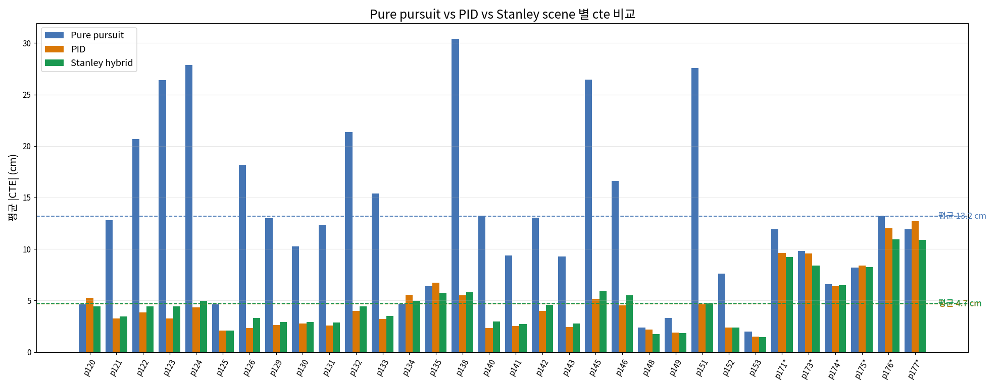
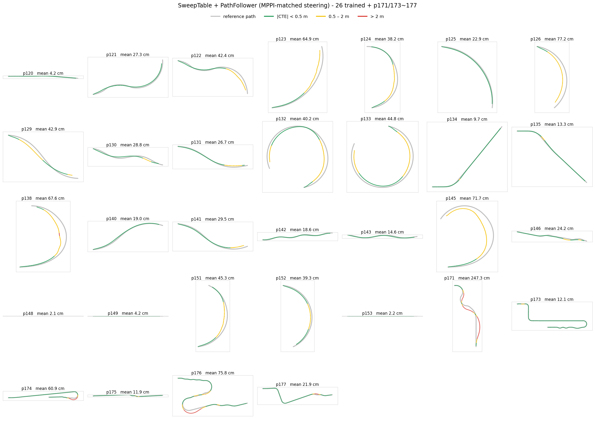
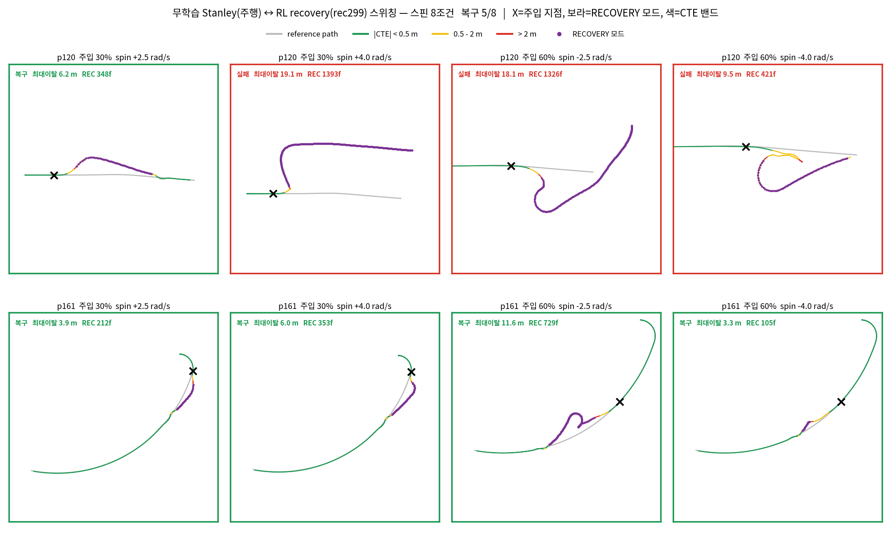
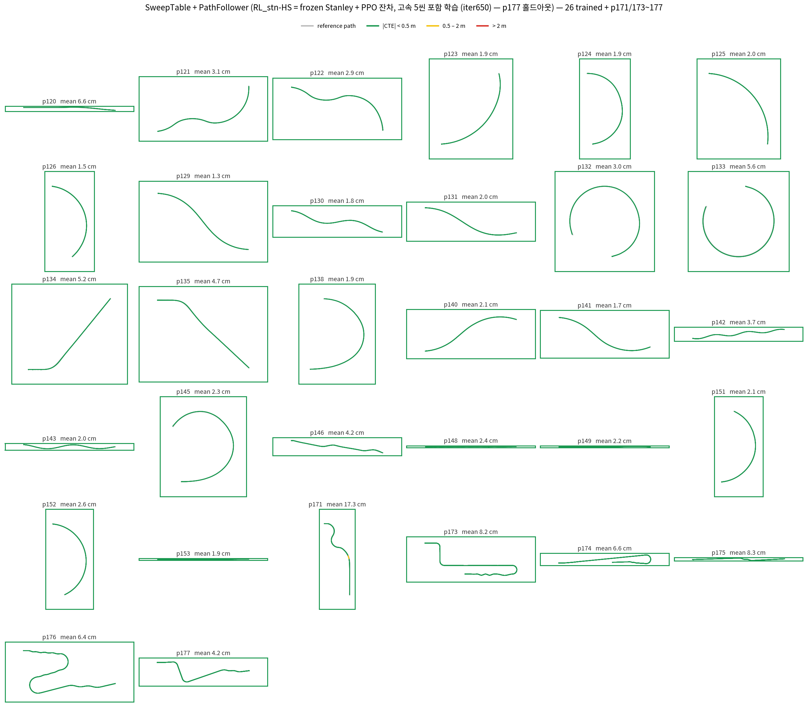

# MPPI to Stanley Controller 

## 요약 (10줄 이내)

**지난 논의 (2026-08-05)** — 키워드 3줄
- SweepTable 로 MPPI 대체 할 것

**이번 결과 / 막힌 것 / 다음**
- 결과: RL_stanley&RL_recovery — 무외란 **32/32 완주** (저속 평균 CTE 0.028 m, 고속 0.06~0.08 m), 스핀 외란 완주는 주입 지점에 따라 31/31(30% 지점)에서 24/31(60% 지점)로 갈린다.
- 막힌 것: switch 로직으로 인한 dual policy / 통합 단일 policy 결정
- 다음: 장애물 회피 훈련

### 요약

기존 파이프라인은 MPPI 골든 마이닝(씬당 수 시간) → BC 증류 → 잔차 RL이었다. 

이 시간적 비용에 비해 `table sweep n분` 만에 구동계 파악이 비용적으로 훨씬 효율적이라 구동계를 학습하기 위한 데이터를 뽑고, 학습하는 것보다 sweeptable 작성이 비용적 측면에서 유리.

## 1. SweepTable + PathFollower 

MPPI 없이 SweepTable만으로 주행이 되는지 검증. 

재생해 봤으나 9.05 m 발산 — openloop 오차 때문에 **상태를 보고 되먹이는 폐루프 제어기가 반드시 필요**함을 확인. 

그래서 SDK 문서의 PathFollower (pure pursuit) 제어기 사용

**결과.** 순정 파라미터 0.53 m(30/32) → 조향 cap·lookahead 완화 튜닝으로 0.357 m.
직선/완곡선은 수 cm로 통과하지만 **급곡률 코너에서 일관되게 이탈** (p171 2.47 / p126 0.77 / p145 0.72 m).

**분석.** 
1. lookahead point에 대해서 선제조향 (lookahead 3.5 → 2.0 m)
2. tank &rarr; car 에 맞는 조향 limit 조정 (steer_cap 0.5 → 1.0)

## 2. Pure pursuit vs PID vs Stanley 성능비교

Stanley : ω −= k·e                          ← e = 횡오차, P 항만
PID     : ω −= k·e + Ki·∫e dt + Kd·de/dt    ← 같은 e 에 I·D 를 추가

> PID는 다른 목적의 제어기가 아니라 Stanley 항에 두 개를 더 얹은 것

 * I는 오차가 한쪽으로 오래 남아 있을 때 그 상수 편향을 지움 — (옆바람, 지속 경사, 휠 얼라인먼트 틀어짐, 조향 중립 오차)
 * D는 오차가 줄어드는 속도를 보고 해당 방향 속도 감쇠
 * 3d 기준으로 terrain mesh마다 I항의 bias가 다를 수 있어서 Stanley 선택

* CTE 횡방향 오차 기준으로 비교해보았다

**성능 정리 — 32씬 평균 |CTE| (외란 없음)**

| 구분 | Pure pursuit | PID (P+I+D) | Stanley hybrid (P) |
|---|---|---|---|
| 직선 4씬 (p120·148·149·153) | 3.1 cm | 2.7 cm | **2.4 cm** |
| 곡선 22씬 | 15.8 cm | **3.6 cm** | 4.0 cm |
| 고속 6씬 (p171·173~177) | 10.3 cm | 9.8 cm | **9.0 cm** |
| **전체 32씬** | 13.2 cm | **4.7 cm** | **4.7 cm** |
| 최대 CTE > 2 m 인 씬 | 0개 | 0개 | 0개 |

   

## 3. Stanley 제어기 적용

* 일반 Purepursuit(0.357 m)

* tuned pure pursuit(pure pursuit + 고속 steering 제한 + 속도연동 lookahead (0.132 m))

* stanley (0.047 m)

* 스핀 8조건 중 복구 5/8. 

## 4. RL_stn — frozen Stanley + PPO 잔차 (0807S, 08-07 밤)

* 기존 구조(frozen BC + PPO 잔차 &rarr; frozen Stanley + residual_PPO) Stanley base로 교체
*  Stanley 제어기가 못 지운 오프셋을 residualRL이 보정

**결과.** **32/32 완주 전 그린**, 저속 평균 0.028 m, 고속 6~8 cm CTE

* 무외란 주행

* 외란 주행 성능

---
### next step 

* 장애물 회피 주행