# Base Stanley Recovery Complete

> **요약:** disturbance 복구 실패의 원인을 recovery나 residual이 아니라 **base Stanley closed-loop 제어 결함**에서 찾았고, 이를 수정하여 **무외란 41/42, disturbance 41/42**를 달성했다.

---

## 요약

### 해결한 문제

* **Base Stanley closed-loop 결함 3건 수정**

  * CTE 피드백이 차량의 실제 조향 능력과 맞지 않는 문제
  * 코너에서 envelope가 정상 동작하지 않는 버그
  * 곡률을 고려하지 않는 목표 속도

### 성능

* **무외란:** 41 / 42 PASS 
* **Disturbance:** 41 / 42 PASS (잔여 프레임 부족으로 사실상 42/42)
* **Recovery 진입:** 78 → **18회**

### 남은 과제

* disturbance 복구는 해결
* 다음 단계는 **장애물 회피 학습**

---

## 1. 원인 분석

문제의 핵심은 다음 한 문장으로 정리된다.

> **Stanley가 요구하는 조향량이 차량이 실제로 낼 수 있는 조향 능력과 맞지 않았다.**

그 결과가 상황마다 다르게 나타났다.

| 상황           | 기존 동작                          | 결과                            |
| ------------ | ------------------------------ | ----------------------------- |
| **저속 재획득**   | CTE에 비례해 과도한 조향 요구             | Steering 포화 → 경로 관통 → S자 오버슛  |
| **고속 주행**    | 속도가 올라가면 CTE 피드백이 사실상 사라짐      | 오차를 줄이지 못하고 경로와 평행하게 표류       |
| **코너**       | Envelope 버그로 조향 한계 완화가 동작하지 않음 | Steering cap에 계속 걸려 코너 밖으로 밀림 |
| **코너 진입 속도** | GT 속도를 그대로 사용                  | 차량이 감당 가능한 속도보다 빨라 지속적인 포화 발생 |

즉,

* **저속에서는 너무 공격적**
* **고속에서는 너무 소극적**
* **코너에서는 버그 때문에 조향 여유조차 없었다**

Disturbance 이후 **"복구는 되지만 다시 추종을 못하는"** 현상은 모두 이 base controller의 문제였다. Recovery와 residual은 원인이 아니라 증상을 처리하고 있었던 셈이다.

---

## 2. 수정 내용

### (1) CTE 항 재설계

기존

```
k · CTE
```

↓

수정

```
atan(k · CTE / (v + 2))
```

* 속도가 높을수록 자연스럽게 감쇠
* 그러나 CTE 피드백이 0으로 사라지지 않음
* 추가로 **실측 ω_max(v)의 80%**에서 clamp하여 차량이 실제 낼 수 있는 조향만 요구하도록 변경

---

### (2) 정보 관측 수정

정보 관측 오류: 곡률 정보가 controller 에 넘어가고 있지 않았음 이를 수정

```
미래 곡률 k에 따른 조향 명령 : 4.0 → 최대 8.5
```


이를 수정하여 코너에서 정상적으로 steering가 작동

---

### (3) 곡률 기반 감속 추가

목표 속도 앞단에

```
v_cap = √(4.0 / |κ|)
```

를 적용

> **곡률이 큰 곳에서는 먼저 속도를 줄이도록 변경**했다.

---

### (4) Residual 재학습

새로운 base controller 위에서 residual을 다시 학습하였다.

* it100 채택
* it150 이후 성능 붕괴는 재확인


---

## 3. 결과

| 항목               |                        수정 전 |         수정 후 |
| ---------------- | --------------------------: | -----------: |
| 무외란 PASS         |                     37 / 42 |  **41 / 42** |
| Disturbance PASS |                     33 / 42 |  **41 / 42** |
| Recovery 진입      |                         78회 |      **18회** |
| p167             | 무외란 FAIL / Disturbance FAIL | **둘 다 PASS** |

### 무외란

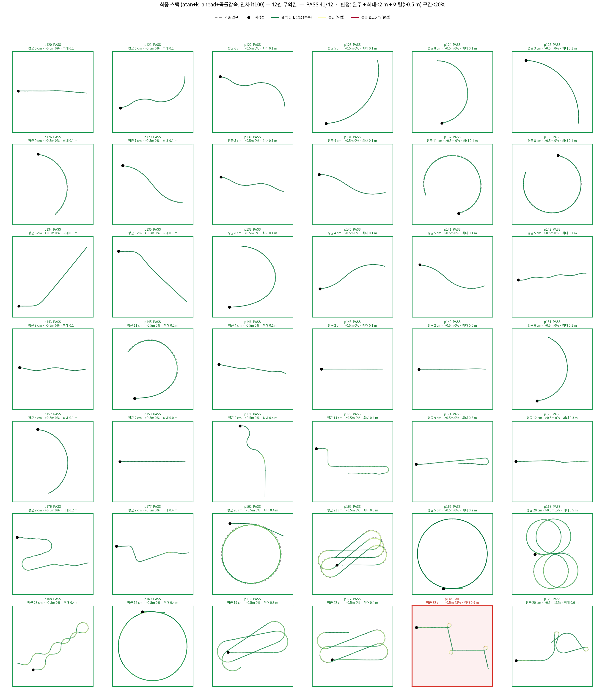

* **41 / 42 PASS**
* 유일한 FAIL은 **p178**
* 최대 CTE 0.91 m로 치명적인 이탈은 아님

### Disturbance (spin ±3.5)

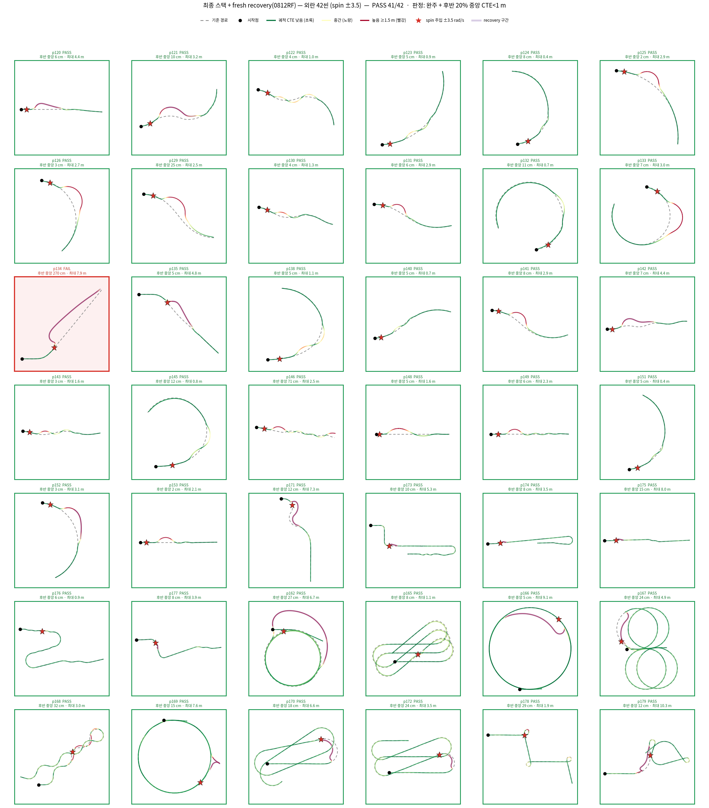

* **41 / 42 PASS**
* Recovery 구간이 크게 감소
* FAIL은 **p134**만 남음(경로가 너무 짧아서 복구하기에 시간이 부족했음, 잔여 프레임이 많았다면 복구 했을 것.)

---

### Before / After

Disturbance 이후 동일한 spin(±3.5)을 주입하여 비교하였다.

* **Before**

  * Recovery는 성공하지만 RL_stn 로 switch 후 오차가 생김(state 전달 오류 이었음을 확인)
  * 이후 CTE가 계속 증가하며 다시 추종 실패

* **After**

  * Recovery 1회(또는 0회) 후
  * 즉시 낮은 CTE로 복귀(state 전달 정상화 &rarr; 피드백 루프 정상 작용)
  * 정상 추종 유지


| 씬 | before | after |
|---|---|---|
| p121 | 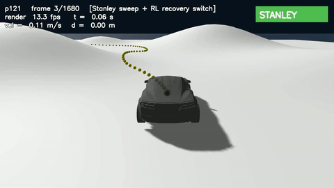 | 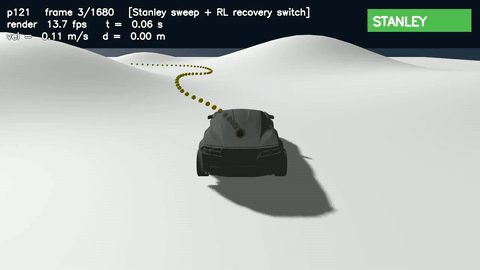 |
| p142 | 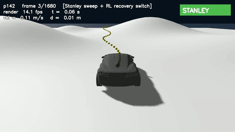 | 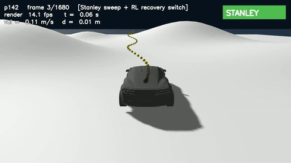 |
| p171 | 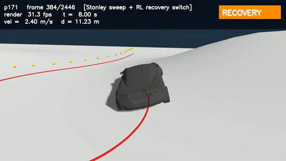 | 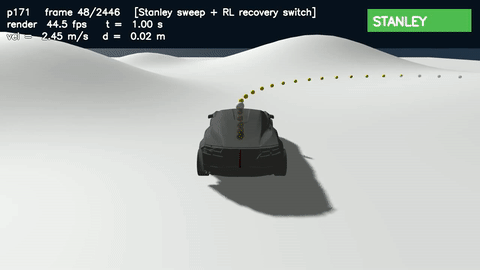 |
| p166 | 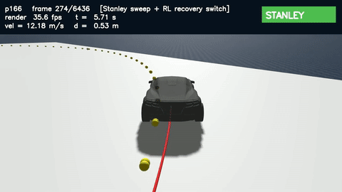 | 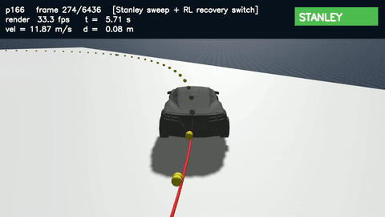 |
| p168 | 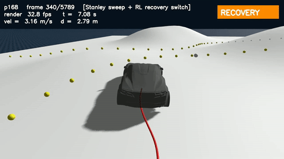 | 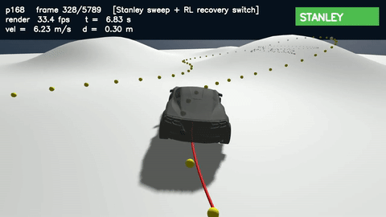 |
| p169 | 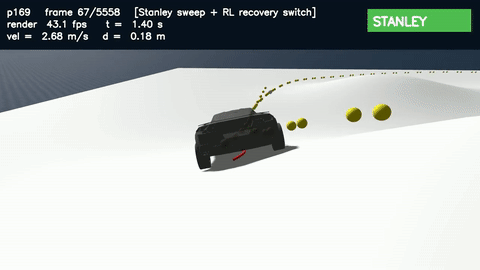 | 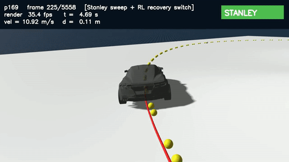 |
| p170 | 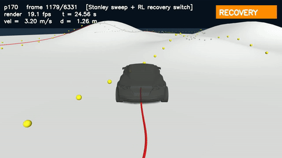 | 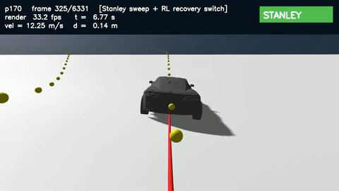 |
| p178 | 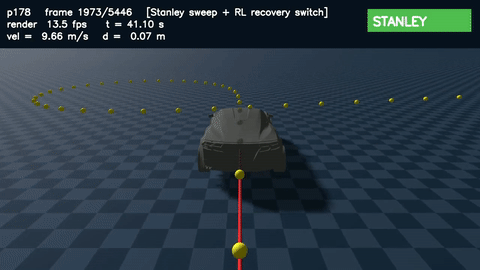 | 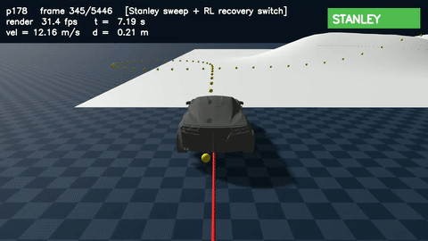 |
| p179 | 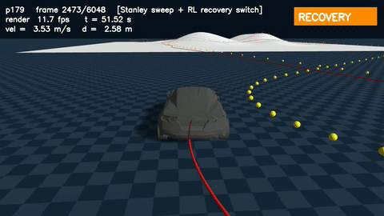 | 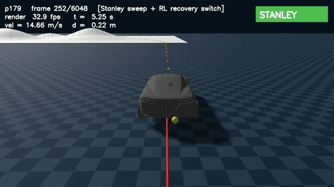 |
| p176 | 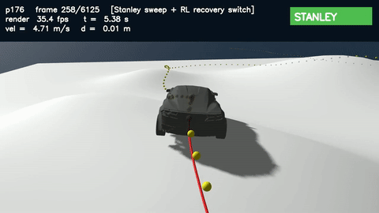 | 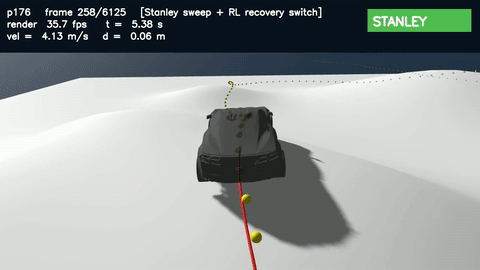 |

---

## 결론

**Stanley closed-loop 자체를 차량의 실제 조향 능력과 일치하도록 정상화**

그 결과

* 저속 과조향,
* 고속 표류,
* 코너 steering 포화

세 가지 문제가 동시에 해결되었고,

결과: 

* **무외란 41/42** (사실상 42/42, 너무 짧은 경로라 복구 여유 프레임 부족, 만약 시간 더 있었다면 복구 했을 것.)
* **Disturbance 41/42**(사실상 42/42)
* **Recovery 진입 78→18회**


---

## next step

장애물 회피 학습