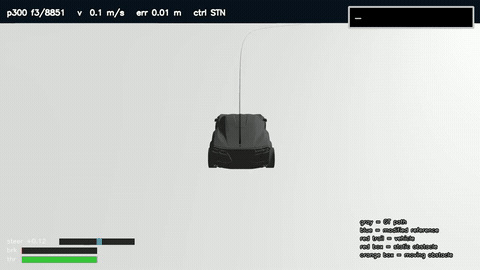
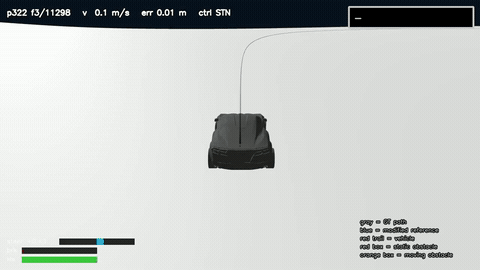
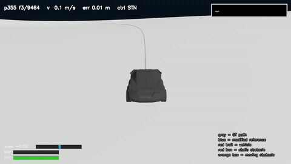
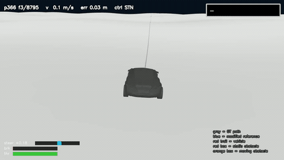
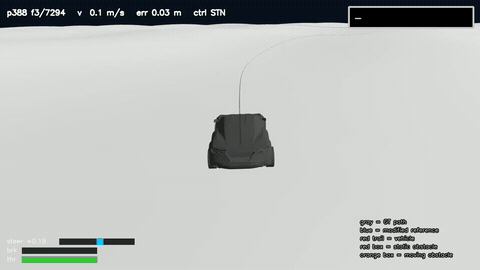
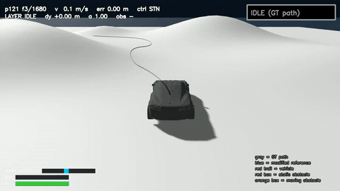
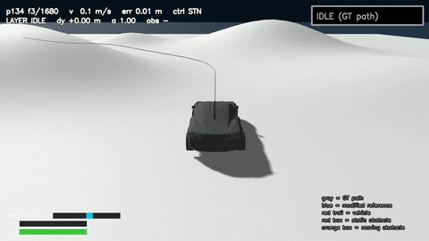
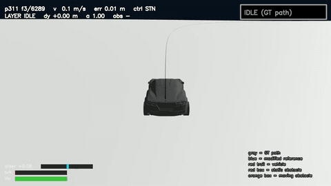
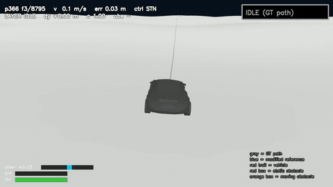
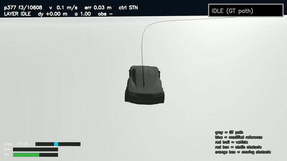

# MultiScene 학습 환경 구성 비교

> 고정된 작은 환경에서 **상태 다양성**을 키울 것인가, 큰 지형에서 **환경 자체의 다양성**을 키울 것인가

| 구분 | A (500m) | B (3km) |
|---|---|---|
| 학습 환경 | 500×500 m single env, multiple paths | 3×3 km Large Mesh grid(multiple env), multiple paths |
| 핵심 | 단일 mesh 상태 다양성 | 다중 mesh **지형 다양성** |

이후 본문에서는 **A (500m)**, **B (3km)** 으로 표기함.

* A: single terrain + multiple paths
* B: multiple terrain + multiple paths

## 1. 학습 환경

### A. 500m 단일 Mesh

> **고정된 환경, 여러 경로에서의 다양한 상태를 학습**

- 500 × 500 m Terrain
- 미리 구성된 여러 GT Path(경로)
- 각 Env는 특정 (Path,state) 담당
- Random : Spawn / 속도 / 오프셋 / 헤딩
- 동일한 지형, 여러 경로 에서 속도/오프셋/헤딩 perturbation 을 주어서 학습

### B. 3km Large Mesh

> **다양한 환경과 경로에서 일반화 학습**

- 3 × 3 km Large Terrain
- Terrain을 여러 Sector로 분할
- Sector별 독립 Path 구성
- 각 Env가 서로 다른 Path 주행
- Random Spawn / 속도 / 오프셋 / 헤딩 / 외란
- 지형·곡률·경사·Path 구조 자체의 **환경 다양성** 확보

### A vs B 핵심 차이

| 항목 | A (500m) | B (3km) |
|---|---|---|
| Path 샘플링 | O | X |
| Spawn 샘플링 | O | X |
| 외란 학습 | X | X |
| Randomization | 동일 | 동일 |
| Path 다양성 | O | O |
| **Terrain 다양성** | 없음 | **높음** |
| 핵심 차이 | 500×500 한정 | **3×3 km terrain 속 다양한 지형** |

> path/spawn sampling : 병렬 env가 랜덤으로 (n 경로 , state(spawn)) 분포에서 샘플링 하여 residual RL 진행
## 2. 학습 효율

### 학습 시간 비교

| 항목 | A (500m) | B (3km) |
|---|---:|---:|
| Env × rollout steps | 4096 × 128 | 96 × 1536 |
| 총 경험량 | 157.3M | **44.2M** |
| 학습 시간 | 4시간 08분 | **2시간 14분** |
| Iter당 시간 | 49.6초 | **26.8초** |
| 처리량 | 10.6k steps/s | 5.5k steps/s |
| 42씬 CTE (A의 학습 환경) | 9.85 cm | **8.89 cm** (미학습) |

> B의 경로 길이가 길어서 rollout step을 길게 가져감

### 해석

- B는 **경험량 3.6배 적고, 학습 시간 절반**으로 A의 학습 환경에서 A보다 낮은 CTE에 도달함
- **동일 지형에서 많은 경로/상태를 반복하는 것보다, 다양한 Path/지형에서 경험을 얻는 것이 더 효율적**임

## 3. 무외란 주행

### Cross Evaluation

| 학습 모델 | 평가 환경 | 완주 | CTE |
|---|---|---:|---:|
| A (500m) | A (Home) | 42/42 | 9.85 cm |
| A (500m) | B (Unseen) | 99/99 | 10.41 cm |
| B (3km) | B (Home) | 99/99 | **8.75 cm** |
| B (3km) | A (Unseen) | 42/42 | **8.89 cm** |

### 해석

- **B는 Home / Unseen 모두 안정적**
- A → B에서도 99/99 완주
- B → A에서도 42/42 완주
- 따라서 **지형 다양성이 일반화에 유리**함

### 세부 지형별 결과 (B 환경, 3km 99씬)

| 지형(섹션) | 평균 v (m/s) | A (500m) CTE | B (3km) CTE |
|---|---|---|---|
| T0 고속 직선 | 20 | **11.8** | 12.7 |
| T1 고속 대곡선 | 21 | 22.4 | **15.5** |
| T2 고속 언덕 | 16 | 10.4 | **9.5** |
| T3 | 12 | 8.9 | **6.3** |
| T4 | 12 | 9.4 | **6.9** |
| T5 | 11 | 9.2 | **6.4** |
| T6 요철 | 8 | **6.9** | 7.6 |
| T7 급경사 | 6 | **6.2** | 7.1 |
| T8 technical | 8 | 8.5 | **6.8** |
| **전체 (99/99 완주)** | — | 10.41 | **8.75** |
| 저속·고곡률 30씬 (추가) | 3~5 | **9.03** | 10.69 |
| 속도 오차 (T3k 99) | — | 0.17 m/s | 0.16 m/s |

- 대체로 B가 우세함. 특히 고속 대곡선(T1)에서 22.4 → 15.5 cm
- 저속·요철·급경사(T6/T7, 저속 30)에서는 A가 0.5~1.7 cm 우위 — B가 학습한 지형이라도 모든 경로에서 우위는 아니였음

## 4. 외란 주행 — Rule Recovery

> 외란 복구는 **Rule Recovery Path Planner**가 경로를 만들고, Base Stanley + RL_STN이 그 경로를 추종함.
> 따라서 Planner 성능(경로 생성)과 정책 성능(복구 경로 추종)을 분리해서 봄.

* spin 3.5 rad/s 
* 같은 씬이면 A/B 동일 주입점
* 동일 초기 상태
* 동일 Planner
* 동일 Base Stanley
* 42씬은 씬별 고정 주입점
* B 99씬은 진행률 0.35.

### Cross Evaluation

| 학습 모델 | 평가 환경 | PASS | Recovery PASS | GT CTE 후반20% | Recovery Path CTE | Max Rec CTE | 복구 시간 | BLOCKED |
|---|---|---:|---:|---:|---:|---:|---:|---:|
| A (500m) | A (Home) | 42/42 | 41/42 | 7.9 cm | 33.0 cm | 98 cm | 6.65 s | 1 |
| A (500m) | B (Unseen) | 90/99 | 96/99 | 10.3 cm | 35.4 cm | 99 cm | 8.69 s | 3 |
| B (3km) | B (Home) | 99/99 | 99/99 | 7.2 cm | 36.8 cm | 98 cm | 8.44 s | 0 |
| B (3km) | A (Unseen) | **42/42** | **42/42** | **5.6 cm** | **31.2 cm** | **60 cm** | **4.30 s** | **0** |

PASS = 완주 ∧ 후반 20% 중앙 GT CTE < 1 m · Recovery PASS = MERGE 성공 ∧ BLOCKED 없음 · 복구 시간 = 외란 감지 → MERGE (중앙값)

### 해석

- **B → A (Unseen)가 4조건 중 최고**: A의 홈 성적보다도 GT CTE·최대 이탈·복구 시간 모두 우위임 (복구 6.65 → 4.30 s)
- **A → B (Unseen)는 90/99**: 실패 9씬 전부 T1(24 m/s 대곡선). MERGE는 됐지만 복귀 후 고속 재추종에서 1~2.6 m 이탈함 — A의 학습 분포 밖 속도임
- Home ↔ Unseen 격차: A는 큼(100% → 91%), B는 없음

### Recovery Path CTE의 의미

| 지표 | 기준 경로 | 측정 대상 |
|---|---|---|
| **GT CTE** | 원래 GT 경로 ↔ 차량 | 외란으로 얼마나 이탈했고, 최종적으로 GT에 복귀했는지 |
| **Recovery Path CTE** | Planner가 만든 복구 경로 ↔ 차량 (RETURN 구간) | Base Stanley + RL_STN이 **복구 경로를 얼마나 잘 추종**하는지 |

- 두 값은 섞지 않음. GT CTE는 일반화 격차를, Recovery Path CTE는 추종 성능을 봄.
- Recovery Path CTE는 31~37 cm 대역으로 모델 간 차이가 ±2 cm — Planner가 항상 기하 한계 곡률(κ 0.276, 최소 반경 3.6 m)의 최단 루프를 고르므로 저속 풀조향 추종 한계가 하한을 만듦.
- 모델 차이는 **최대 이탈(60 vs 98 cm)과 복구 시간(4.3 vs 6.7 s)** 에서 남 → B가 복구 경로를 더 빨리·덜 벗어나며 따라감.

## 5. 최종 결론

- **B (3km)**: 지형 다양성 ↑
- 학습 시간 ↓ (경험량 1/3.6, 시간 1/2)
- **Unseen 일반화 ↑** — 무외란 42/42·8.89 cm, 외란 42/42·4.3 s (A의 홈보다 우위)
- Home 성능도 경쟁력 있음 — 99/99, 고속 대곡선 포함
- Recovery는 Rule Planner 기반 → **정책 성능과 Planner 성능을 분리해서 평가**: Planner는 안정적(생성·MERGE 100%), 차이는 RL_STN의 복구 경로 추종(최대 이탈·복구 시간)에서 발생함
- 채택: **B (3km) 학습 방식 + Rule Recovery Planner**

## 6. 주행 결과 영상

### B 무외란 주행 (2배속 GIF)

| p300 T0 고속직선 22 m/s | p322 T2 고속언덕 | p355 T5 | p366 T6 요철 | p388 T8 technical |
|---|---|---|---|---|
|  |  |  |  |  |

### B 외란 복구 주행 (2배속 GIF)

spin 3.5 rad/s 주입 → SETTLE → Rule Recovery Planner(Dubins/Quintic) → RETURN → MERGE.

| p121 (A 42씬 · 저속 ψ_err 74°) | p134 (A 42씬 · 후진 ψ_err 140°) | p311 (B T1 · 24 m/s 대곡선) | p366 (B T6 · 요철) | p377 (B T7 · 급경사 12%) |
|---|---|---|---|---|
|  |  |  |  |  |

> **영상 선 색 의미**
> - **회색 선**: 원래 GT 경로
> - **하늘색(청록) 굵은 선**: Planner가 cost 최소로 **선택한 Recovery Path** — 차량이 실제로 추종하는 경로
> - **초록 / 파랑 / 보라 / 주황 가는 선**: 하늘색 이외의 선은 전부 **후보 Recovery Path** (복귀 거리 가까움·중간·멂 × Quintic/Dubins 조합 중 2차 feasibility를 통과한 후보). 색은 후보 번호일 뿐 의미 차이는 없음
> - **회색 반투명 가는 선**: feasibility 검사에서 **기각된 후보** (곡률·횡가속·제동·코리도 위반)
> - **빨간 실선**: 차량이 실제로 지나간 궤적
> - **빨간 상자**: 정적 장애물 / **주황 상자**: 이동 장애물 (본 영상에는 없음)
> - 재계획(8 Hz)으로 플랜이 바뀌면 후보·선택선이 새로 그려짐
