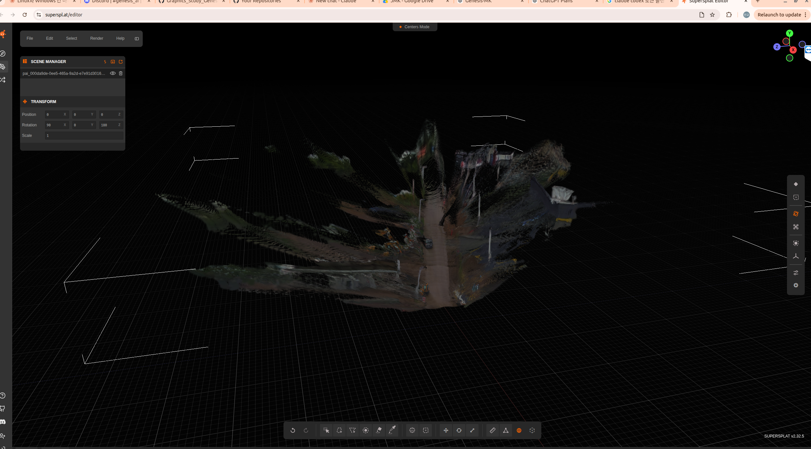

# NVIDIA Instant NuRec RTX 4090 로컬 검증 요약

작성일: 2026-09-04  

---

> instant nurec 데모를 로컬에서 실행 후 web 에서 결과 확인 한 것

## 결론 요약

| No. | 결론 |
| ---: | --- |
| 1 | **RTX 4090 24GB에서 Instant NuRec pretrained inference는 실제 성공했다.** |
| 2 | **공식 sample NCore clip 기준 `pq-front`, `pa-front`, `pa-front merge`가 모두 OOM 없이 완료됐다.** |
| 3 | **최신 재측정 기준 `pa-front merge` 생성 시간은 16.41초, 최대 GPU memory는 19,317 MiB였다.** |
| 4 | **RTX 4090 24GB는 공식 "more than 24GB" 조건의 경계선이라 공식 보장으로 표현하면 안 된다.** |
| 5 | **Full NuRec training/refinement와 quantization은 이번 실험에서 검증하지 않았다.** |

---

## 1. Instant NuRec이 무엇인가

| 항목 | 내용 |
| --- | --- |
| 분류 | pretrained feed-forward 3D reconstruction model |
| 입력 | NCore V4 driving log |
| 출력 | static 3D Gaussian PLY, sky sidecar `.npz`, sky preview `.png` |
| 목적 | driving log를 빠르게 3D Gaussian scene으로 변환 |
| 실행 방식 | native Python inference |
| Docker 필요 여부 | Instant NuRec inference에는 Docker 불필요 |
| Full NuRec과 차이 | Full NuRec은 downstream training/refinement pipeline |
| 이번 검증 범위 | Instant NuRec pretrained inference only |

---

## 2. 공식 문서/README 기준 스펙

| 항목 | 공식 기준 |
| --- | --- |
| repo | `NVIDIA/instant-nurec` |
| Python | `>=3.11,<3.12` |
| PyTorch | `torch==2.7.0+cu128` |
| TorchVision | `torchvision==0.22.0+cu128` |
| NCore | `nvidia-ncore==18.7.0` |
| CUDA runtime | PyTorch CUDA 12.8 wheel |
| 입력 형식 | NCore V4 `.json` 또는 `.lst` |
| GPU memory | **more than 24GB** |
| System RAM | **more than 48GB 권장** |
| 공식 sample dataset | `nvidia/PhysicalAI-Autonomous-Vehicles-NCore` |
| checkpoint | `nvidia/instant-nurec` |

---

## 3. 공식 스펙 vs 우리 서버

| 항목 | 공식 기준 | 우리 서버 | 판단 |
| --- | --- | --- | --- |
| OS | Linux x86_64 | Ubuntu Linux x86_64 | 충족 |
| Python | `>=3.11,<3.12` | 3.11.11 | 충족 |
| PyTorch | `2.7.0+cu128` | `2.7.0+cu128` | 충족 |
| CUDA runtime | CUDA 12.8 wheel | CUDA 12.8 wheel | 충족 |
| GPU | NVIDIA CUDA GPU | RTX 4090 | 충족 |
| VRAM | more than 24GB | 24,564 MiB | 경계선 |
| RAM | more than 48GB 권장 | 61 GiB | 충족 |
| sample NCore access | gated access 필요 | 성공 | 충족 |
| checkpoint access | 필요 | 성공 | 충족 |

---

## 4. 공식 Inference Profile

| profile | camera | frames | resolution | 특징 | 검증 |
| --- | --- | ---: | --- | --- | --- |
| `pq-front` | front-wide 1개 | 18 | 784x448 | point-query, 출력 적음 | **완료** |
| `pa-front` | front-wide 1개 | 18 | 784x448 | dense pixel-aligned | **완료** |
| `pa-multiview` | 1/3/5 cameras | camera당 18 | 504x280 | multi-camera | 미검증 |

---

## 5. 실제 테스트 결과

| 테스트 | profile | 입력 범위 | merge | 결과 | 출력 Gaussians | PyTorch reserved peak | `nvidia-smi` sampled peak |
| --- | --- | --- | --- | --- | ---: | ---: | ---: |
| 최소 smoke test | `pq-front` | 1 chunk, 약 13.5초 | No | **성공** | 728,967 | 10.73 GiB | 12,492 MiB |
| front dense test | `pa-front` | 1 chunk, 약 13.5초 | No | **성공** | 1,741,403 | 9.58 GiB | 11,308 MiB |
| 공식 README demo | `pa-front` | 전체 sample, 약 20초, 2 chunks | Yes | **성공** | 1,918,402 | 16.94 GiB | 19,317 MiB |

---

## 6. 실제 생성 시간 및 GPU 자원

| 항목 | 실측값 |
| --- | ---: |
| 전체 wall time | **16.41초** |
| Python 내부 측정 시간 | **14.37초** |
| chunk inference 시간 | 약 **2.8초** |
| 처리 입력 길이 | 약 **20초 demo clip** |
| 처리 chunk 수 | **2 chunks** |
| merge 전 Gaussians | **3,178,040** |
| voxelization 후 출력 Gaussians | **1,918,402** |
| 출력 전체 크기 | **143 MB** |
| PLY 파일 크기 | 약 **141 MB** |
| `nvidia-smi` GPU memory peak | **19,317 MiB** |
| PyTorch reserved peak | **16.94 GiB** |
| PyTorch allocated peak | **6.63 GiB** |
| GPU utilization peak | **100%** |
| GPU power peak | **271.32 W** |
| CPU 사용률 | **139%** |
| Host RAM peak RSS | 약 **2.87 GiB** |
| Swap 사용 | **0** |
| 4090 VRAM total | 24,564 MiB |
| peak 기준 남은 VRAM 여유 | 약 **5.2 GiB** |

---

## 7. 실제 Inference GPU Memory 요약

| 기준 | 최대값 |
| --- | ---: |
| `nvidia-smi` sampled peak | **19,317 MiB** |
| PyTorch reserved peak | **16.94 GiB** |
| PyTorch allocated peak | **7.59 GiB** |
| 4090 VRAM total | 24,564 MiB |
| peak 기준 남은 여유 | 약 5.2 GiB |

---

## 8. 양자화 가능 여부

| 항목 | 확인 결과 |
| --- | --- |
| INT8 | 공식 CLI 옵션 확인 안 됨 |
| FP8 | 공식 CLI 옵션 확인 안 됨 |
| 4-bit | 공식 CLI 옵션 확인 안 됨 |
| FP16/BF16 | 공식 CLI 직접 지정 옵션 확인 안 됨 |
| 이번 실험 | 양자화 적용 안 함 |
| 판단 | **공식 지원 전 임의 적용하지 않는 것이 맞음** |

---

## 9. 학습/Refinement GPU Memory

| 항목 | 판단 |
| --- | --- |
| Instant NuRec inference | 이번 실험에서 성공 확인 |
| Instant NuRec training | 이번 실험에서 측정 안 함 |
| Full NuRec training/refinement | 이번 실험에서 실행 안 함 |
| 우리 서버 VRAM | 24GB급, 공식 기준 경계선 |
| 우리 서버 RAM | 61 GiB, 권장 충족 |
| 최종 판단 | **이번 결과로 training/refinement 가능하다고 말하면 안 됨** |

---

## 10. 미검증 항목

| 항목 | 상태 |
| --- | --- |
| Full NuRec training | 미검증 |
| NuRec refinement | 미검증 |
| `pa-multiview` | 미검증 |
| 5-camera input | 미검증 |
| render preview/video | 미검증 |
| custom NCore dataset | 미검증 |
| quantization inference | 미검증 |
