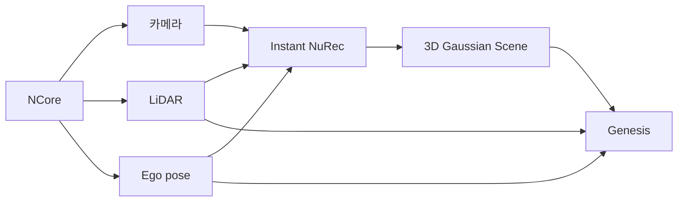
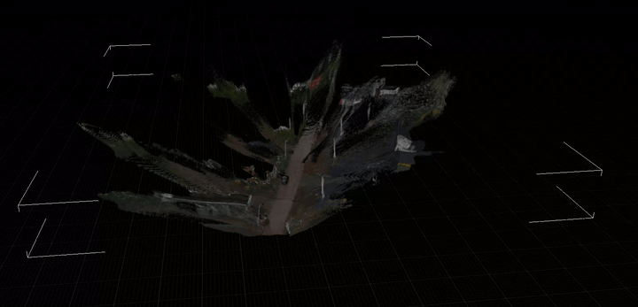
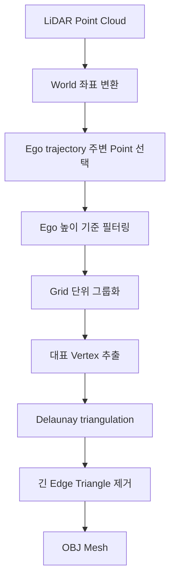
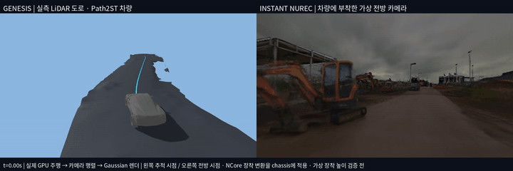

# Instant NuRec 기반 Genesis 환경 구성

> 한줄 요약: NCore 센서 데이터로 3D Gaussian Scene을 생성하고, LiDAR 기반 Mesh와 주행 경로를 Genesis에 결합

Instant Nurec : 실제 센서 데이터에 존재하는 장면을 재구성하는 도구

## 1. 입력 데이터

- 카메라: 영상 정보
- LiDAR: ray를 쏘아 point cloud를 생성 -> depths 추정용
- Ego pose: 센서가 각 순간 어디에 있었고 어느 방향을 보고 있었는지
    >ego : 관측 주체/카메라 를 의미



## 2. Instant NuRec을 이용한 3D Scene 생성



> web viewer 에서 열은 ply(polygon file format)
### 2.1 Scene 생성 과정

- 입력 데이터
- 좌표계 정렬
- 3D Gaussian Scene 생성

```text
카메라 영상 + LiDAR 깊이 + Camera pose
                    ↓
              좌표계 정렬
                    ↓
           Instant NuRec 추론
                    ↓
             3D Gaussian Scene
```

Ncore 정보(카메라 + LiDAR depth + camera pose) -> instant nurec -> 3d gaussian scene 생성

* ncore(여러 프레임 이미지,lidar depths, cam pos) 정보 저장
* 데이터들을 하나의 3D 좌표계에 정렬
* pretrained reconstruction model : 이미지, LiDAR, pose 정보를 이용해 Gaussian의 위치·크기·색상·투명도 등을 예측
* 3D gaussian scene 생성

### 2.2 Point Cloud와 Gaussian의 차이

> gaussian 이랑 pointcloud는 다름

Point Cloud는 위치를 표현하는 3D 점들의 집합.

```text
Point 1: x, y, z
Point 2: x, y, z
Point 3: x, y, z
```

Gaussian Scene은 각 요소가 위치뿐 아니라 크기, 방향, 색상, 투명도 등의 시각 정보를 함께 가짐.

```text
Gaussian 1:
- 위치
- 크기
- 방향
- 색상
- 투명도
```

따라서 Point Cloud는 공간 구조를 나타내는 데이터에 가깝고, Gaussian Scene은 장면을 렌더링하기 위한 표현에 가까움.

## 3. Genesis 환경 변환

생성된 도로 pointcloud를 휴리스틱 샘플링하여 Genesis에 import

### 3.1 주행 경로 변환

ego pose trajectory와 sensor data로 경로정보(a,k) 계산 후 Genesis import

### 3.2 LiDAR 기반 Mesh 생성

#### Mesh 생성 절차



| 단계 | 설명 |
|---|---|
| 1 | NCore LiDAR point cloud를 읽음 |
| 2 | 각 LiDAR frame의 point를 world 좌표로 변환 |
| 3 | ego trajectory 주변 point만 남김(휴리스틱 룰) |
| 4 | ego 높이와 비슷한 point만 남김(휴리스틱 룰) |
| 5 | 남은 point를 `0.5m` grid 단위로 묶음 |
| 6 | 각 grid cell에서 median point를 대표 vertex로 사용 |
| 7 | XY 평면에서 Delaunay triangulation 수행 |
| 8 | edge가 너무 긴 triangle 제거 |
| 9 | OBJ mesh로 저장 후 Genesis 로딩 |

#### 휴리스틱 기준

| 규칙 | 값 |
|---|---|
| ego 경로에서 XY 거리 | `< 5m` |
| ego pose 높이와 LiDAR point z 차이 | `< 0.35m` |
| grid 크기 | `0.5m` |
| grid cell 최소 point 수 | `>= 5` |
| triangle 최대 edge 길이 | `< 1.1m` |

> 공식 기준으로는 Instant NuRec repo가 “static scene Gaussians를 PLY와 sky cubemap으로 export”하는 범위입니다. Genesis Nyx 문서도 Gaussian splat은 simulated geometry와 같이 렌더링하는 용도라고 설명하고, collider/physics mesh 생성 기능으로 보기는 어렵습니다.

## 4. 결과

### Mesh와 Path를 적용한 Genesis 주행



왼쪽 : instant nurec에서 생성한 3D Gaussian Scene에 Genesis 차량만 합성  
오른쪽 : Genesis 시뮬레이션에서 mesh, path import 후 실제 주행

## 5. 한계점 

- Gaussian Scene은 시각화 중심 
- 물리 충돌용 Mesh는 별도 모델 기반 생성 필요(3D gaussian &rarr; Mesh)
