# Instant Nurec vs Nurec 실행 

목적 : 3D gaussian scene을 physics foundation으로 올리기 위해 rendering layer를 actual collision/physics layer로 올리기 위한 framework

###  Instant NuRec과 NuRec 비교

| 구분 | Instant NuRec | 일반 NuRec |
|---|---|---|
| 목적 | 빠른 3D Scene 생성 | Scene별 학습을 통한 고품질 3D Scene 생성 |
| 생성 방식 | Pretrained model의 단일 forward pass | Scene별 최적화 및 학습 |
| 생성 시간 | **2.7초** (추론 구간 실측) | **약 8분 03초** (동일 데모·3-camera·1,000 step 실측) |
| Scene 표현 | 3D Gaussian Splatting | Layer 기반 3D Gaussian Splatting (layer: 객체/움직임 등에 따라 분리해서 관리) |
| 현재 공개 출력 | Static Gaussian PLY, Sky Cubemap | USDZ, Gaussian checkpoint, Scene 정보, 경로 및 Track 정보 |
| Dynamic 객체 | 연구 모델에는 포함되지만 현재 standalone repo에서는 미지원 | 차량, 보행자 등을 별도 **Dynamic Layer**로 관리 |
| 새로운 View 렌더링 | 가능하지만 입력 View에서 멀어질수록 품질 저하 가능 | 가능하며 Scene별 최적화로 상대적으로 높은 품질(최적화&품질 비례) |
| **물리 충돌용 Mesh** | 별도 생성 필요 | 별도 **Mesh 생성 과정** 필요 |
| 시뮬레이터 연동 | PLY Viewer 또는 별도 Renderer 필요 | USDZ 및 gRPC를 통해 Omniverse·Isaac Sim 등과 연동 |
| 공식 최소 GPU 사양 | NVIDIA CUDA GPU, VRAM 24GB 초과, CUDA 12.8+ | NVIDIA CUDA GPU, VRAM 24GB 초과, CUDA 12.8+ |
| 공식 권장 GPU 사양 | VRAM 48GB 초과 | VRAM 48GB 초과 |
| 현재 RTX 4090 24GB | 동일 데모에서 1,918,402 Gaussian 생성 확인 | 동일 데모·3-camera·1,000 step 실행 확인, 최대 GPU 메모리 약 8.2GB |

### NuRec 실행 Pipeline

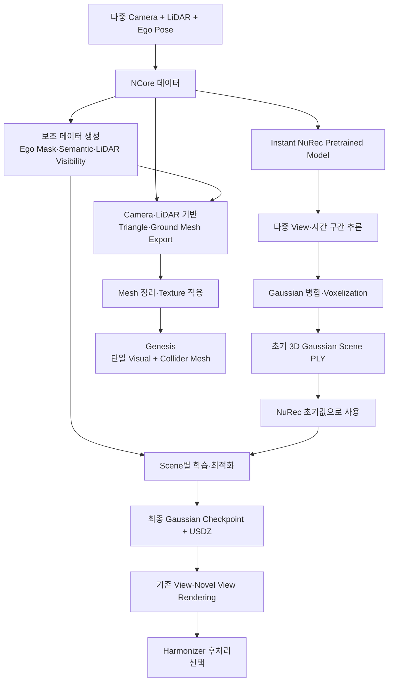

#### 핵심

- Instant NuRec은 범용 Pretrained Model을 사용하여 Scene의 초기 Gaussian을 빠르게 생성
- 다중 Camera View와 서로 다른 시간 구간을 사용한 후 Gaussian을 병합하는 것이 장면 범위와 초기값 품질을 높임
- 일반 NuRec은 Instant NuRec PLY를 Background Gaussian 초기값으로 사용한 후에도 Scene별 추가 학습·최적화 과정이 필요함.
- 학습이 완료된 Scene은 재학습 없이 다양한 View에서 Rendering 가능함.
- NuRec의 Mesh Export는 Gaussian Scene을 Mesh로 직접 변환하는 기능이 아니며, Camera·LiDAR Dataset에서 Triangle·Ground Mesh를 별도로 생성함.
- Genesis에서 같은 Mesh를 Visual과 Collider로 사용하려면 Export한 Mesh의 Hole, Face 수, Texture를 정리해야 함.

| 구간 | 일반 NuRec | Instant NuRec |
|---|---|---|
| 동일 시간대 0~20.01초 160 frames | 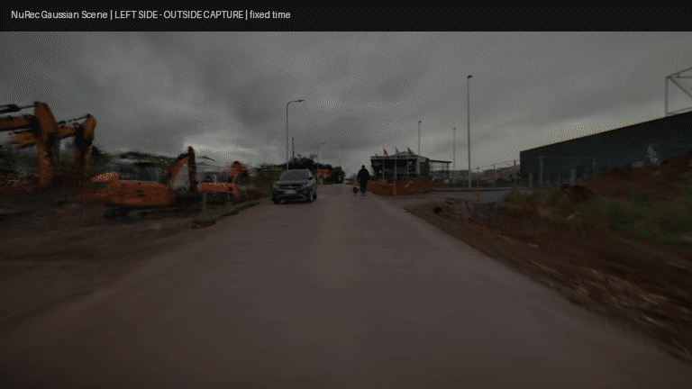 | 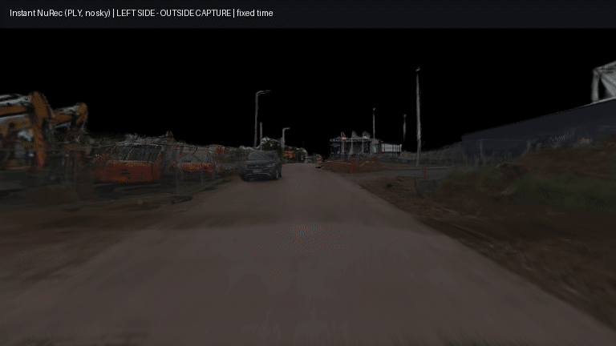 |

* nurec의 보행자는 동적 객체로 표현: 움직이는 보행자

### 현재까지 실행한 Mesh화 및 Genesis 결과

목표: Gaussian Scene을 mesh로 바꾸고 Genesis에서 차량을 주행시키는 것.

#### 1. Gaussian Scene을 직접 Mesh화

- **GS2Mesh**: Instant NuRec과 일반 NuRec Gaussian을 각각 여러 시점에서 렌더링하고, Stereo Depth·TSDF로 mesh를 생성함. 두 결과 모두 시각용 mesh는 생성됐지만 관측하지 못한 측면·후면과 도로 외곽이 끊김.
- **DN-Splatter / AGS-Mesh**: Gaussian 위치·법선에서 Poisson mesh를 생성함. 주변 구조는 포함됐지만 표면이 과도하게 메워지고 도로가 울퉁불퉁해짐. 이 mesh를 collider로 주행하면 약 25% 지점에서 차량이 전복함.
- 따라서 Gaussian-derived mesh만으로는 현재 데이터에서 정확한 도로 collider를 만들지 못함.

#### 시도한 Mesh화 프레임워크

| 프레임워크 | 쉬운 설명 | 실행 상태 | Genesis Mesh 렌더 | Genesis 주행 |
|---|---|---|---|---|
| GS2Mesh | Gaussian Scene을 여러 카메라에서 다시 보고 깊이를 만들어 TSDF mesh로 합침. | 실행 완료 | 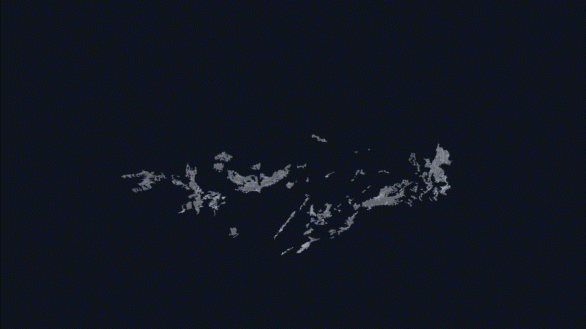 시각용 mesh 생성 성공, 끊긴 도로·가려진 영역이 남음. | 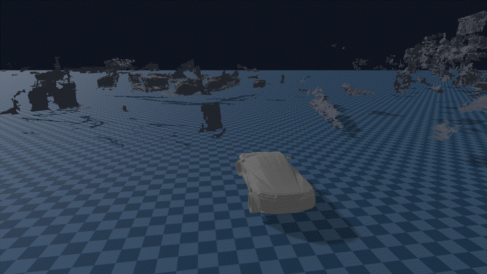 시각용 mesh로 로딩. LiDAR 도로·ground plane을 물리용으로 분리함. |
| DN-Splatter / AGS-Mesh | Gaussian의 위치·방향 정보를 표면으로 이어 Poisson mesh를 만듦. | 실행 완료 | 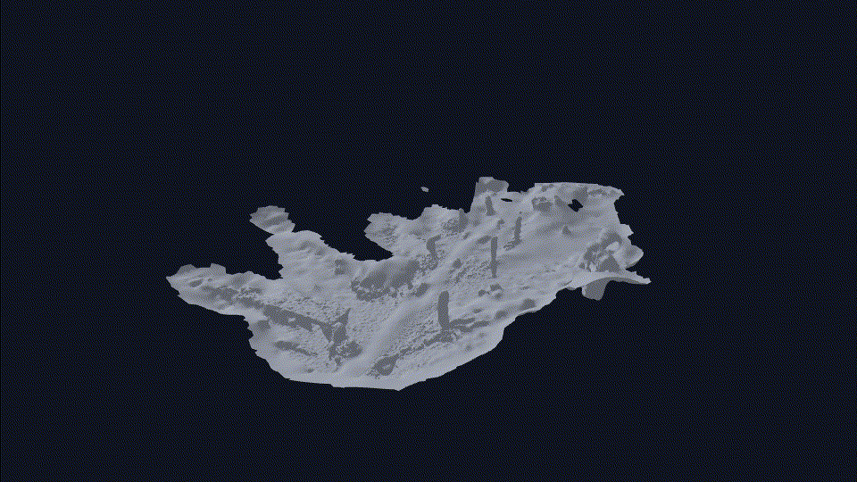 Poisson mesh 생성 성공. | 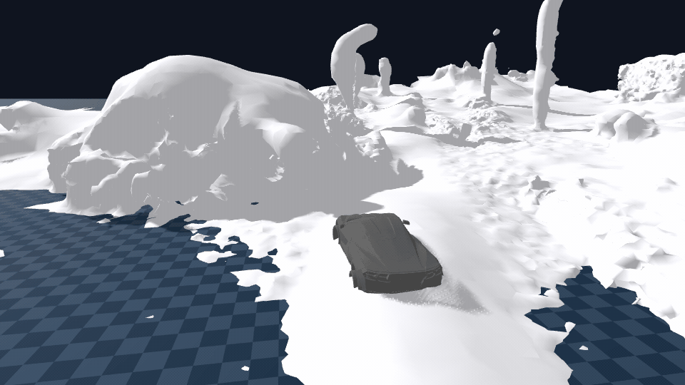 시각용 mesh로 로딩. LiDAR 도로·ground plane을 물리용으로 분리함. |
| NCore Camera depth + LiDAR TSDF | Camera depth로 주변을 만들고 LiDAR로 도로 높이를 보강해 mesh를 만듦. | 실행 완료 | 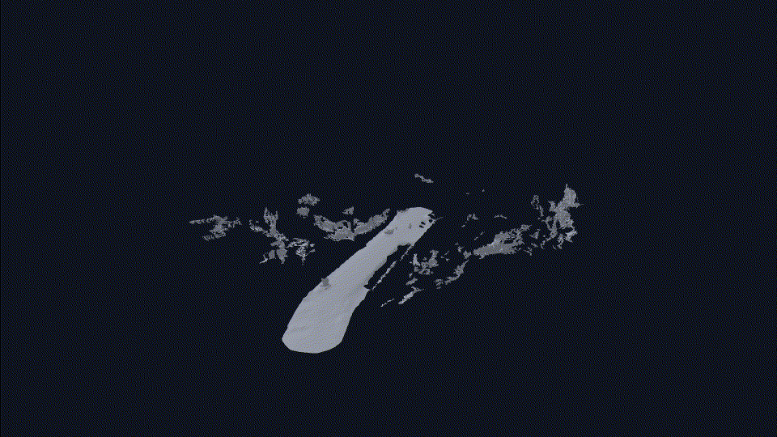 Camera depth TSDF 주변 mesh와 LiDAR road mesh를 NCore world 좌표에서 결합함. | 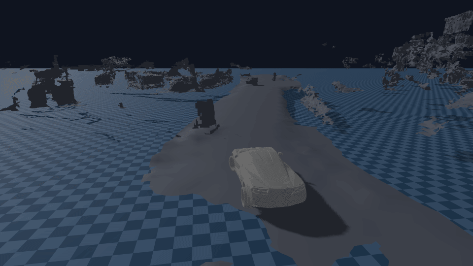 현재 적용 방식. |
| MILo | Gaussian의 크기·방향을 이용해 물체 표면을 직접 찾아 mesh로 추출함. | 추출 단계 미실행 | 아직 미실행 | - |

#### 2. 현재 Genesis 주행 방식 : Ncore

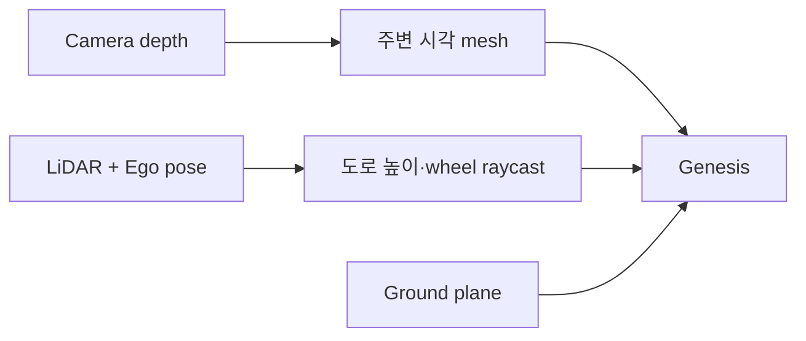

- Camera depth TSDF mesh는 건물·주변 구조를 보이는 **시각용 mesh**로 사용함.
- LiDAR road mesh는 바퀴가 따라갈 높이를 계산하는 **도로용 mesh**로 사용함.

결과 GIF: 

#### 3. Instant Nurec vs Nurec mesh 생성

그렇다면 instant nurec 이면 안되는가? 

 시간 비교 : **2.7초** vs **약 8분** (RTX 4090 실측)

| Instant NuRec mesh | 일반 NuRec mesh |
|---|---|
| 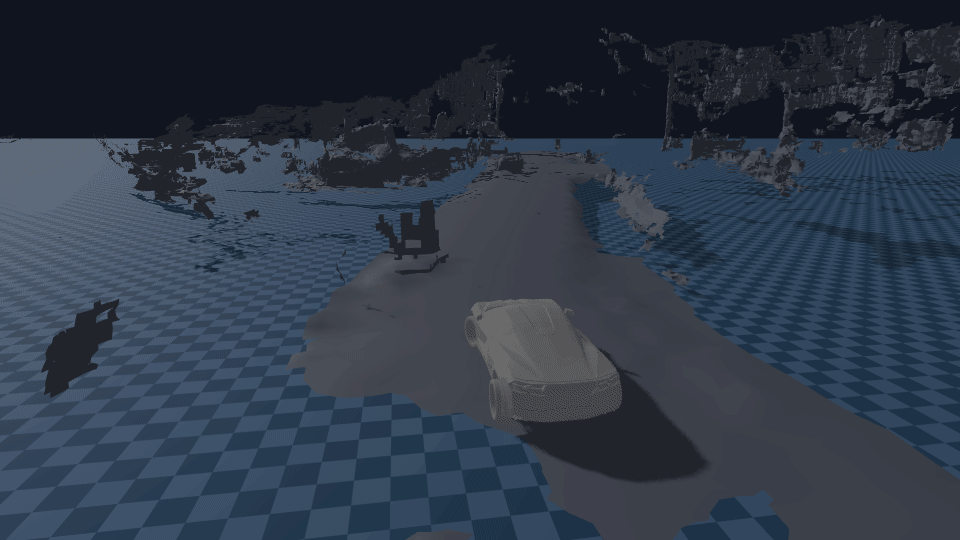 |  |
| 동일한 NCore 경로·LiDAR 도로 물리 조건에서 생성한 mesh를 Genesis에 표시함. | 동일한 NCore 경로·LiDAR 도로 물리 조건에서 생성한 mesh를 Genesis에 표시함. |

#### 4. 현재 결론

- 지금 mesh 단절은 Genesis 오류가 아니라, **카메라·LiDAR가 보지 못한** 측면·후면·가려진 영역의 **관측 부족** 때문임.
- 일반 NuRec과 Instant NuRec의 mesh 차이가 작아 보이는 것도 동일한 TSDF 변환과 LiDAR 도로 보강이 Gaussian 렌더링 품질 차이를 줄이기 때문임.
- 현재는 **LiDAR road mesh를 물리용으로 유지하고, Gaussian-derived mesh는 건물·벽 등 시각용 보조 geometry로 사용하는 방식**이 가장 안정적임.

### Next Step
* 아직 3DGS 를 mesh화 하는 것에 대한 개념 이해가 부족
* 개념/방법 공부 후 더 다양한 방법 시도해볼 예정
* 현재까지는 instant nurec이 시간 비용적으로 더 효율적으로 보임