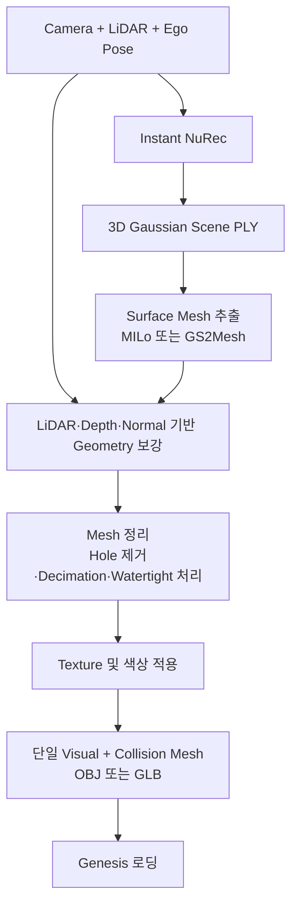

# Nurec

목적 : 3D gaussian scene을 physics foundation으로 올리기 위해 rendering layer를 actual collision/physics layer로 올리기 위한 framework

###  Instant NuRec과 NuRec 비교

| 구분 | Instant NuRec | 일반 NuRec |
|---|---|---|
| 목적 | 빠른 3D Scene 생성 | Scene별 학습을 통한 고품질 3D Scene 생성 |
| 생성 방식 | Pretrained model의 단일 forward pass | Scene별 최적화 및 학습 |
| 생성 시간 | 약 1.5초 | 약 75분 (연구 결과 기준) |
| Scene 표현 | 3D Gaussian Splatting | Layer 기반 3D Gaussian Splatting |
| 현재 공개 출력 | Static Gaussian PLY, Sky Cubemap | USDZ, Gaussian checkpoint, Scene 정보, 경로 및 Track 정보 |
| Dynamic 객체 | 연구 모델에는 포함되지만 현재 standalone repo에서는 미지원 | 차량, 보행자 등을 별도 Dynamic Layer로 관리 |
| 새로운 View 렌더링 | 가능하지만 입력 View에서 멀어질수록 품질 저하 가능 | 가능하며 Scene별 최적화로 상대적으로 높은 품질 |
| Instant NuRec 결과 활용 | 최종 PLY로 사용하거나 NuRec 초기값으로 전달 | Instant NuRec PLY를 초기값으로 받아 추가 학습 가능 |
| Gaussian → Mesh 직접 변환 | 미지원 | 미지원 — Gaussian 자체를 Triangle/Physics Mesh로 직접 변환하지 않음 |
| 물리 충돌용 Mesh | 별도 생성 필요 | 별도 Ground Mesh 또는 nvblox 등의 Mesh 생성 과정 필요 |
| 시뮬레이터 연동 | PLY Viewer 또는 별도 Renderer 필요 | USDZ 및 gRPC를 통해 Omniverse·Isaac Sim 등과 연동 |
| 공식 최소 GPU 사양 | NVIDIA CUDA GPU, VRAM 24GB 초과, CUDA 12.8+ | NVIDIA CUDA GPU, VRAM 24GB 초과, CUDA 12.8+ |
| 공식 권장 GPU 사양 | VRAM 48GB 초과 | VRAM 48GB 초과 |
| GPU 예시 | A100, A40, RTX A6000, L40/L40S, H100 등 | A100, A40, RTX A6000, L40/L40S, H100 등 |
| 현재 RTX 4090 24GB | pa-front 실행 확인. 다중 View는 VRAM 부족 가능성 있음 | 실행은 가능할 수 있지만 공식 최소 VRAM 요건에는 미달 |

> 일반 NuRec의 USDZ 출력은 Gaussian Scene이 Mesh로 변환된다는 뜻이 아님. 공식 워크플로의 물리 Mesh는 LiDAR·Depth를 nvblox 등으로 처리해 별도로 생성함.

### Instant NuRec Gaussian Scene의 Mesh화 프레임워크

목표: Instant NuRec으로 생성한 3D Gaussian Scene을 정확한 Surface Mesh로 변환하고, 같은 Mesh를 Genesis의 Visual과 Collider에 함께 사용하는 것
| 프레임워크 | 방식 | 장점 | 한계 | 현재 목적 적합도 |
|---|---|---|---|---|
| MILo | Gaussian 파라미터와 Camera View를 이용해 Surface Mesh 추출 | 실외 Scene 처리, 적은 Vertex로 정밀한 Mesh 생성, 물리 시뮬레이션 활용 가능 | Instant NuRec Renderer·Camera 형식 연결 필요 | 높음 |
| GS2Mesh | Gaussian에서 Novel Stereo View와 Depth를 생성한 후 TSDF로 Mesh 추출 | Noisy Gaussian에서 비교적 부드러운 Mesh 생성, 별도 추가 최적화 불필요 | Gaussian Renderer와 Camera View 필요. 입력 View 밖의 형상은 정확도 보장 불가 | 높음 |
| SuGaR | Gaussian을 표면에 정렬하고 Poisson 기반 Mesh 추출 및 재최적화 | UV Texture가 포함된 전통적 OBJ Mesh 생성 가능 | 원본 영상·Camera와 추가 학습 필요. 넓은 실외 Scene은 처리 부담이 큼 | 보통 |
| DN-Splatter / AGS-Mesh | Depth·Normal 정보를 사용해 TSDF·Poisson Mesh 추출 | LiDAR·Depth를 활용하면 도로 높이와 경사를 보다 정확하게 복원 가능 | Instant NuRec PLY의 단순 후처리가 아니며 별도 Pipeline 연결 필요 | 높음 — Geometry 보강용 |
| splat-transform | Gaussian PLY를 Voxelize하여 Watertight Collision Mesh 생성 | Instant NuRec PLY에서 빠른 Collider 생성, GLB 출력 | Voxel 기반 근사 Mesh로 시각적 세부 품질이 낮음 | 낮음 — Prototype용 |
| NVIDIA Simplicits | Mesh 변환 없이 Gaussian에 물리 적용 | Gaussian을 직접 탄성 시뮬레이션에 사용 가능 | 정적 도로 Collider나 Genesis용 단일 Mesh 출력 목적과 다름 | 낮음 |

#### Pipeline

#### 적용 방향

- Instant NuRec Gaussian Scene을 반드시 출발점으로 사용하는 경우 MILo 또는 GS2Mesh가 적합함.
- 시각적 품질과 Texture가 가장 중요한 경우 SuGaR를 사용할 수 있음.
- 도로 높이, 경사, 벽 위치 등 물리 Geometry의 정확도는 LiDAR·Depth 기반 DN-Splatter 또는 TSDF로 보강하는 것이 적합함.
- 최종 Mesh는 OBJ 또는 GLB로 변환하여 Genesis에서 동일한 Visual·Collision Mesh로 사용함.
- pa-front와 같이 입력 View가 제한된 Gaussian Scene은 보이지 않은 방향의 정확한 Mesh 복원이 어려우므로 다중 Camera View와 LiDAR 활용이 필요함.
