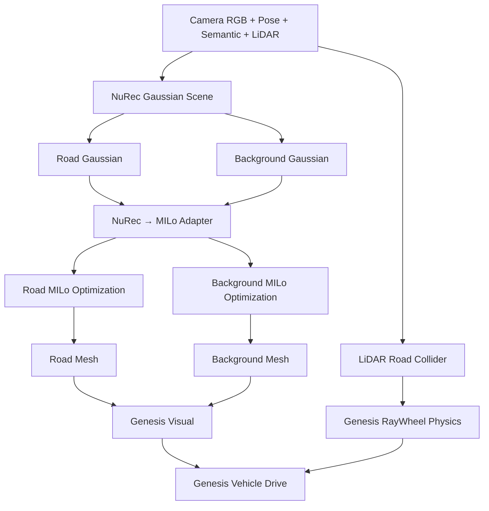

# NuRec Gaussian Scene을 MILo Mesh로 변환하고 Genesis에 적용하는 Workflow

> NuRec은 rendering용 3D Gaussian Scene을 만들고, MILo는 이를 surface에 맞게 재최적화해 Mesh를 추출한다. 현재 안정적인 주행은 MILo visual mesh와 LiDAR physics collider를 분리하는 방식이다.

NuRec Gaussian은 새로운 camera view를 렌더링하는 데 적합하지만, 차량이 직접 주행할 수 있는 연속 triangle surface를 보장하지 않는다. 따라서 3DGS를 바로 Genesis collider로 넣지 않고, Road와 Background를 분리한 뒤 MILo surface optimization과 LiDAR 검증을 거쳐 Genesis에 적용한다.

이 문서는 현재 NCore/NuRec/MILo/Genesis 실험에서 사용한 흐름과, MILo mesh를 physics collider로 바로 쓰지 못한 이유를 정리한다.

## 1. 전체 구조



## 2. NuRec이 만드는 것

NuRec Gaussian 하나는 다음 정보를 가진다.

```text
위치 + 크기 + 방향 + 색상 + 투명도
```

이는 camera에서 보이는 영상을 잘 재현하기 위한 표현이다. 따라서 Gaussian Scene에 도로가 보여도 다음은 보장하지 않는다.

- 연속적인 triangle surface
- 차량 폭 전체를 덮는 도로
- 평평한 물리 surface
- 미관측 영역의 geometry

> **핵심 아이디어**: Gaussian은 rendering 표현이고, Mesh는 물리/표면 표현이다. 둘은 자동으로 같아지지 않는다.

## 3. Road와 Background를 분리하는 이유

Road는 평평함·연속성·높이가 중요하고, Background는 건물·벽·수목 같은 입체 구조가 중요하다. 전체 Gaussian에 같은 surface loss를 적용하면 도로와 구조물이 서로의 최적화를 방해한다.

| Layer | 포함 class | 필요한 특성 |
|---|---|---|
| Road | road, sidewalk, terrain | 평탄성, 연속성, LiDAR 높이 정합, wheel contact |
| Background | building, wall, fence, pole, vegetation 등 | 입체 구조, visual coverage |
| 제외 | sky, ego vehicle, 차량, 보행자 등 dynamic class | static mesh 학습에서 제외 |

따라서 Road와 Background Gaussian을 별도 MILo optimization으로 처리하고, 마지막에 Genesis에서 visual layer로 함께 표시한다.

## 4. NuRec → MILo Adapter

Adapter는 별도 학습 모델이 아니라 NuRec 결과와 MILo 입력을 연결하는 코드이다.

| 입력 | Adapter 처리 | 출력 |
|---|---|---|
| NuRec Gaussian PLY | MILo Gaussian attribute 형식으로 변환 | MILo initial Gaussian PLY |
| NCore Camera RGB | pinhole virtual camera로 rectification | COLMAP image |
| NCore camera pose | world-to-camera pose 변환 | COLMAP camera pose |
| semantic segmentation | Road/Background별 alpha mask 생성 | layer별 RGB supervision |
| NCore LiDAR | Road height anchor·검증 point 생성 | LiDAR surface constraint |

좌표계는 NCore world를 유지한다.

```text
+X front
+Y left
+Z up
```

Genesis에서도 같은 좌표계를 사용하므로, GLB를 로딩할 때 추가 축 회전을 적용하지 않는다.

## 5. MILo에서 최적화하는 것

MILo는 Gaussian 위치·크기·방향과 surface occupancy를 조정하면서, 중간에 Mesh를 반복적으로 추출한다.

```text
Gaussian → 임시 Mesh → image/depth/normal과 비교 → Gaussian 수정
```

### 5.1 Road optimization

Road pixel에 대해서만 RGB loss를 적용하고, 도로 surface에 필요한 제약을 추가한다.

```text
Road loss =
  Road RGB loss
+ NuRec geometry anchor
+ LiDAR height loss
+ Up-normal loss
+ Depth-normal consistency
+ Mesh consistency
```

| 제약 | 목적 |
|---|---|
| Geometry anchor | NuRec Gaussian이 원래 scene geometry에서 과도하게 이동하지 않게 함 |
| LiDAR height loss | Road Gaussian의 Z가 측정 LiDAR road height에 맞게 함 |
| Up-normal loss | Road surface normal이 +Z 방향에 가깝게 함 |
| Depth-normal consistency | 렌더링 depth와 normal이 하나의 표면을 가리키게 함 |
| Mesh consistency | 추출 Mesh와 Gaussian surface가 서로 어긋나지 않게 함 |

### 5.2 Background optimization

Background는 도로처럼 평평하게 만들지 않는다. Road/sidewalk/terrain pixel을 RGB loss에서 제외하고, 정적 구조의 appearance와 surface consistency만 최적화한다.

```text
Background loss =
  Background RGB loss
+ NuRec geometry anchor
+ Depth-normal consistency
+ Mesh consistency
```

## 6. MILo Mesh 추출

MILo는 Gaussian을 단순히 삼각형으로 연결하는 방식이 아니다.

```text
Gaussian
    ↓
Gaussian 주변 Voronoi point 생성
    ↓
Delaunay tetrahedralization
    ↓
occupancy / SDF 계산
    ↓
Marching Tetrahedra
    ↓
Triangle Mesh
```

> **잘못된 이해**: Gaussian PLY가 있으면 바로 좋은 collider Mesh가 나온다.
>
> Gaussian PLY만으로도 proxy Mesh는 만들 수 있지만, 물리적으로 연속적인 road surface를 얻으려면 MILo optimization과 LiDAR 검증이 추가로 필요하다.

## 7. 현재 실측 시간

RTX 4090에서 경량 검증 설정으로 실행한 결과이다. Gaussian count를 고정하고 densification을 끈 빠른 validation 설정이다.

| 구간 | Gaussian 수 | 설정 | 실측 시간 |
|---|---:|---|---:|
| Road MILo optimization | 101,606 | 1,200 step | 44.7초 |
| Background MILo optimization | 80,000 | 1,200 step | 29.1초 |
| Road / Background Mesh extraction | Delaunay pivot 최대 20,000 | 200 refinement | 각 약 10초 내외 |
| 전체 전처리·검증·후처리 | - | 경량 validation | 약 2~4분 |

NuRec Scene이 이미 생성되어 있으면 NuRec의 scene optimization은 반복하지 않아도 된다. 다만 MILo의 surface-aware optimization은 별도 단계이다.

정식 MILo 수준의 고품질 결과를 목표로 하면 더 많은 iteration, densification, 고해상도 surface refinement가 필요하므로 수십 분~1시간 이상의 비용을 예상해야 한다.

## 8. Mesh 검증과 후처리

MILo가 추출한 Mesh는 바로 collider로 사용하지 않고 다음을 검사한다.

- 긴 triangle edge 제거
- LiDAR road height와 크게 다른 face 제거
- 작은 floater component 제거
- camera 관측 범위 밖 face 제거
- 차량 중심선과 wheel footprint의 vertical raycast hit 검사

현재 Road Mesh의 변화는 다음과 같다.

| 단계 | Vertex | Triangle | Component | 특징 |
|---|---:|---:|---:|---|
| MILo raw road mesh | 176,070 | 353,331 | 177 | 최대 edge 약 5.3 m, 넓은 외삽·floater 포함 |
| LiDAR 검증 후 road mesh | 36,886 | 71,882 | 5 | 도로에 가까운 영역만 유지, hole과 요철은 남음 |

## 9. Genesis 적용 방식

현재 Genesis에서는 visual mesh와 physics collider를 분리한다.

```text
MILo Road Mesh       → Visual mesh
MILo Background Mesh → Visual mesh
LiDAR Road Mesh      → RayWheel physics collider
```

LiDAR collider는 fallback ground가 아니다. 실제 NCore LiDAR와 ego pose로 만든 측정 기반 road surface이다.

| 항목 | 결과 |
|---|---|
| Genesis 좌표계 | NCore world 유지, +X front / +Z up |
| visual layer | MILo Road + Background mesh |
| physics layer | LiDAR road triangle mesh |
| fallback ground | 미사용 |
| wheel contact | 100% |
| 경로 진행률 | 97.8% |

## 10. MILo Mesh를 collider로 직접 쓰지 못한 이유

Road centerline만 보면 일부 구간에 Mesh가 있어도, 실제 차량은 좌우 바퀴 폭 전체에서 surface가 연속이어야 한다.

```text
centerline hit
    ≠
four-wheel footprint hit
```

현재 MILo Road Mesh는 전체 경로 중심선 hit율이 63.4%였고, 차량 폭까지 고려하면 연속적으로 네 바퀴를 지지하는 구간이 매우 짧았다. 직접 collider 시험에서는 시작 시점에 두 바퀴만 Mesh를 감지해 차량이 바로 기울었다.

> **문제점**: Genesis 로딩 오류가 아니라, MILo Road Mesh의 hole과 surface coverage 부족이다.

## 11. 현재 결론

현재 성공한 범위는 다음과 같다.

```text
NuRec Gaussian Scene
→ Road / Background semantic layer 분리
→ MILo adapter
→ layer별 MILo optimization
→ 실제 triangle Mesh 추출
→ Genesis visual mesh 로딩
→ LiDAR collider 위 RayWheel 주행
```

아직 해결되지 않은 목표는 다음이다.

```text
MILo Road Mesh 하나
= Visual mesh
= Physics collider
```

이를 위해서는 Road Gaussian coverage 확대, LiDAR-anchored SDF/TSDF 결합, 차량 폭 기준 hole closing, road 전용 surface regularization, 관측 confidence 기반 physics mesh 정책이 필요하다.
