# with LiDAR
> 목표: gaussian splatting으로 만들어진 씬을 mesh화

- 여기서 제약조건: gaussian splatting은 visual scene이라서 뎁스 정보가 불분명하다 &rarr; 현재 nurec 데모 에서는 lidar 가 있기때문에 가능하다 라고 가정하고 진행


### mesh 자동화 과정: 3DGS는 visual layer이다

* 3DGS 에선 lidar 정보가 없다 &rarr; **visual layer**이기때문
* **전통 방식**에선 사람이 **수동으로 mesh를 직접 깔았음** &rarr; 이 부분을 **자동화**할 순 없을까?


### Nurec은 mesh 자동화를 제공하는가?
> 다음은 mesh와 관련된 Nurec의 함수들이다

* `export-depth` : 학습된 Gaussian 씬을 특정 카메라 시점에서 렌더링한 **Gaussian depth** : 굳이 nurec이 아니더라도 Gaussian Scene의 최적화가 잘 되어있으면 gaussian depth는 어떤 프레임워크이던 계산 가능함
* `export-mesh` : LiDAR·카메라 관측을 점군으로 합치고, 점의 표면 방향(normal)을 추정한 뒤 Poisson Surface Reconstruction으로 삼각형 mesh를 만드는 기능 : Lidar 정보 사용, 시각 layer인 3DGS에선 **Lidar를 사용할 수 없는 가정이므로 기각**


```
NuRec 3D Gaussian Scene
    ↓
NuRec export-depth
    ↓
여러 카메라 시점에서 Gaussian depth 렌더링
    ↓
depth + 카메라 intrinsics·poses
    ↓
[방법 A] depth를 3D 점으로 역투영 → 법선 추정 → Poisson mesh(`export-mesh`)
[방법 B] depth를 TSDF로 융합 → 표면 추출 → triangle mesh(`export-depth`)

```


| 방법 | 결과 이미지 | 처리 방식 | 판정 |
|---|---|---|---|
| 원본 NuRec Gaussian 도로 | 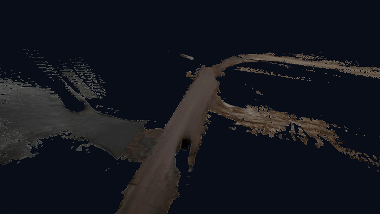 | NuRec road Gaussian layer 렌더링 | 비교 기준 |
| A | 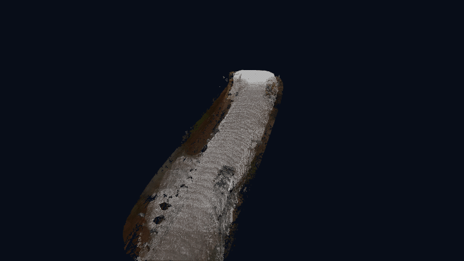 | LiDAR 사용 | **사용 불가** |
| B | 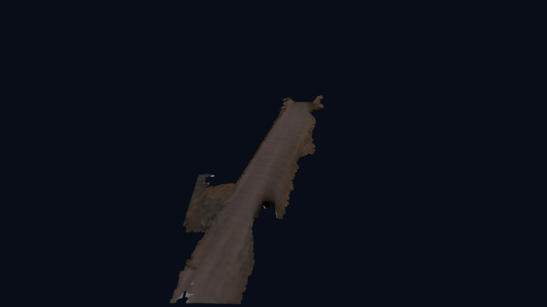 | Gaussian depth → TSDF → Mesh + Gaussian RGB 투영 | **사용 가능** |


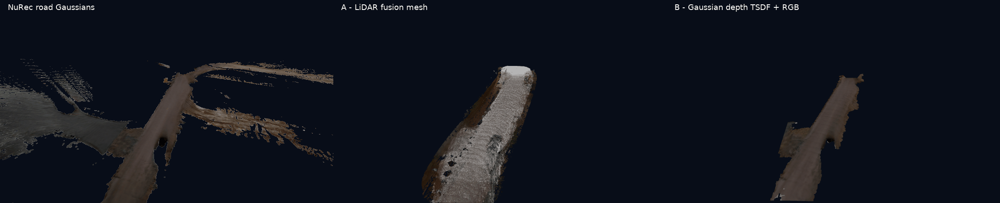
* 순서대로 GT, lidar 사용, gaussian depth 방법


### Gaussian Depth 활용

여러 시점의 Gaussian depth를 TSDF voxel에 가중 평균으로 누적한 뒤, TSDF = 0인 표면에서 mesh를 추출함. Gaussian RGB는 추출한 mesh의 색상으로 투영함.

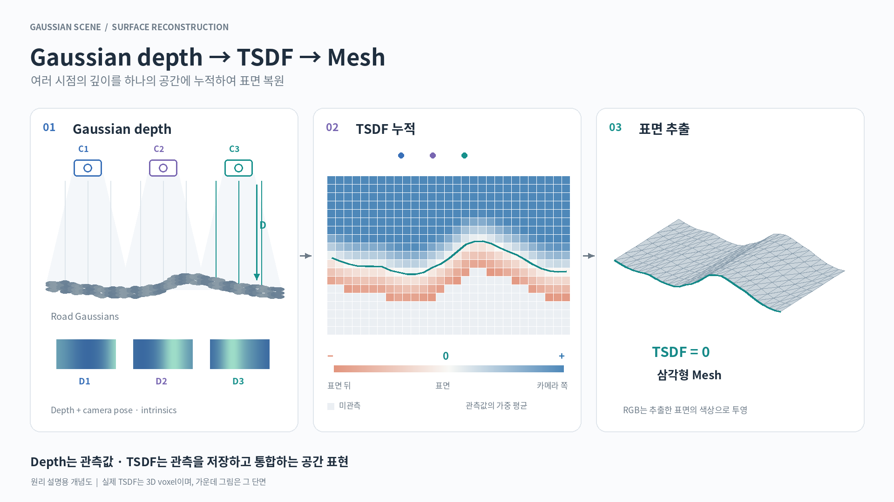


### Mesh 생성 과정
1. gaussian scene 생성
2. 여러 시점의 Gaussian depth 추출
3. 카메라 pose·intrinsics로 각 depth가 3D 공간의 어디에 해당하는지 계산 &rarr;가상의 공간에 배치하는 카메라 이므로 정보를 알 수 있음
4. TSDF: truncated signed distance function 으로 voxel처럼 공간을 나누어, 각 voxel에 표면까지의 거리를 부호 있는 숫자로 표시
5. Opacity(불투명도)와 전체 장면 depth로 가려진 도로를 제외하고, 인접 시점끼리 depth가 맞는지 검사
6. 통과한 depth를 TSDF와 융합하여 표면 형성 &rarr; Triangle Mesh 
7. Gaussian Rendering RGB를 mesh에 투영하여 텍스쳐, 색상 생성


### Depth 추출 방식

| 방식 | 설명 | 시각 자료 |
|---|---|---|
| Camera Depth | LiDAR depth, RGB-D depth,stereo depth, monocular depth estimation등 **camera depth \(Z\)**를 의미 | - |
| **Gaussian Renderer Depth** | 화면 pixel 위치에서 가우시안까지의 거리를 측정하여 depth map 생성 | 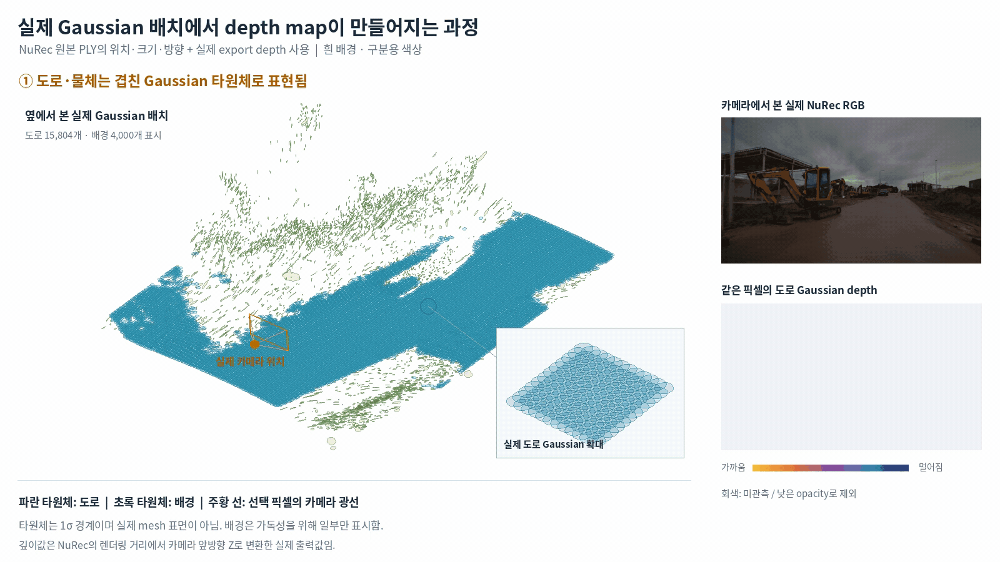 |
| Stereo Depth | 두 이미지의 시차(u,v 좌표의 차이)와 카메라(가상에 우리가 배치하므로 pose를 안다) 간 거리(baseline)를 이용해 depth 계산(단 두 카메라 간 대응점 존재해야함)| 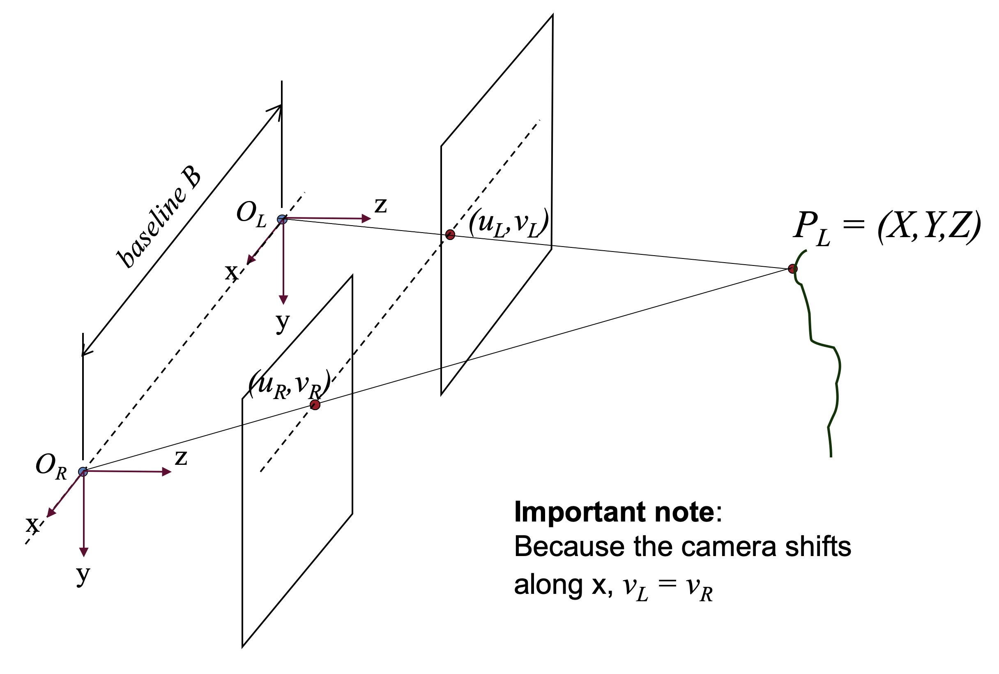 |

### TSDF 에 대하여


### 결과 GIF

앞 단계에서 생성한 mesh와 Genesis 적용 결과를 순서대로 정리한다.

1. **Gaussian depth + TSDF 융합으로 도로 mesh 생성**  
   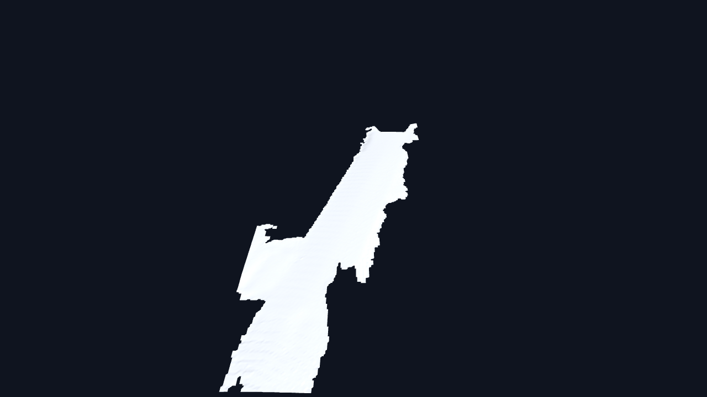

2. **Gaussian RGB를 mesh에 투영하여 색상·텍스처 생성**  
   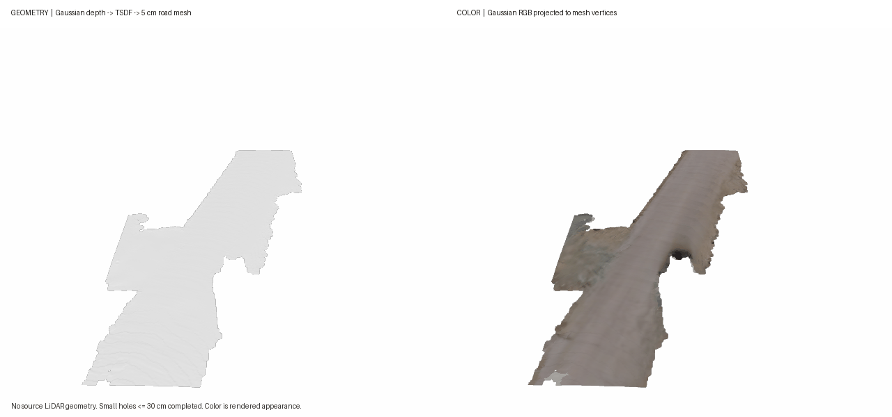

3. **도로 mesh만 Genesis에 적용한 주행**  
   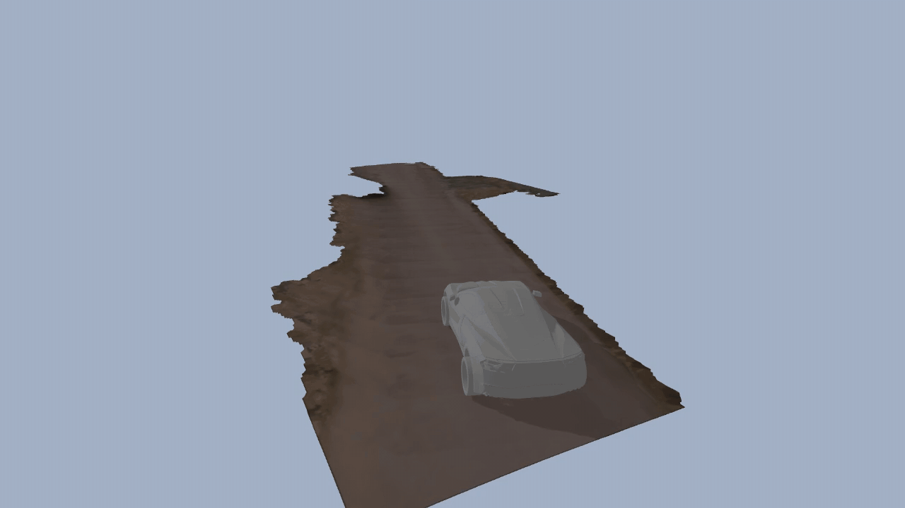

4. **도로와 배경 합성 mesh를 Genesis에 함께 적용한 주행**  
   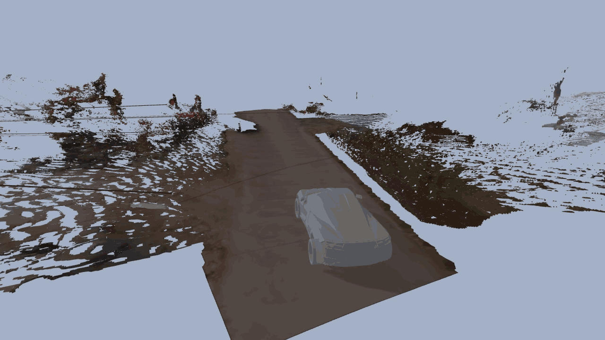


> 잘되지 않은 이유는 배경 분리가 제대로 되지 않아서
