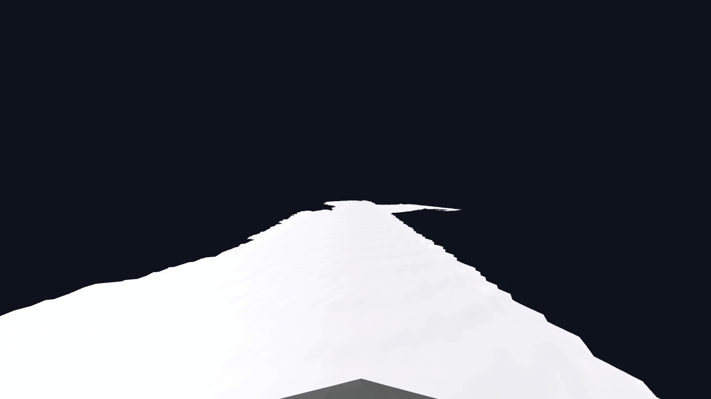

* Gaussian &rarr; camera depth &rarr; TSDF &rarr; Mesh

### 단계
1. gaussian scene 생성
2. 여러 시점의 Gaussian depth 추출
3. 카메라 pose·intrinsics로 각 depth가 3D 공간의 어디에 해당하는지 계산
4. TSDF: truncated signed distance function 으로 voxel처럼 공간을 나누어, 각 voxel에 표면까지의 거리를 부호 있는 숫자로 표시
5. Opacity(불투명도)와 전체 장면 depth로 가려진 도로를 제외하고, 인접 시점끼리 depth가 맞는지 검사
6. 통과한 depth를 TSDF와 융합하여 표면 형성 &rarr; Triangle Mesh 
7. Gaussian Rendering RGB를 mesh에 투영하여 텍스쳐, 색상 생성

### Depth 추출

| 방식 | 설명 | 시각 자료 |
|---|---|---|
| Camera Depth | 가장 큰 범위(스테레오 뎁스 포함) | - |
| **Gaussian Renderer Depth** | 화면 pixel 위치에서 가우시안까지의 거리를 측정하여 뎁스맵 생성 |  |
| Stereo Depth | 두 이미지의 시차(u,v 좌표의 차이)와 카메라(가상에 우리가 배치하므로 pose를 안다) 간 거리(baseline)를 이용해 depth 계산 &rarr; 대응점이 있도록 카메라 위치만 신경쓰면 됨.|  |

### 결과 GIF

1. 

2. 

3. 

