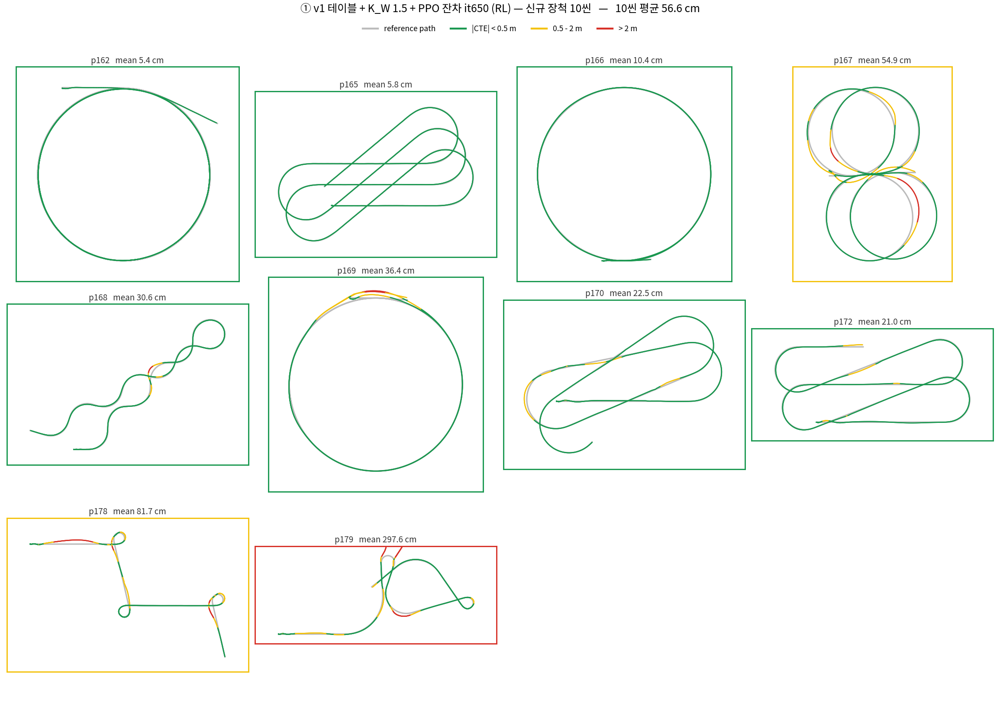
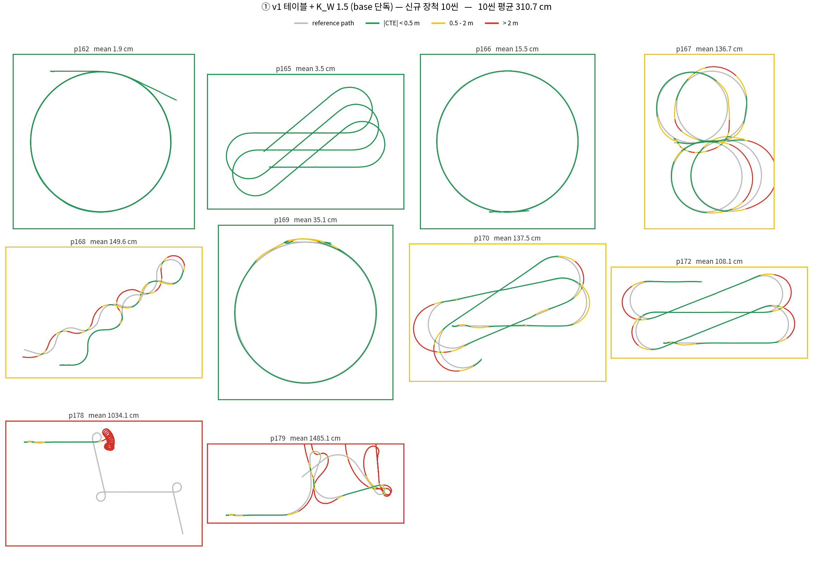
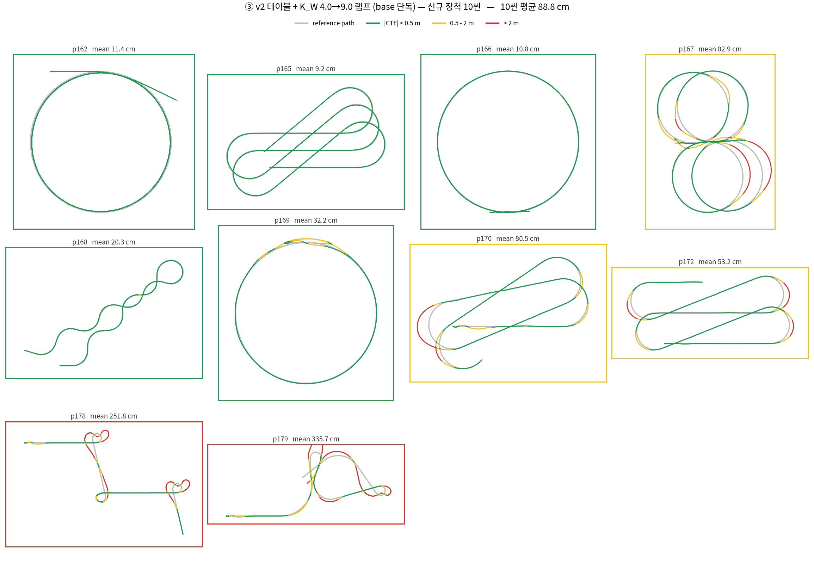
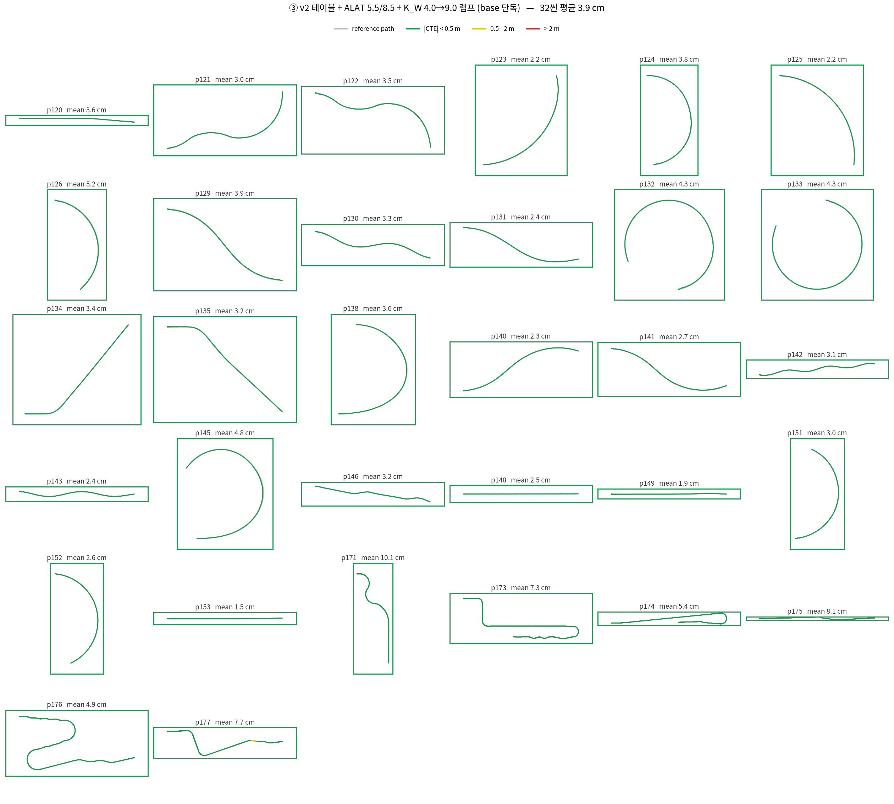
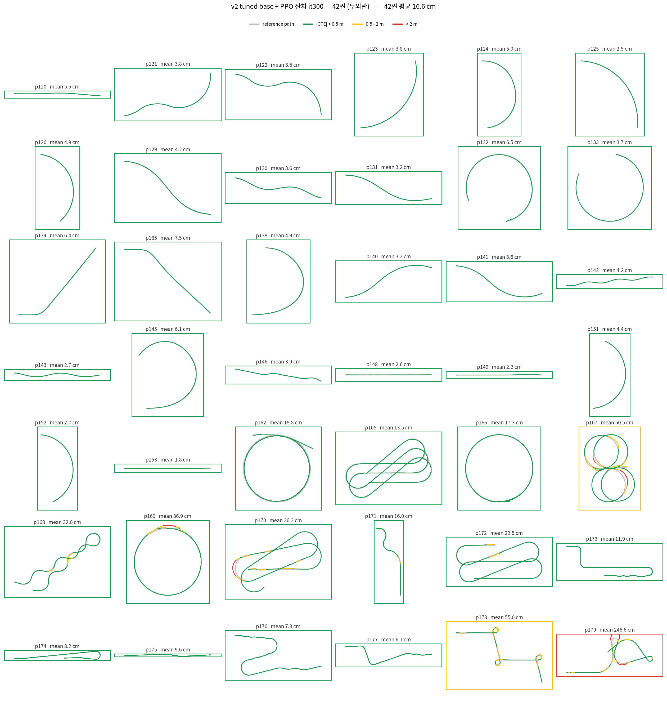
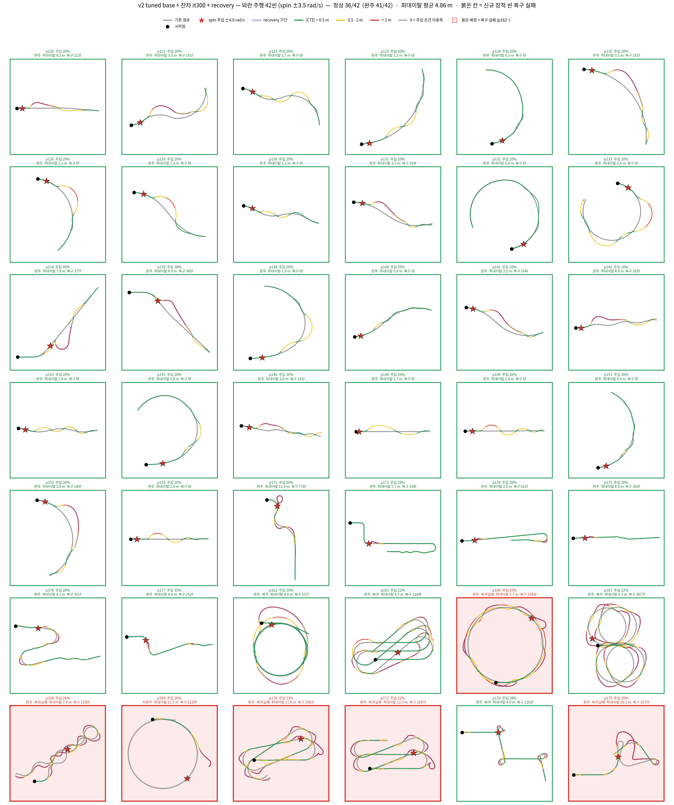
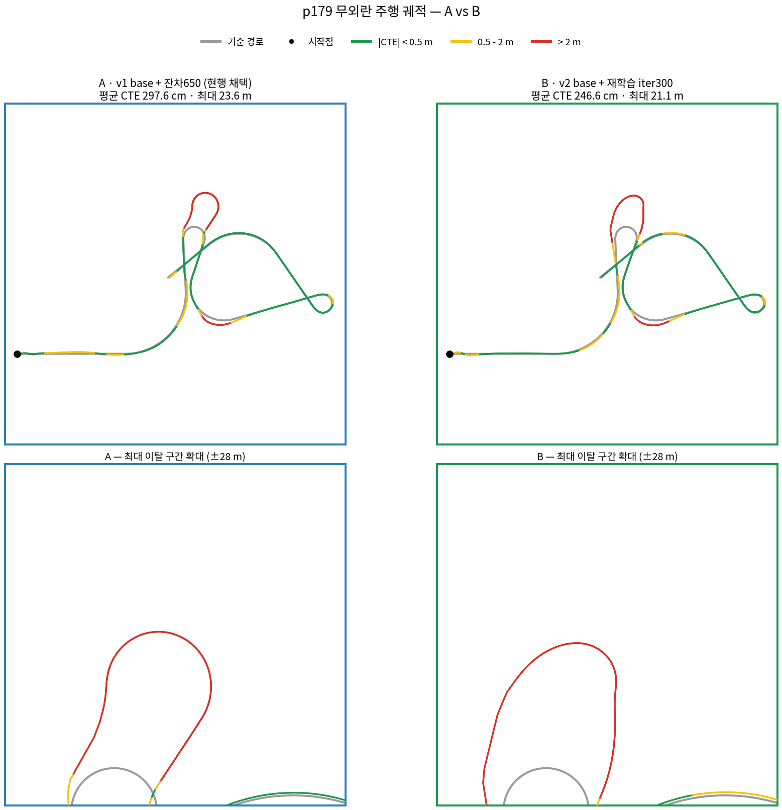

# Sweep Table Coverage Fix 
> 고속 구간 추종 오차의 원인을 스윕 테이블 커버 범위 부족으로 규명하고, 재측정·재튜닝한 기록.

## 요약

**결과**

- 고속 주행 테스트 중 스윕 테이블 문제 발견 — 실측 범위가 v −4~4 m/s(**기존**) 였고, RL의 보정으로 따라가는 현상 확인
- 테이블 재측정 및 업데이트 (v −4~26 m/s, 72,765 그리드 — **수정**)
- **채택: new sweeptable + residual** — `중·고속 강건성`이 근거. 중속 cap saturation 33 → 10%

**미해결**
* 외란 주행에서 조향이 부족한 부분이 보이는데 3d mesh에 의한 언더스티어 의심되어 확인중
* 외란 주행에 대해서 강건하지 않은 모습을 보임.
* 3D mesh를 제거하여 mesh에 의한 노이즈를 없애고, 중*고속 데이터량을 맞춰서 재학습 예정

## 용어

| 용어 | 정의 |
|---|---|
| **기존 테이블 v1** | 구 테이블 — 속도 **−4~4 m/s** 만 실측. 그 위는 v=4 값으로 외삽 |
| **수정 테이블 v2** | 재측정 테이블 — 속도 **−4~26 m/s**|
| **a_lat** | 고속에서 steering이 물리적으로 더 많은 힘을 요구하는 것 때문에 너무 많이 제한되지 않도록 상한 증가 |
| **K_W** | 차량이 경로에서 틀어진 정도(heading error)를 보고 얼마나 강하게 방향을 틀지 정하는 값(피드백) |
---

---

## 1. 고속 영역 오차 확인

새로운 고속 경로로 무외란 주행하던 중 오차가 반복 발생.

| 씬군 | 속도 중앙값 | 속도 최대 (목표 / 실측) | v1 base 단독 평균 CTE | 완주 |
|---|---|---|---|---|
| 기존 32씬 | 4.7 m/s | 24 / 23.6 m/s | 8.8 cm | 32/32 |
| **신규 장척 중·고속 10씬** | **8.0 m/s** | 25 / **19.4 m/s** | **277 cm** | **8/10** |

> 목표 25 m/s 인데 실측이 19.4 에 머문다 — v1 은 고속 구간에서 목표 속도조차 못 따라간다.

**고속**씬에서 오차가 잘 나타남

* 문제 확인: 빨강(cte>2 m)이 고속 씬에 집중 &rarr; 해결이 안되어 제어기 자체 성능만 평가해봤더니 발산

---

## 2. 원인 분석

테이블 커버 범위가 −4~4 m/s 뿐이었고, 그 위는 RL 잔차가 덮고 있었다.

---

## 3. Sweep Table 재측정

SDK 파일은 건드리지 않고 격자만 교체.

| 축 | 범위 | 기존 테이블 그리드 수(v1) | 수정 테이블 그리드 수(v2) |
|---|---|---|---|
| 속도 범위 (m/s) |−4 ~ 4 → **−4 ~ 26** | 11 | **21** |
| steer (정규화) | −1 ~ 1 | 5 | **11** |
| throttle (정규화) | −1 ~ 1 | 5 | 5 |
| pitch (deg) | −35 ~ 35 | 9 | 9 |
| roll (deg) | −30 ~ 30 | 7 | 7 |
| **총 행 수** | 축 격자점의 곱 | 17,325 | **72,765** |

---

## 4. 수정 Table 기반 튜닝

### 제어기 **base 단독**

> 고속에서 steering 제한을 두는 ALAT, k_w 파라미터 각각 튜닝

| 구성 | 기존 32씬 | 신규 10씬 |
|---|---|---|
| v1 | 8.8 cm / 최대 6.70 m | 277 cm (8/10) |
| **v2** | **3.9 cm / 0.99 m** | **91 cm (10/10)** |

**base 단독은 v2 우위** — 32씬 2.3배, 신규 10씬 3배.

#### 신규 10씬 (제어기 단독)

| 기존 v1 tuned, 완주 8/10 |신규 v2 tuned, 완주 10/10 |
|:---:|:---:|
|  |  |
| p178·p179 발산 (1034 / 1485 cm) | 두 씬 모두 완주 (262 / 341 cm) |

* 기존 32씬에 대한 주행은 두 제어기 모두 동일하게 완료함(저속 + 중속 영역)

> tuned = sweeptable + K_W 4.0~9.0 , a_lat 5.5/8.5

**a_lat** = 고속에서 steering이 물리적으로 더 많은 힘을 요구하는 것 때문에 너무 많이 제한되지 않도록 상한 증가 — 4.0 → **5.5** 
**K_W** = 차량이 경로에서 틀어진 정도(heading error)를 보고 얼마나 강하게 방향을 틀지 정하는 값, 같은 오차라도 시간에 따라 더 빨리 누적되므로, 속도에 비례하여 조정 **4.0~9.0 (속도에 따라)**.

* 신규 장척 10씬. 빨강은 p178·p179 둘뿐
       * 179 는 3D mesh에 의해 차량이 공중에 뜨는 현상 발견 &rarr; 물리적으로 못줄이는 잔차

---

## 5. Residual RL 평가

sweeptable freeze + Residual RL 

| | 기존 32씬 | 신규 장척 10씬 |
|---|---|---|
| sweeptable(v2) | 3.9 cm | 91 cm (10/10) |
| **+RL_it300** | 5.2 cm | **52.9 cm (10/10)** |

 

### 무외란 주행 결과

---

## 6. 외란 복구 평가 (RL &lrarr; RL_recovery)

주입 조건: 3D mesh 에 의한 노이즈를 막기 위해서, `평지`이거나 낮은 경사일 것, 외란 후 `복구할 경로`(프레임)이 많이 남아있을 것.

### 정량 평가 — v2 tuned base + 잔차 it300

| 항목 | 무외란 | 외란 (spin ±4.0 rad/s) |
|---|---|---|
| 완주 | **42/42** | **35/42** |
| 평균 CTE | **16.2 cm** | 51 cm (recovery 제외 구간) |
| 씬별 최대 이탈 평균 | 46 cm | 4.86 m |
| 전 씬 최대 이탈 | 0.58 m | 26.12 m |
| recovery 진입 | 없음 | 평균 1041 frame 발동 |

고곡률에서 `understeer 현상`이 발생하는데 3D mesh에 의한 것인지, 모델의 학습 오류 인지 확인이 필요함

### 복귀 실패 구간 분석

* 해당 씬은 3D Mesh에 의해 차량이 지형을 밟고 점프하는 현상이 일어나 물리적으로 오차가 생길 수 밖에 없었음.

실패는 신규 씬에서만 발생. 유형은 셋으로 갈린다 — 전부 recovery 모드 안에서의 문제라 residual 재학습으로는 해결되지 않는다.

 p166 · p167 · p168 · p170 · p172 : RL_recovery 에서 학습하지 않은 고속 씬부분의 문제

 P169 : 외란으로 인한 이탈 후 정지

 

---

### next step
1. 고속 * 저속 데이터 분포 맞춰서 재학습
2. RL_recovery 점검
3. 장애물 회피 훈련(진행 보류 했던 것 수정 및 재개)