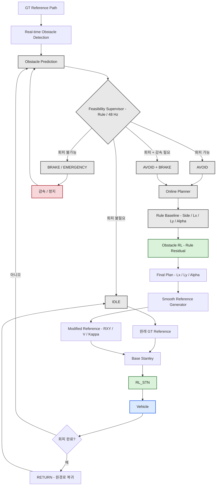
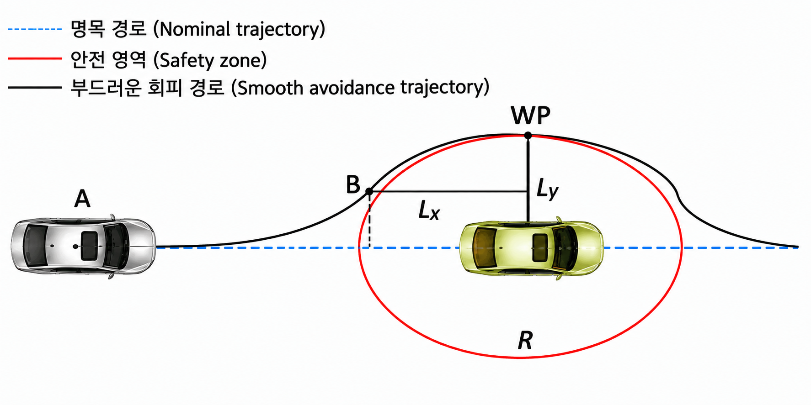
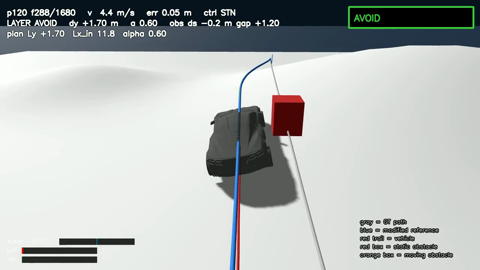
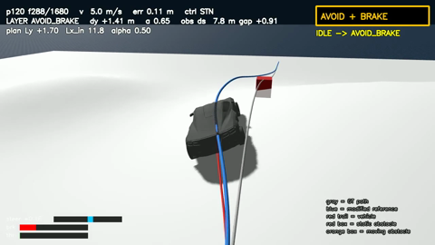
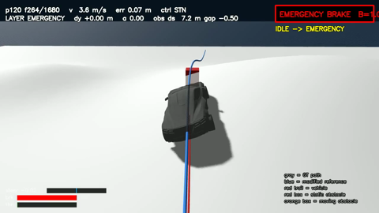
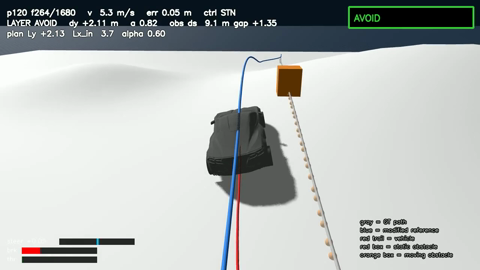
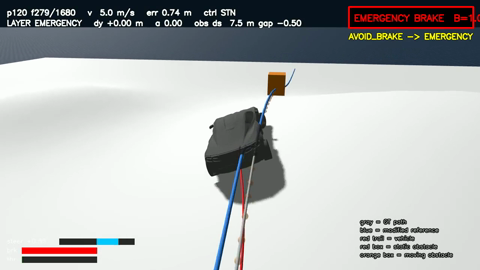
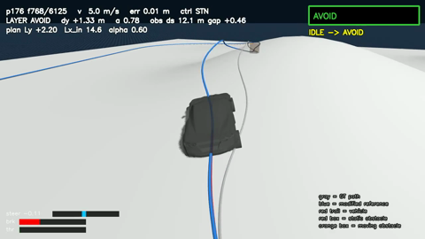
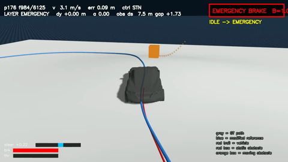

# how to avoid obstacle

## 요약

**해결한 문제**

- 기존 **Base Stanley + RL_STN + recovery** 주행 스택 위에 장애물 회피를 **경로 레이어**로 구현함.
- Rule Supervisor가 `IDLE / AVOID / AVOID+BRAKE / BRAKE / EMERGENCY` 모드를 판단함.
- Rule이 `Ly / Lx / α`를 결정하고 수정 reference를 생성함.
- 정적·동적 장애물 및 갑작스러운 pop-in 상황까지 회피 구조를 검증함.
- 이동 장애물은 `정보 기반 예측`과 8 Hz `재계획`으로 대응함.
- EMERGENCY 상황에서는 직접 제동 override함.
- 장애물이 없을 때는 기존 reference를 그대로 사용하여 기존 주행 성능을 유지함.

**성능 결과**

- 정적 60 Grid: **59 / 60 PASS**
- 봉쇄 상황: **2 / 2 정지 성공**
- 동적 장애물: **18 / 18 무충돌**
- 동적 장애물 최소 간격: **1.8 m 이상**
- Pop-in:
  - 20 m 이상: 회피
  - 16~14 m: 감속 + 회피
  - 12 m: EMERGENCY 정지
  - 8 m 이하: 물리적으로 회피 불가능
- 기존 외란: **41 / 42** — 기존 실패와 동일
- 무장애물 주행: **기존 성능과 동급**

**남은 과제/판단필요**

- **Obstacle RL 학습기 디버깅 중**
- 현재 RL은 Rule의 `Ly / Lx / α`를 `ΔLy / ΔLx / Δα` 형태로 미세 조정하는 구조임.
- 문제 수정 후 **Rule vs Rule + RL 성능 비교 예정**
- 현재 RL의 task가 최적 경로 파라미터 튜닝인데, `상황 판단 RL`로 업그레이드 해야하는지? - 피드백 필요

---
## 차량 제어 pipeline

### Rule 기반 장애물 회피
> Rule은 장애물 회피의 안전성, 물리적 가능성, 기본 회피 경로를 담당, 
RL 로 더 나은 해를 결정하기 전, Rule 기반으로 1차적인 회피, 경로 수정 결정

### Rule 기반 장애물 회피

Rule은 장애물 회피의 **안전성·물리적 가능성·기본 회피 계획**을 결정한다.  
RL이 회피 계획을 미세 조정하기 전에, 현재 상황에서 **안전하게 회피할 수 있는 기본 해**를 먼저 계산한다.

#### 1. Rule이 판단하는 것

| 구분 | 판단 항목 | 의미 |
|---|---|---|
| 장애물 | 통과점 | 차량과 장애물이 만날 것으로 예상되는 위치 |
| 장애물 | 크기 / 최소 Lateral Clearance | 장애물과 차량 사이에 확보해야 하는 최소 횡방향 거리 |
| 회피 방향 | 좌 / 우 Feasibility | 어느 방향으로 회피할 수 있는지 판단 |
| 회피 거리 | Available Distance | 회피에 사용할 수 있는 현재 남은 종방향 거리 |
| 경로 | `Lx` | 회피를 시작하고 완료하기 위해 필요한 종방향 거리 |
| 경로 | `Ly` | 장애물을 피하기 위해 필요한 횡방향 이동량 |
| 경로 | `α` | 회피 trajectory의 형태 및 보수성 |
| 차량 물리 | Curvature | 차량이 실제로 따라갈 수 있는 곡률인지 확인 |
| 차량 물리 | Lateral Acceleration | 최대 허용 횡가속도를 초과하지 않는지 확인 |
| 차량 물리 | Steering Limit | 조향각 및 조향률 한계 내에서 가능한지 확인 |
| 감속 | Braking Requirement | 현재 속도로 회피가 어려운 경우 필요한 감속량 |
| 복귀 | Return Point | 장애물 통과 후 원래 경로로 복귀할 위치 |
| 속도 | Target Speed | 회피 과정에서 유지하거나 낮춰야 할 속도 |

#### 2. Rule의 최종 출력

| 출력 | 의미 |
|---|---|
| `Side` | 장애물을 좌측 또는 우측 중 어느 방향으로 회피할지 |
| `Lx*` | 회피에 필요한 최종 종방향 거리 |
| `Ly*` | 회피에 필요한 최종 횡방향 이동량 |
| `α*` | 회피 trajectory의 형상 파라미터 |
| `Feasibility` | 해당 회피 계획이 차량의 물리적·거리 제약을 만족하는지 |
| `Brake Requirement` | 회피를 위해 필요한 감속 수준 |
| `Trajectory Constraints` | 곡률·횡가속도·조향 등 trajectory가 만족해야 하는 제약 |

#### 3. Rule의 역할

> **Rule은 "이 상황에서 안전하게 어떻게 피할 것인가?"에 대한 기본 회피 계획을 결정한다.**  
> 이후 Obstacle RL은 이 Rule 계획을 기준으로 `Lx`, `Ly`, `α`를 residual 방식으로 미세 조정한다.

### 파라미터

* lx : 종방향 거리
* ly : 횡방향 이동/회피 거리

### Rule Trajectory 생성

* smooth 경로여서 조향이 급격히 바뀌지 않도록 함
* 장애물 좌/우 우회 선택 (feasibility, 거리, 곡률, 안전성)

* 둘다 feasible 하다면 비용 최소 기준으로

| 단계            | Rule이 하는 일                  | 쉽게 말하면                       |
| ------------- | ------------------------------ | ------------------------------- |
| 장애물 감지      | 장애물 위치·크기·속도 파악  | 장애물이 어디 있고 얼마나 빨리 움직이는지 확인   |
| 위험 판단       | `ds`, `ttc`, `gap` 등 확인       | 충돌 위험이 있는지 확인           |
| 회피 가능성 판단   | `d_avail`과 필요한 거리 비교       | 옆으로 피할 공간이 충분한지 확인 |
| 모드 결정       | `AVOID / AVOID_BRAKE / BRAKE / EMERGENCY` | 어떻게 대응할지 결정                |
| 회피 방향 결정    | `Ly` 결정                          | 왼쪽으로 갈지 오른쪽으로 갈지 결정     |
| 회피 시작 위치 결정 | `Lx_in` 결정                     | 언제부터 회피를 시작할지 결정     |
| 회피 경로 형태 결정 | `α` 결정                         | 얼마나 부드럽게/보수적으로 피할지 결정           |
| Spline 생성   | `Plan()` 실행                        | 결정한 값을 실제 회피 곡선으로 만듦     |
| 지속 감시       | 48 Hz 강등 등                     | 상황이 더 위험해지면 Brake/Emergency로 변경 |

### Feasibility

Rule이 생성한 회피 trajectory가 **차량의 물리적 한계와 현재 상황의 시간·거리 조건을 만족하는지** 확인

| 구분 | 검사 항목 | 의미 |
|---|---|---|
| 경로 | Max Curvature | 차량이 따라갈 수 있는 최대 곡률을 초과하지 않는지 |
| 차량 동역학 | Max Lateral Acceleration | 회피 중 횡가속도가 허용 범위를 초과하지 않는지 |
| 조향 | Steering Limit | 필요한 조향각이 차량의 조향 한계 이내인지 |
| 조향 | Steering Rate | 조향 변화 속도가 허용 범위 이내인지 |
| 거리 | Available Distance | 회피에 사용할 수 있는 남은 종방향 거리가 충분한지 |
| 시간 | TTC (Time To Collision) | 장애물과 충돌하기까지 남은 시간이 충분한지 |
| 제동 | Braking Distance | 현재 속도에서 정지하기 위해 필요한 거리가 얼마인지 |
| 회피 | Required Avoidance Distance | 현재 속도와 trajectory에서 회피에 필요한 최소 거리 |

### Rule Based 주행 모드

| 모드 | 의미 | 행동 |
|---|---|---|
| AVOID | d_avail ≥ d_steer : 남은 거리 > 현재 속도에서 조향으로 피할 수 있는 임계점(거리) | Lx,Ly, α 파라미터 결정 |
| AVOID+BRAKE |  감속: 장애물이 너무 가까워서 현재 속도로는 충돌안하는 곡선 불가 &rarr; 감속 후 조향  v * 0.3,0.5,0.8,1.0 등 | 감속 |
| BRAKE | 조향으로 회피 불가, 브레이크 | V 참조 → 0 (정지 후 재판단·hold) |
| EMERGENCY | 장애물이 갑자기 차량 앞에 튀어나왔을때 급브레이크 | throttle 0 / brake 1.0 직접 override (RL 무관) |
| Supervisor (48 Hz) | 방금 만든 계획이 아직 안전한가? 를 지속 확인 &rarr; 위험 감지시, 더 보수적인(안전한) 정책으로 이동 | AVOID→AVOID+BRAKE→EMERGENCY |

### Rule base 주행 영상 

**영상** (회색=GT, 파랑=수정 reference, 빨강 상자=정적, 주황 상자=이동 장애물, 우상단=모드):

| 영상(썸네일 클릭 시 재생) | 상황 | 무엇을 보는가 |
|---|---|---|
|  | 정적앞에 가만히 있는 장애물을 미리 보고 피하는 주행 | AVOID: 스플라인 진입→유지→복귀, 간격 1.17 m |
|  | 16 m 앞 갑자기 등장 (v:7.6m/s) | AVOID+BRAKE: `v` * `α 0.5` 로 감속하며 회피, 간격 1.70m |
|   | 너무 가까워서 피할 시간이 부족한 상황 | EMERGENCY → 4.8 m 앞 정지 → BRAKE HOLD |
|  | 느리게 가는 앞차를 만나서 추월하는 상황 | 만남 예측 → AVOID → 경로 재계획 2회 → 추월 복귀 |
|  | 앞차 급제동으로 기존 경로/예측이 틀어지는 위험한 상황 | 예측 깨짐 → AVOID→AVOID+BRAKE→EMERGENCY → 4.35 m 뒤 정지 |
|   | 맞은편에서 오는 차를 피해 | 만남점 기준 22.5 m 전 AVOID, 교행 후 복귀 (간격 1.97) |
|   | 옆에서 차량이 가로질러 들어와 충돌 가능 | 예측 충돌 → EMERGENCY 양보·정지 → 실제 통과 확인 후 재출발 (간격 4.6) |

## Obstacle RL의 역할

* 회피 경로, 속도를 경험적 최적 비용으로 미세 조정 (파라미터: Ly, Lx, α)
* `RL_obstacle`의 권한 : `AVOID`, `AVOID+BRAKE` 모드에서만 개입

### 무엇을 학습 시키는가? 

> "Rule이 이렇게 계산했는데, 이 상황에서 조금 더 좋은 방법이 있나?"

* 현재는 **더 나은 경로로 수정**의 역할 이지만, 발전 시키면, **상황에 맞게 mode 선택** 및 **상황 판단**의 task 도 수행하는 방향 고려중

<b>RL 입·출력 state</b> (펼치기)

### RL_obstacle 입력

| 구분  | State      | 의미                      |
| --- | ---------- | ----------------------- |
| 장애물 | `ds_meet`  | 차량과 장애물이 만날 것으로 예상되는 거리 |
| 장애물 | `v_along`  | 장애물의 종방향 상대속도           |
| 장애물 | `v_lat`    | 장애물의 횡방향 상대속도           |
| 장애물 | `r_eff`    | 장애물 크기 + 동적 예측 불확실성 여유  |
| 장애물 | `lat_pred` | 만남 시점에 예상되는 장애물의 횡방향 위치 |
| 장애물 | `gap_pred` | 만남 시점의 예상 장애물-차량 거리     |
| 장애물 | `t_meet`   | 차량과 장애물이 만날 것으로 예상되는 시간 |
| 장애물 | `dynamic`  | 동적 장애물 여부 (`0/1`)       |

| 구분 | State     | 의미                    |
| -- | --------- | --------------------- |
| 차량 | `v`       | 현재 차량 속도              |
| 차량 | `Δy_cur`  | 현재 기준 경로에서의 횡방향 위치 오차 |
| 차량 | `Δy′_cur` | 현재 횡방향 속도             |
| 차량 | `α_cur`   | 현재 회피/감속 상태           |

| 구분 | State     | 의미             |
| -- | --------- | -------------- |
| 경로 | `κ_ahead` | 약 5 m 앞 경로의 곡률 |

### Rule 결과
| 구분   | State                | 의미                        |
| ---- | -------------------- | ------------------------- |
| Rule | `Ly_rule`            | Rule이 결정한 회피 방향 및 횡방향 이동량 |
| Rule | `Lx_rule`            | Rule이 결정한 회피 시작 거리        |
| Rule | `α_rule`             | Rule이 결정한 회피 곡선 파라미터      |
| Rule | `feasibility_margin` | 회피 가능 여유 *(현재 미사용, 이후 RL이 상황에 따른 Mode 선택시 사용)*       |

### RL_obstacle 출력 (PPO)

| 구분  | Action         |         범위 | 의미                     |
| --- | -------------- | ---------: | ---------------------- |
| RL  | `ΔLx`          | `0 ~ +4 m` | 회피 시작 거리를 늘림           |
| RL  | `ΔLy`          |   `±0.6 m` | 횡방향 회피량을 조정            |
| RL  | `Δα`           | `-0.3 ~ 0` | `α`를 감소시켜 회피 계획 조정     |
| 초기값 | `ΔLx, ΔLy, Δα` |  `0, 0, 0` | 학습 초기에는 Rule 계획 그대로 사용 |

#### 판단 필요
* RL_obstacle : 현재 파라미터 최적화의 기능만 하고 있는데, `상황 판단`에 따라 `주행 mode 변경` 기능으로 task 업그레이드 하는 방향이 맞는지?