# Terrain & Recovery Planner

### 요약

- **Recovery 재설계**: RL이 T/B/S를 직접 출력하던 복구를 **룰 기반 Recovery Path Planner**(1차 feasibility → 후보 생성 → 2차 feasibility → cost 선택)로 교체하고, 만들어진 복귀 경로는 기존 Base Stanley + RL_STN이 그대로 추종한다.
- **동작 흐름**: 외란 감지 → SETTLE(안정화) → RETURN(복귀 경로 추종) → MERGE(GT 복귀). Supervisor 48 Hz / 재계획 8 Hz, 경로가 유효하면 재계획하지 않음.
- **결과 (외란 42씬, spin 3.5)**: 구 RL_recovery 41/42 → **룰 플래너 42/42** (기하 한계 플랜: 복구 319f·배율 1.19)


## Recovery 재설계 — 복귀 경로 생성 + 기존 추종 스택

RL이 제어 입력(T/B/S)을 직접 내던 복구를, 룰 기반 '복귀 경로 생성 + 기존 추종 스택 재사용' 구조로 바꾼 설계와 검증 기록.

### 1. 설계 변경

복구를 '제어 문제'에서 '경로 문제'로 바꾼 이유 — 경로만 갈아끼우면 CTE·heading 피드백이 OOD에서도 그대로 동작한다.

| 구분 | 흐름 |
|---|---|
| 기존 | Recovery State → Recovery RL → **(T,S,Brake) 직접 출력** |
| 변경 | Recovery State → **Rule Recovery Path Planner** → **Recovery Path** → Base Stanley + RL_STN → Vehicle |

 **경로를 먼저 만들고 기존 제어기가 추종.**
 
차이점: 별도의 OOD복구용 layer를 두지 않아도 cte, heading error 등의 피드백이 OOD에서도 강건


### 2. Recovery Path Planner 설계

이탈 상태에서 GT 경로로 되돌아오는 복귀 경로를 만드는 4단계 파이프라인(공간 제한 → 후보 생성 → 검증 → 비용 선택)의 정의.

#### 2.1 전체 흐름

플래너가 한 번 계획할 때 수행하는 4단계의 순서 요약.
1. 1차 feasibility(후보 **공간** 설정)
2. 공간 내에서 path 후보 생성
3. 2차 feasibility(feasible path만 남김)
4. 각 후보 cost 평가


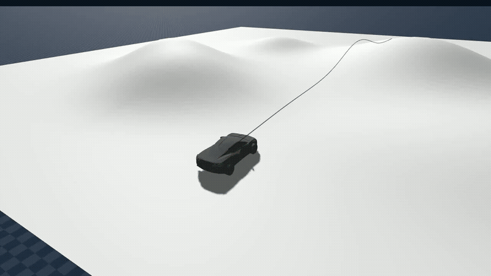 

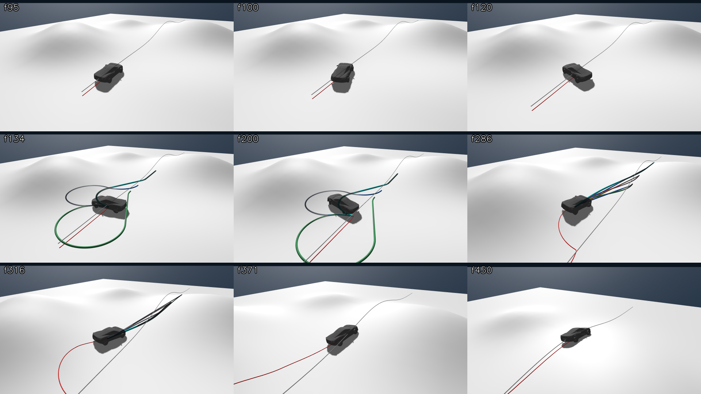

> 경로 후보 생성 및 선택 과정

#### 2.2 1차 Feasibility — 후보 공간 제한

후보를 만들기 전에, 차량 물리(조향·제동)와 지형이 허용하는 복귀 가능 '공간'(Lx 범위·곡률 한계)을 먼저 좁힌다.

| 검사 항목               | 내용                            |
| ------------------- | ----------------------------- |
| Available distance  | 전방 가용 거리 확인                   |
| `κ_steer` / `R_min` | 조향/속도 한계로 가능한 최소 회전반경 계산         |
| `κ_allow(v) = a_lat_max / v²`        | 현재 속도로 감당 가능한 최대 곡률/steering |
| `Lx_min`            | 최소 복귀 거리(최대 조향으로 가장 빨리 복귀할 수 있는 거리)                      |
| `Lx_max`            | 최대 복귀 거리(트랙 끝까지 남은 거리)  |
| 제동거리                | 풀 브레이크로 언제 멈추나  |
| Corridor            | 주행가능한 길의 여유(횡방향)|
| Terrain             | 지형 여유(안전한 길)   |

* 현재 위치 + `Lx_min` 이 가장 중요 : 차량이 물리적으로 필요한 최소 복귀거리
* 현재 위치 + `Lx_max`: 상한선

---

#### 2.3 후보 생성

좁혀진 공간 안에서 복귀 거리 × 감속률 × 생성기 조합으로 여러 후보 경로를 만든다.

| 후보 요소     | 종류                      |
| --------- | ----------------------- |
| 기존 경로 복구 거리  | 가까움 / 중간 / 멂            |
| `α`       | 표준 / 보수                 |
| Generator | Frenet Quintic(부드럽게 옆으로 이동해서 복귀) / Dubins(회전반경을 고려해서 크게 돌아 GT로 복귀)|

---

#### 2.4 2차 Feasibility — 완성 trajectory 검증

완성된 후보 궤적 전체가 실제로 주행 가능한지 하드 제약(곡률·횡가속·조향률·제동·코리도·지형)으로 걸러낸다.

생성된 trajectory 전체를 대상으로 **Hard Constraint**를 검사

| 검사 항목 | 조건 |
|---|---|
| Curvature | `κ_max ≤ κ_allow(v(s))` (가능한 곡률) |
| Lateral acceleration | `a_lat(s) ≤ 4.0 m/s²` 횡가속 |
| Steering limit | 조향 한계 이내 |
| Steering rate | 근사 이내 |
| Available distance | 가용 거리 이내 |
| Braking | 제동거리 조건 만족 (`brake_capability.csv`) |
| Corridor | 코리도 이탈 없음 |
| Terrain slope | 경로 기준 slope 제한 |
| Terrain roll | 경로 기준 roll 제한 |

> Cost가 낮더라도 Hard Constraint를 위반한 후보는 사용할 수 없다.

* "차량 최대 조향, 제어로 주행 가능한 궤적인가?" 를 평가

---

#### 2.5 Cost 평가

하드 제약을 통과한 후보 중 빠르고 부드럽게 복귀하는 경로를 최소 비용으로 고른다.

Feasible 후보만 대상으로 Cost를 계산한다.

| Cost 항목         | 평가 목적       |
| --------------- | ----------- |
| Path length     | 전체 복귀 경로 길이 |
| Merge distance  | 빠른 복귀 여부    |
| `∫κ² ds`        | 곡률 부담       |
| Steering effort | 조향 부담       |
| `max a_lat`     | 최대 횡가속도     |
| Speed loss      | 속도 손실       |
| `−progress`     | 진행도 보상      |
| Smoothness      | 경로의 부드러움    |

* 최소 비용

---

#### 2.6 최종 Recovery Reference(경로)

선택된 경로를 기존 Base Stanley + RL_STN이 그대로 추종할 수 있는 레퍼런스 슬롯 형식(RXY/V/HR/κ/ARC)으로 변환한다.

최적 후보를 기존 추종 스택이 사용할 수 있는 Recovery Slot으로 변환한다.

| 출력               | 내용                |
| ---------------- | ----------------- |
| `s_merge`        | GT 복귀 위치          |
| `Lx / Ly`        | 종·횡방향 복귀량         |
| Shape parameters | 경로 형상             |
| `α(s)`           | 경로 방향             |
| `V(s)`           | Target speed      |
| `RXY`            | 위치 Reference      |
| `HR`             | Heading Reference |
| `κ`              | Curvature         |
| `ARC`            | Arc 정보            |

---

#### 2.7 후보가 없는 경우

모든 후보가 기각되면 제동 후 조건을 바꿔 재계획하는 fallback.

* 브레이크 후 차선의 경로 재계산
* 후보 생성
---

### 3. Path Generator

이탈 크기·헤딩 오차에 따라 두 생성기(Frenet Quintic / Dubins CSC)를 골라 쓰는 기준.

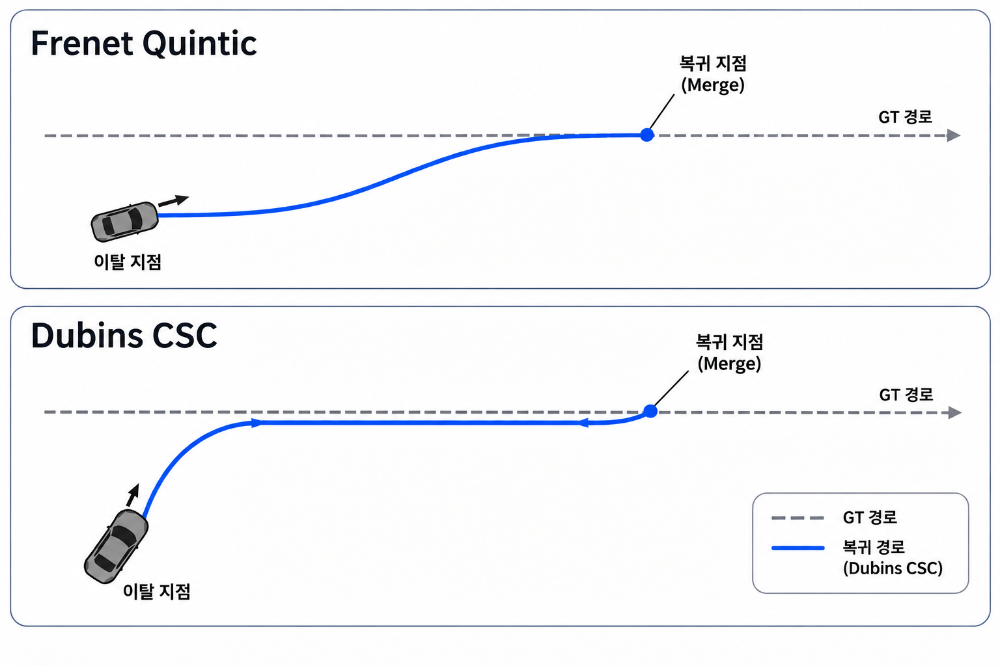

| 상황                  | Generator          | 개념                      | 사용 조건 |
| ------------------- | ------------------ | ----------------------- | --- |
| GT와 방향이 비슷하고 이탈이 작음 | **Frenet Quintic** | 옆으로 부드럽게 경로에 붙음 |  HE < 45° & |cte| < 8 m |
| 헤딩 오차가 크거나 이탈이 큼    | **Dubins CSC**     | 크게 회전해서 방향을 맞춘 뒤 GT에 붙음 | HE ≥ 45° & 큰 cte |

---

### 4. State Sheet

플래너가 읽는 입력과 내보내는 출력 전체를 한 곳에 모은 명세.

#### 4.1 Input

차량 상태·GT 대비 오차·제어 제약·지형 정보 등 계획에 쓰이는 입력 목록.

| 구분 | 항목 | 내용 |
|---|---|---|
| Vehicle Dynamic | pose | (x, y, ψ) |
| | v_long | 종방향 속도 |
| | yaw rate | 요레이트 |
| | v_lat | 횡방향 속도 (가능한 경우) |
| | stability | 차량 안정 여부 |
| Feedback | s_near | GT 최근접 종방향 위치 |
| | cte | GT 대비 횡방향 오프셋 |
| | he | 경로 대비 헤딩 오차 |
| | κ | 전방 GT 곡률 |
| | v(m/s) | 전방 GT 목표 속도 |
| FeedForward | δ_max | 최대 조향각 |
| | δ̇_max | 조향률 제한, 초기 1.5 rad/s |
| | κ_max | 최대 허용 곡률 |
| | a_lat_max | 최대 횡가속도, 초기 4.0 m/s² |
| | Brake capability | sweeptable derived |
| 환경 정보 | Corridor | 이탈 시 복귀 가능 영역 |
| | Terrain height | 지형 높이 |
| | Terrain normal | 지형 법선 |


#### 4.2 출력

계획 결과로 복구 슬롯에 쓰는 경로 파라미터와 레퍼런스 항목.

| 구분 | 항목 | 목적 |
|---|---|---|
| Recovery Path 파라미터 | s_merge, Lx, Ly, shape parameters, α(s), target speed V(s), feasibility | 경로 생성 |
| Recovery Reference (복구 슬롯) | RXY, V, HR, κ, ARC | stanley 추종용 변환 |
| 재샘플링 간격 | 0.125 m spacing | 경로의 해상도 |


---

### 5. SETTLE

스핀 직후처럼 차량이 불안정할 때는 경로를 만들지 않고 먼저 차량을 세우는 단계.

차량이 불안정한 상태에서는 Recovery Path를 생성하지 않는다.

#### 5.1 SETTLE 진입 조건

요레이트·횡속도 임계로 '지금은 계획보다 안정화가 먼저'인 상태를 판정한다.

다음 조건 중 하나라도 만족하면 SETTLE로 진입한다.

| 조건 | 기준 |
|---|---|
| Yaw rate | \|yaw rate\| > 1.5 rad/s |
| Lateral velocity | \|v_lat\| > 2.0 m/s |
| 자세 변화 | 급격한 자세 변화 |

> SETTLE 중에는 Reference 추종보다 차량 안정화가 우선한다.

* 이때는 브레이크 밟아서 pose 안정화

---

### 6. Recovery Supervisor

복구 상태기계를 48 Hz로 관리하고, 경로 재계획은 필요할 때만 8 Hz로 수행하는 관리자.

#### 6.1 주기

상태 관리(48 Hz)와 경로 재계획(8 Hz)의 주기를 분리해 불필요한 재계획을 막는다.

| 기능 | 주기 |
|---|---|
| Recovery Supervisor | 48 Hz |
| Recovery Path 재계획 | 8 Hz |

Supervisor는 빠른 주기로 상태를 관리하고, Path Planner는 필요한 경우에만 새로운 Recovery Path를 생성한다.

#### 6.2 Recovery Mode

NORMAL → SETTLE → RETURN → MERGE(+BLOCKED)로 이어지는 복구 상태 정의.


| 상태 | 역할 |
|---|---|
| NORMAL | GT 경로 정상 추종 |
| SETTLE | 차량 안정화, Recovery Path 생성 금지 |
| RETURN | Recovery Reference 추종 |
| MERGE | GT 경로로 복귀하고 GT Slot 복원 |
| BLOCKED | 후보가 없을 때 정지 hold 후 재시도 |

#### 6.3 Recovery Path 재계획 조건

현재 경로가 유효한 동안은 유지하고, 위반·이탈·환경 변화가 있을 때만 다시 계획한다.

현재 경로를 계속 사용할 수 있는 동안에는 불필요하게 재계획하지 않는다. 다음 조건에서만 Path를 교체한다.

| Trigger | 기준 |
|---|---|
| Feasibility violation | 현재 경로가 feasibility 조건 위반 |
| Path deviation | 경로 이탈 > 1 m |
| Merge point change | merge point 변화 > 3 m |
| Corridor change | 코리도 변화 |
| Terrain change | 지형 조건 변화 |

---


<details>
<summary><b>Obstacle / Recovery 관계와 우선순위</b> (펼치기)</summary>


> 현재 이 부분은 다른 팀원이 담당

#### 전체 구조

```text
                    Path Planning Layer
                            │
             ┌──────────────┴──────────────┐
             ▼                             ▼
   Obstacle Planner               Recovery Planner
   (Rule + Obstacle RL)           (Rule + optional RL)
             └──────────────┬──────────────┘
                            ▼
                Modified / Recovery Reference
                            ▼
                      Base Stanley → RL_STN → Vehicle
```

#### 공통 원칙

Obstacle과 Recovery 모두 T/S를 직접 제어하지 않는다.

```text
Obstacle / Recovery Planner → Path / Reference 생성
  → 기존 추종 스택 사용 (Base Stanley + RL_STN)
```

즉, 두 Planner 모두 경로를 만들고 기존 제어기가 추종하는 구조를 유지한다.

#### 초기 우선순위

```text
EMERGENCY > Obstacle Avoidance > Recovery > GT
```

**RETURN 중 장애물 발생**

```text
Recovery
  ├─ 경로 소유권 유지
  └─ 종방향 안전 개입 허용 (EMERGENCY, BRAKE)
```

초기 설계에서는 장애물이 발생해도 Recovery 경로 자체의 소유권은 유지한다. 다만 EMERGENCY/BRAKE는 안전을 위해 종방향으로 개입할 수 있다.

**회피 중 대이탈**

```text
Obstacle Avoidance Path → 대이탈 → 회피 플랜 폐기 → SETTLE → Recovery
```

Obstacle Avoidance 중 차량이 크게 이탈하면 회피 플랜을 폐기하고 SETTLE로 전환한다.

최종 우선순위와 경로 소유권은 상태기계로 명확히 정의하고 시나리오 테스트로 검증한다.


</details>

### 7. 외란 주입 결과 비교 : RL recovery vs Recovery Path Planner(Rule)

외란 42씬(spin 3.5)에서 구 RL 복구와 신 룰 플래너(기하 한계/capacity)를 동일 조건으로 비교한 최종 결과.

Recovery 최종 A/B (외란 42씬, spin 3.5 rad/s)

| 항목 | 구 RL_recovery (T/B/S 직접) | 신 룰 복귀 경로 (기하 한계 플랜, 재계획 의존) | **신 룰 복귀 경로 (차량 capacity 반영 플랜)** |
|---|---|---|---|
| PASS (완주 ∧ 후반 20% 중앙 CTE < 1 m) | 41/42 | 42/42 | **42/42** |
| 완주 배율 중앙 | **1.15** | 1.19 | 1.67 |
| 복구 프레임 중앙 (진입 씬) | 341 | **319** | 606 |
| 플랜 수 중앙 (재계획) | — | 2~3 (플랜 미추종 → 재계획으로 보정) | **1 (플랜을 그대로 추종)** |
| 유일 실패 | p134 (후반 CTE 2.70) | **없음** (p134 해결) | **없음** |
| 비고 | — | 저속 Dubins 언더스티어처럼 밀림 | 정확 추종·재계획 없음, 대신 루프 반경 5~6 m 로 복구 시간 ↑ |


|이미지|구 RL_recovery|Rule-base|차량 capacity 반영 Rule base|
|---|---|---|---|
| 42씬 그리드 | 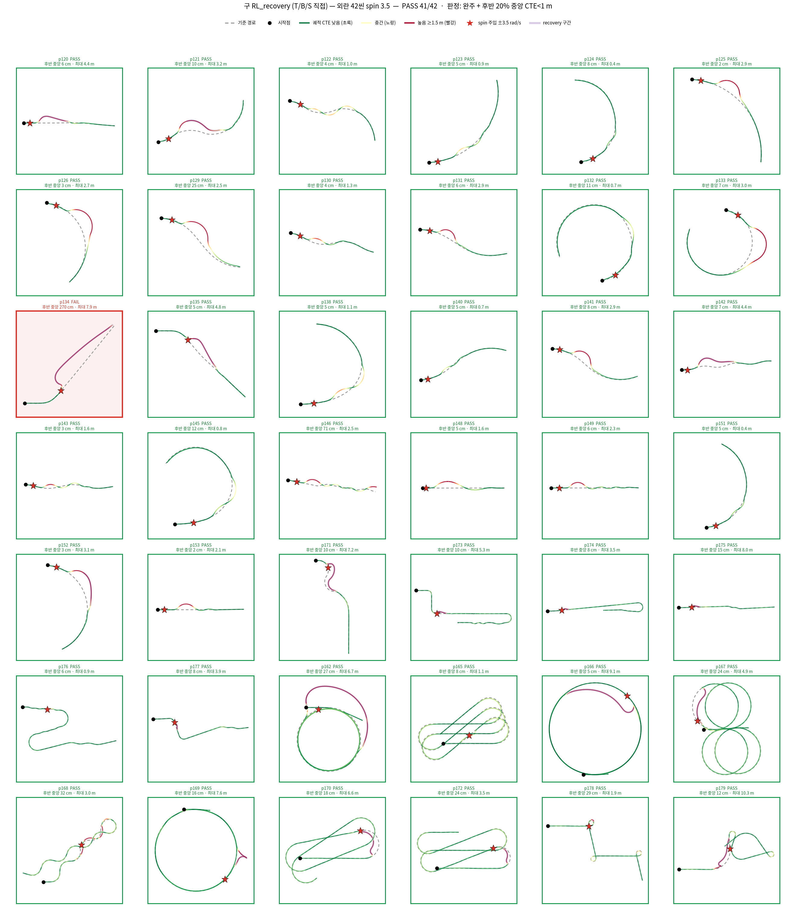 | 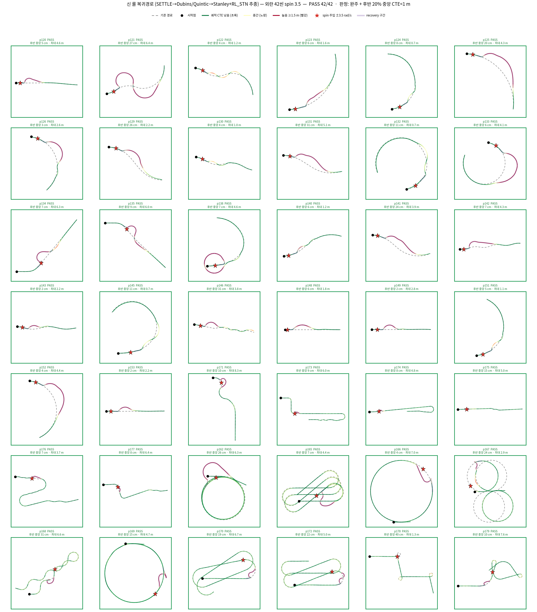 | 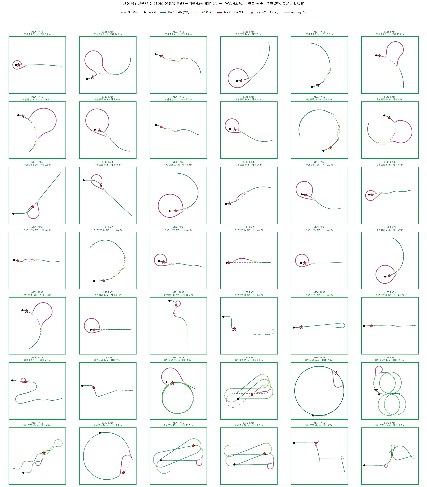 |

### 주행 영상 (capacity, spin 3.5 — 클릭 재생)

capacity 플랜의 복구 과정(SETTLE→RETURN→MERGE)을 씬별 영상으로 확인 (썸네일 클릭 시 재생).

| p120 | p134 | p151 | p169 | p176 |
|---|---|---|---|---|
| <a href="https://github.com/user-attachments/assets/a528c63b-2278-4767-87f0-63afd5d9bf02">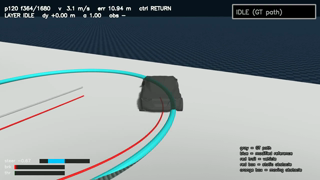</a> | <a href="https://github.com/user-attachments/assets/7ef7c61b-8e7c-497c-ab06-3950ef3339cc">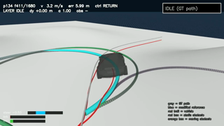</a> | <a href="https://github.com/user-attachments/assets/96891405-dac1-45ab-b079-d55a3bc56e65">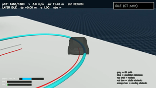</a> | <a href="https://github.com/user-attachments/assets/55abcda1-f367-4a19-be89-6f1832304d80">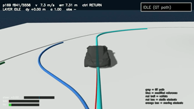</a> | <a href="https://github.com/user-attachments/assets/afff3987-1320-420a-b267-8bbab8644aa3">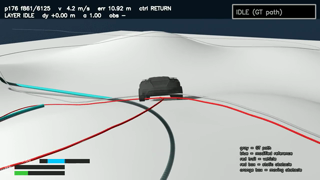</a> |

### SDK 1.3.0 DifferentiablePlant vs SweepTable

스윕테이블(측정 기반 역모델)과 SDK 1.3.0의 autodiff 역플랜트를 개루프·폐루프에서 비교하고 스윕테이블 유지를 결정한 기록.


