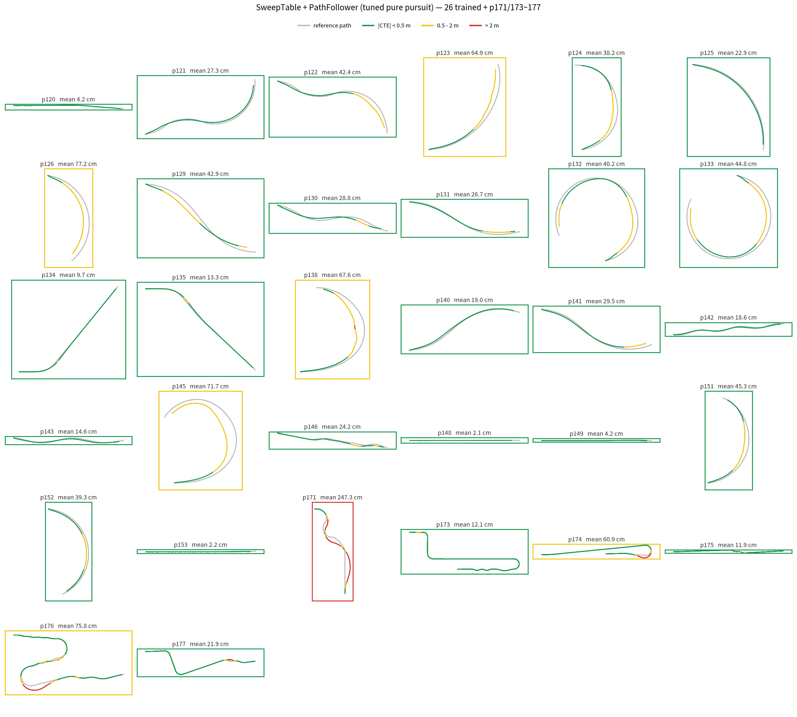
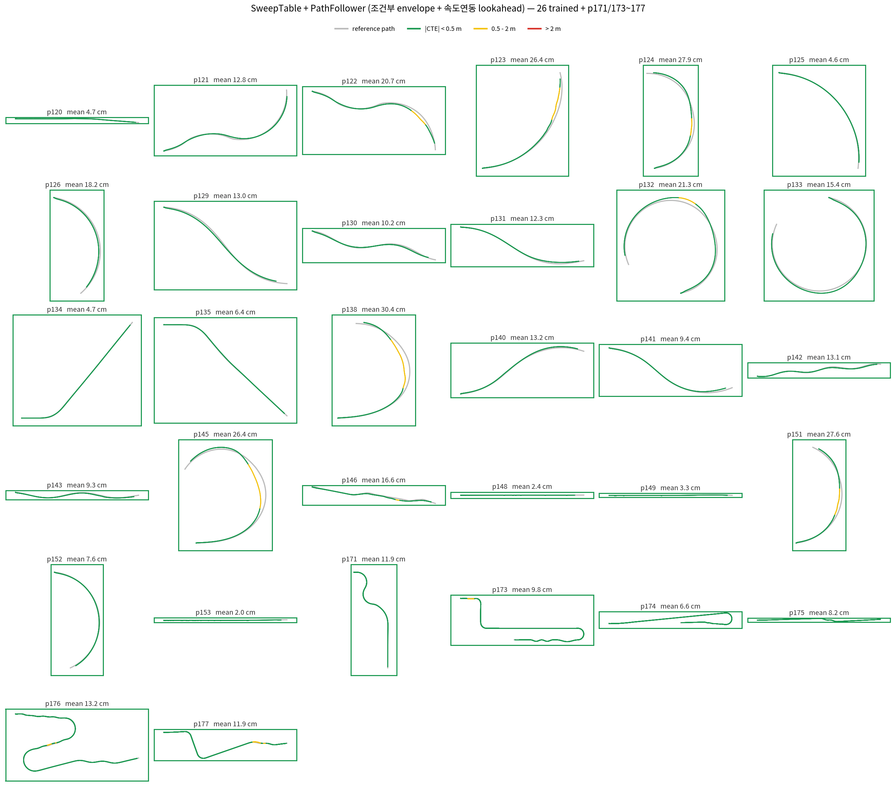
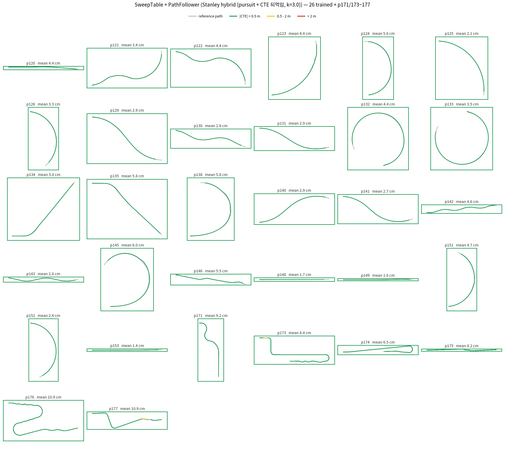
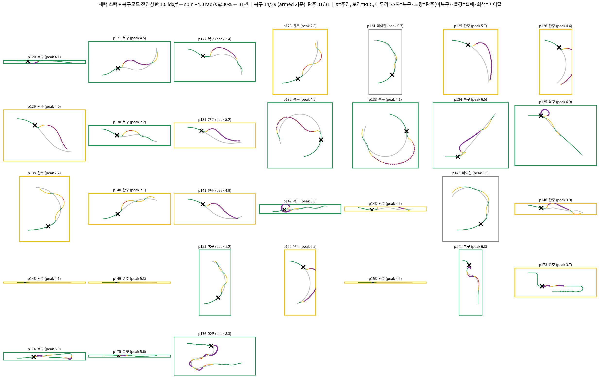

# 0805 자료맵 — SweepTable → 제어기 개선 → 무증류 RL 스택 (2026-08-05 ~ 08-09)


## 전체 스토리 (한 문단)

기존 파이프라인은 MPPI 골든 마이닝(씬당 수 시간) → BC 증류 → 잔차 RL이었다. 

```
[1] MPPI 가중치 튜닝 (grid search)
      env   : R=1(real) + I=2048(imagination)
      MLP   : -
      규모  : 씬 1~4개 × seed 4 × 파라미터 격자 (1_tune.py grid — 수동 반복, 총 trial 수 미기록)
      비용  : ≈0.9 s/프레임 (마이닝과 동일)
      시간  : 미기록 (정성 튜닝 누적 — §2.4 가중치가 그 결과물)

[1'] MPPI Optuna (보조 트랙 — 고속 실패 8씬 안정화 전용, 26씬 golden 과 별개)
      env   : R=1(real) + I=1024(imagination)
      MLP   : -
      규모  : eval 6씬(287f, frac 0.6) × 86 trial (완료 50 / pruned 34, TPE + MedianPruner)
      비용  : 1 trial ≈ 9분 (unpruned — dual_scene 마이그레이션 ×8.2 가속 후. 이전 71분)
      시간  : ≈9~10h (추정 = 50×9분 + 34×3~4분, 중간 정지·재개 포함)

[2] 골든 추출
      env   : R=1(real) + I=2048(imagination)
      MLP   : -
      규모  : 26경로 = 12,240 프레임
      비용  : ≈0.9 s/프레임 (실측)
      시간  : ≈3h 4m (추정 = 12,240 × 0.9s)

[3] BC 학습
      env   : -
      MLP   : 31 -> [128,128,64] -> 20        30,164 params (125 KB)
      규모  : 26경로 (12,240프레임, L/R flip ×2), 300 epoch
      비용  : 0.44 s/epoch
      시간  : 2m 11s (실측)

--------------------------------------------------
                     합계  ≈ 12 ~ 13h 6m  ([1'] 보조 트랙 ≈9~10h 별도)
```

이 시간적 비용에 비해 `table sweep n분` 만에 구동계 파악이 비용적으로 훨씬 효율적이라 구동계를 학습하기 위한 데이터를 뽑고, 학습하는 것보다 sweeptable 작성이 비용적 측면에서 유리.


## 진행 사다리 (한눈에)

| 단계 | 스택 | 32씬 평균 CTE | 근거 자료 |
|---|---|---|---|
| 0 | sweeptable (T,S) openloop 재생 | 9.05 m 발산 (별도 실험, 자료 없음) | — |
| 1 | SweepTable + SDK PathFollower(pursuit) 튜닝 | 0.357 m | ./01_sweep주행그리드_32씬.png |
| 2 | + 조건부 envelope + 속도연동 lookahead | 0.132 m | ./13_sweep주행그리드_32씬_개선레시피.png |
| 3 | + Stanley hybrid (CTE 되먹임 k=3.0) | 0.047 m | ./18_sweep주행그리드_32씬_stanley.png |
| 4 | + PPO 잔차 (RL_stn, 고속 미포함 학습) | 저속 우수 / 고속 4씬 발산 | ./30_rlstn주행그리드_32씬.png |
| 5 | + PPO 잔차 고속 포함 (RL_stn-HS, **채택**) | 32/32 완주, 저속 0.028 m | ./34_rlstnHS주행그리드_32씬.png |
| 6 | + RL recovery 스위칭 (0808R2 it299, **채택**) | 외란 벤치 §6 참조 | ./37_최종스택_복구벤치8조건_그리드.png, ./40_31씬복구그리드_spin+4.0at30.png, ./41_31씬복구그리드_spin-4.0at60.png |

---

## 1. SweepTable + PathFollower 

MPPI 없이 SweepTable만으로 주행이 되는지 검증. 

재생해 봤으나 9.05 m 발산 — openloop 오차 때문에 **상태를 보고 되먹이는 폐루프 제어기가 반드시 필요**함을 확인. 

그래서 SDK 문서의 PathFollower (pure pursuit) 제어기 사용

**결과.** 순정 파라미터 0.53 m(30/32) → 조향 cap·lookahead 완화 튜닝으로 0.357 m.
직선/완곡선은 수 cm로 통과하지만 **급곡률 코너에서 일관되게 이탈** (p171 2.47 / p126 0.77 / p145 0.72 m).

**분석.** 
1. lookahead point에 대해서 선제조향 (lookahead 3.5 → 2.0 m)
2. tank &rarr; car 에 맞는 조향 limit 조정 (steer_cap 0.5 → 1.0)


## 2. Pure pursuit vs PID vs Stanley 성능비교


* CTE 횡방향 오차 기준으로 비교해보았다

**성능 정리 — 32씬 평균 |CTE| (외란 없음)**

| 구분 | Pure pursuit | PID (P+I+D) | Stanley hybrid (P) |
|---|---|---|---|
| 직선 4씬 (p120·148·149·153) | 3.1 cm | 2.7 cm | **2.4 cm** |
| 곡선 22씬 | 15.8 cm | **3.6 cm** | 4.0 cm |
| 고속 6씬 (p171·173~177) | 10.3 cm | 9.8 cm | **9.0 cm** |
| **전체 32씬** | 13.2 cm | **4.7 cm** | **4.7 cm** |
| 최대 CTE > 2 m 인 씬 | 0개 | 0개 | 0개 |


## 3. Stanley 제어기 적용

* 일반 Purepursuit(0.357 m)


* tuned pure pursuit(pure pursuit + 고속 steering 제한 + 속도연동 lookahead (0.132 m))


* stanley (0.047 m)


* 스핀 8조건 중 복구 5/8. 


## 4. RL_stn — frozen Stanley + PPO 잔차 (0807S, 08-07 밤)

* 기존 구조(frozen BC + PPO 잔차 &rarr; frozen Stanley + residual_PPO) Stanley base로 교체
*  Stanley 제어기가 못 지운 오프셋을 residualRL이 보정

**결과.** **32/32 완주 전 그린**, 저속 평균 0.028 m, 고속 6~8 cm CTE


* 무외란 주행


* 외란 주행 성능


---
### next step 

* 장애물 회피 주행